# Technical Specification

# 1. Introduction

## 1.1 Executive Summary

**Project Overview**

This Technical Specification documents the repository whose landing page (`README.md`) identifies it as **Student_Mngt_29-Jun-2026**. The repository is intentionally minimal at its root, comprising an Apache License 2.0 file (`LICENSE`), a two-line placeholder `README.md`, and a single substantive payload directory, `society_mgmt_300k/`. That directory is the entire technical subject of this document. It is a **synthetic, deterministically generated JavaScript code corpus** engineered to an exact size of **300,000 lines** distributed across 29 `.js` files (25 under `society_mgmt_300k/src/` and 4 under `society_mgmt_300k/tests/`), accompanied by a single MIT `LICENSE.txt`.

Although the directory taxonomy mirrors a conventional layered backend — `controllers/`, `services/`, `models/`, `repositories/`, `routes/`, `middleware/`, `domain/`, `config/`, and `utils/` beneath `society_mgmt_300k/src/`, plus `tests/unit/` and `tests/integration/` — the code inside these folders contains **no business logic**. Every functional file opens with the comment `// mod_<n> - society module`, declares an unused `const store = []`, and then defines a family of numbered helper functions `mod_<n>_<k>(x)` that are effectively identical: each computes `x*1 + x*2 + x*3` and adds `10` when that sum is even. The corpus contains 33,105 such functions in total, and the entire 300,000-line body reduces to only **nine distinct source-line shapes**. There are no `import`/`require`/`export`/`module.exports` statements, no framework calls, no asynchronous code, no classes, no I/O, and no runtime entry point anywhere in the tree.

The following snapshot summarizes the artifact as directly measured from the repository:

| Attribute | Value (as measured) |
| --- | --- |
| Repository landing name (`README.md` H1) | `Student_Mngt_29-Jun-2026` |
| Primary payload directory | `society_mgmt_300k/` |
| Total JavaScript | Exactly 300,000 lines across 29 `.js` files |
| Generated helper functions | 33,105 (identical integer-arithmetic bodies) |
| Distinct source-line shapes (digit-normalized) | 9 |
| Build/package manifests, imports, exports | None found |
| Runtime entry point / executable wiring | None found |
| Licensing | Apache-2.0 (root) and MIT (`society_mgmt_300k/LICENSE/LICENSE.txt`) |

**Core Problem Addressed**

Because the repository contains no product documentation, requirements, or executable wiring, its purpose is **not stated explicitly and is inferred from its structure**. The artifact's defining characteristics — a precise total line count, a uniform and repetitive module shape, zero external dependencies, and clean, permissive dual licensing — are the hallmarks of a **code-analysis fixture** rather than a deployable product. Framed honestly, the need it satisfies is for a large, predictable, reproducible body of source code suitable for exercising and validating tooling that must parse, index, traverse, search, or benchmark source at scale, not any end-user, transactional, or commercial function. The names "society management" and "Student_Mngt" are cosmetic scaffolding: the `// ... society module` header is a generated constant applied uniformly to controllers, models, routes, tests, and every other file alike.

**Key Stakeholders and Users**

No user roles, personas, or ownership are declared anywhere in the repository. The table below therefore lists the stakeholder groups that a corpus of this nature is structured to serve, **inferred from its form** (deterministic, dependency-free, layered, exactly sized) rather than asserted by any file.

| Stakeholder / User (inferred) | Primary Interest | Engagement With the Corpus |
| --- | --- | --- |
| Code-analysis / indexing tooling | Deterministic, large input to validate parsing and symbol extraction | Ingests the 29 `.js` files and 33,105 functions as a stable fixture |
| Platform / tooling engineers | Reproducible scale and structural regularity | Run traversal, search, and benchmarking against a fixed 300,000-line target |
| Repository maintainers | License compliance and controlled growth | Manage Apache-2.0/MIT notices and the exact line budget |

**Expected Impact and Value Proposition**

The value of this repository is defined by its verifiable structural properties rather than by application features. Its **determinism** (nine repeated line shapes, byte-identical function bodies) and **exact sizing** (precisely 300,000 lines, achieved in part through a 1,999-line `filler.js` padding file) make results reproducible and easy to reason about. Its **zero-dependency, no-runtime** design means it can be analyzed statically without installation, network access, or build steps, and its **permissive dual licensing** (Apache-2.0 at the root, MIT within `society_mgmt_300k/`) keeps it clean for redistribution and automated license scanning. Collectively, these properties position the artifact as a controlled, high-volume test bed rather than a functioning "society management" or "student management" system.


## 1.2 System Overview

This section situates the `society_mgmt_300k/` corpus within its (minimal) project context, describes what it actually consists of, and defines success in terms of the verifiable structural properties the artifact was evidently built to satisfy. Where the repository does not state something (for example, its intended purpose or any operational targets), that fact is called out explicitly rather than inferred as if declared.

### 1.2.1 Project Context

**Business Context and Market Positioning**

The repository is not a market-facing product and declares no commercial, organizational, or user-facing positioning. The only human-readable descriptor is the `README.md`, which contains a single H1 title (`Student_Mngt_29-Jun-2026`) followed by the line "Adding another line for testing purpose" — content that is explicitly test/placeholder material rather than a product statement. There is no `package.json`, no documentation set, and no configuration carrying real values. Accordingly, the artifact is best positioned as a **standalone, non-commercial code corpus** whose "market" is internal tooling and analysis workflows, a characterization derived from its structure because no positioning is stated in any file.

**Current System Limitations (Predecessor / Replacement)**

There is no predecessor system and nothing is being replaced or upgraded. The Git history consists of only three commits — `Initial commit`, `Add files via upload`, and `Update README.md` — indicating the corpus was introduced wholesale (consistent with generated content) rather than evolved from an earlier application. The repository does carry a set of date-stamped branches (for example `29-Jun-2026-Br1`, `01-Jul-2026-Br1`, and `01-Jul-2026-Br1-Br1.1`), which reflects a branching/workflow convention rather than any migration from a prior system. The practical "limitations" relative to a real application are inherent and by design: the code cannot execute, has no persistence, exposes no interface, and performs no work when loaded.

**Integration With the Existing Enterprise Landscape**

The corpus is **fully self-contained and has no integration surface**. Across all 29 `.js` files there are zero `import`, `require`, `export`, or `module.exports` statements, no network or filesystem I/O, no environment or configuration reads, and no framework hooks. The declared `const store = []` in each file is never referenced. Consequently the artifact neither depends on nor exposes any service, API, database, or message channel. Its only meaningful interface to the outside world is the **filesystem and Git**: any generic tool that can read `.js` files can consume the corpus without installation, credentials, or connectivity.

### 1.2.2 High-Level Description

**Primary Capabilities**

The corpus provides structural rather than runtime capabilities. Concretely, it supplies: (1) a broad, layered directory taxonomy of nine `src/` namespaces plus `unit`/`integration` test namespaces; (2) a high symbol density of 33,105 uniformly named functions (`mod_<n>_<k>`); (3) fully deterministic content in which the entire 300,000-line body collapses to just nine distinct line shapes; and (4) an exactly controlled size. These are properties of a static analysis fixture — the corpus does not "do" anything at run time, and none of its functions are ever invoked.

**Major System Components**

The table below enumerates every component, its nominal (name-only) role, and what it actually contains. Nominal roles are the folder names; the actual content is uniform generated code in all cases.

| Directory (under `society_mgmt_300k/`) | Files | Nominal Layer (name only) | Actual Content |
| --- | --- | --- | --- |
| `src/controllers/` | 3 | Request controllers | Uniform `mod_<n>_<k>` arithmetic helpers |
| `src/services/` | 3 | Business services | Same uniform helper pattern |
| `src/models/` | 3 | Data models | Same uniform helper pattern |
| `src/routes/` | 3 | Route definitions | Same uniform helper pattern |
| `src/middleware/` | 3 | Middleware | Same pattern (`file_27.js` holds 705 helpers vs. 1,200) |
| `src/repositories/` | 2 | Data-access repositories | Same uniform helper pattern |
| `src/domain/` | 2 | Domain logic | Same uniform helper pattern |
| `src/config/` | 2 | Configuration | Same pattern; no real config values |
| `src/utils/` | 4 | Utilities | 3 helper files + `filler.js` (1,999 `// filler N` lines) |
| `tests/unit/` | 2 | Unit tests | Same helper pattern; no assertions/runner |
| `tests/integration/` | 2 | Integration tests | Same helper pattern; no assertions/runner |
| `LICENSE/` | 1 | License container | `LICENSE.txt` (MIT) |

The overall layout and the (non-)flow of dependencies are summarized below:

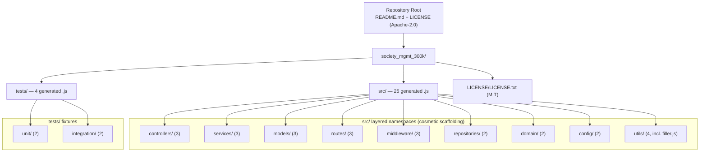

**Core Technical Approach**

The corpus is produced by **deterministic code generation**, not authored application development. A single arithmetic template — `let r=0; r+=x*1; r+=x*2; r+=x*3; if(r%2===0){r+=10}; return r;` — is replicated into numbered functions (`mod_<n>_<k>(x)`), grouped into per-file modules (typically 1,200 functions per file), and distributed across folders whose names are borrowed from conventional layered-backend architecture. Each file is prefixed with a `// mod_<n> - society module` marker and an unused `const store = []`. To reach an exact 300,000-line total, the generation is balanced across 27 files of 10,802 lines and one 6,347-line file (`src/middleware/file_27.js`), then topped off with `src/utils/filler.js`, whose 1,999 lines are pure `// filler N` comments. The net effect is maximum structural regularity and volume with zero behavioral surface.

### 1.2.3 Success Criteria

The repository does not state objectives or performance targets, so the criteria below are expressed as the **verifiable structural goals the artifact demonstrably satisfies**, measured directly from the files. They are structural properties, not operational service levels.

**Measurable Objectives and Key Metrics**

| Verifiable Metric | Design Intent (inferred) | Observed Value |
| --- | --- | --- |
| Total lines of JavaScript | Exact, predetermined size | 300,000 (exact) |
| Source files | Fixed corpus breadth | 29 `.js` files (25 `src`, 4 `tests`) |
| Generated helper functions | High, uniform symbol density | 33,105 |
| Distinct source-line shapes | Maximal uniformity / determinism | 9 |
| External dependencies | Fully self-contained | 0 |
| Runtime entry points / executable wiring | Static-only artifact | 0 |
| License coverage | Redistribution-clean | Apache-2.0 + MIT |

**Critical Success Factors**

The factors that make the corpus fit for its inferred purpose are: **determinism** (identical, reproducible function bodies), **exact sizing** (the 300,000-line total assembled deliberately from fixed-size files plus `filler.js`), **self-containment** (no dependencies, network, or build required to analyze it), and **structural regularity** (a predictable layered layout with consistent naming such as `file_<n>.js` and `mod_<n>_<k>`).

**Key Performance Indicators (KPIs)**

The repository defines **no operational, runtime, or business KPIs** (there are no SLAs, latency/throughput targets, uptime goals, or usage metrics anywhere in the tree, and nothing executes to produce them). The meaningful indicators are therefore the static-analysis metrics in the table above — line count, file/function counts, uniqueness ratio, dependency count, and license coverage — each of which can be recomputed deterministically from the source at any time.


## 1.3 Scope

This section delimits what the `society_mgmt_300k/` corpus actually is and does versus what its folder names might otherwise imply. Because the artifact is a synthetic code fixture rather than an application, "features" and "workflows" are expressed in terms of the corpus's static structure and the consumer-side activities it supports.

### 1.3.1 In-Scope

**Core Features and Functionalities**

The in-scope elements are the generated source assets themselves and the properties that make them useful as an analysis fixture.

| In-Scope Element | What It Covers (as observed) |
| --- | --- |
| Generated source modules | 25 `src/` `.js` files, each typically defining ~1,200 `mod_<n>_<k>(x)` helpers |
| Layered directory taxonomy | Nine `src/` namespaces: `controllers`, `services`, `models`, `routes`, `middleware`, `repositories`, `domain`, `config`, `utils` |
| Test-labeled fixtures | `tests/unit/` (2 files) and `tests/integration/` (2 files), same generated pattern |
| Exact-size padding | `src/utils/filler.js` (1,999 `// filler N` lines) that pads the corpus to exactly 300,000 lines |
| Licensing artifacts | Root `LICENSE` (Apache-2.0) and `society_mgmt_300k/LICENSE/LICENSE.txt` (MIT) |

The **must-have capabilities** are therefore: a large, layered body of syntactically valid JavaScript; a high density of uniquely named functions and files (`file_<n>.js`, `mod_<n>_<k>`); deterministic, repetitive content; and an exactly controlled line count. The **primary workflows** the corpus supports are consumer-side and static: reading and parsing the files, extracting and indexing the 33,105 function symbols, traversing the directory tree, searching across namespaces, and benchmarking tooling against a fixed 300,000-line target. The **essential integrations** required to use it are effectively none beyond a filesystem and (optionally) Git. The **key technical requirements** it embodies are plain function-syntax JavaScript (no ES modules, no `require`), no external dependencies, and no runtime — the corpus is consumed as data, not executed.

**Implementation Boundaries**

| Boundary Dimension | Coverage (as observed) |
| --- | --- |
| System boundary | Static `.js` source files only; no process, server, service, or runtime |
| User groups covered | Tooling/analysis consumers and repository maintainers (inferred); no application end users |
| Geographic / market coverage | None; the corpus is not built, deployed, or distributed to any market or region |
| Data domains included | None; no data model, records, or persistence — the only "inputs" are integers passed to pure functions (never actually supplied) |

### 1.3.2 Out-of-Scope

Despite directory names drawn from a layered "society management" backend, the following are explicitly **not** implemented and are out of scope for this artifact. Each exclusion is grounded in what the files do (and do not) contain.

| Out-of-Scope Capability | Basis (as observed) |
| --- | --- |
| Society/student-management business logic | Folder names only; every body is the identical `x*1+x*2+x*3` arithmetic |
| Data persistence / databases / data models | No model fields, schemas, or DB access; the `const store = []` is never used |
| HTTP/API serving, routing, and request handling | No server bootstrap, route handlers, or web framework anywhere |
| Authentication, authorization, validation, error handling | No such logic in `controllers/`, `middleware/`, or elsewhere |
| Configuration management | `config/` files contain generated helpers, not settings or values |
| Build, packaging, dependency management, CI/CD | No `package.json`, lockfiles, Dockerfile, or pipeline configuration |
| Runnable/assertive test suite | `tests/` files hold the same helpers — no assertions, mocks, or runner |

**Future Phase Considerations**

No roadmap, backlog, TODO markers, issue references, or planned-work notes exist anywhere in the repository. There are consequently no committed future phases to document; any expansion of the corpus (for example, additional generated files or a larger line budget) would be a generation-side decision not currently expressed in the source.

**Integration Points Not Covered**

Because the corpus has no dependencies or I/O, it integrates with **no** external systems: no databases, caches, message queues, identity providers, third-party APIs, or package registries are referenced or supported. The only touch points are the filesystem and the Git repository that hosts the files.

**Unsupported Use Cases**

The corpus cannot be used as a running application, imported as a library (nothing is exported), or invoked as a callable API (its functions are never referenced and there is no entry point). Its `tests/` directories cannot be executed as an automated test suite, since they contain no test framework, assertions, or runner. Any attempt to treat the artifact as a functioning "society management" or "student management" product is unsupported by its contents.


## 1.4 References

The following repository files and folders were examined as the evidence base for this Introduction. Paths are relative to the repository root; no external/web sources were used.

**Root-level artifacts**

- `README.md` — Established the repository landing name (`Student_Mngt_29-Jun-2026`) and confirmed it is placeholder/test content, not a product description.
- `LICENSE` — Root Apache License 2.0; the repository's top-level legal grant.

**Primary payload and directory structure**

- `society_mgmt_300k/` — The single substantive payload directory; confirmed children `src/`, `tests/`, `LICENSE/` and overall 300,000-line scale.
- `society_mgmt_300k/src/` — Layered source tree of 25 `.js` files across nine namespaces.
- `society_mgmt_300k/src/controllers/` — Files `file_0.js`, `file_11.js`, `file_22.js`; `file_0.js` was sampled to confirm the `// mod_<n> - society module` header, unused `const store = []`, and identical `mod_<n>_<k>(x)` arithmetic body (1,200 functions).
- `society_mgmt_300k/src/services/`, `society_mgmt_300k/src/models/`, `society_mgmt_300k/src/routes/`, `society_mgmt_300k/src/domain/`, `society_mgmt_300k/src/repositories/`, `society_mgmt_300k/src/config/` — Confirmed the same uniform generated helper pattern and per-namespace file counts (services 3, models 3, routes 3, domain 2, repositories 2, config 2).
- `society_mgmt_300k/src/middleware/` — Files `file_5.js`, `file_16.js`, `file_27.js`; established the size exception `file_27.js` (6,347 lines / 705 functions).
- `society_mgmt_300k/src/utils/` — Files `file_4.js`, `file_15.js`, `file_26.js`, and `filler.js`; `filler.js` (1,999 `// filler N` comment lines) established the exact-size padding to 300,000 lines.
- `society_mgmt_300k/tests/` — Test tree; confirmed `unit/` and `integration/` subtrees.
- `society_mgmt_300k/tests/unit/` — Files `file_9.js`, `file_20.js`; same helper pattern, no assertions/runner.
- `society_mgmt_300k/tests/integration/` — Files `file_10.js`, `file_21.js`; `file_21.js` sampled to confirm the identical generated pattern in test fixtures.
- `society_mgmt_300k/LICENSE/LICENSE.txt` — MIT License for the subproject; established the dual-licensing arrangement.

**Repository metadata**

- Git history and refs (repository `.git`) — Established the three-commit history (`Initial commit`, `Add files via upload`, `Update README.md`) and the date-stamped branch naming convention; corroborates the wholesale, generated origin of the corpus.


# 2. Product Requirements

## 2.1 Feature Catalog

The repository documented here is a **synthetic, deterministically generated JavaScript corpus** (`society_mgmt_300k/`) with no executable behavior, as established in Sections 1.1 Executive Summary, 1.2 System Overview, and 1.3 Scope. Consequently, the "features" catalogued below are **not application capabilities** — they are the discrete, independently verifiable *structural properties* the artifact was built to exhibit. Every feature is grounded directly in the source and introduces nothing beyond what the files contain. Consistent with Section 1.1, the repository declares no purpose, users, or commercial intent; therefore **Business Value** and **User Benefits** are expressed for the *inferred* consumer set identified in Section 1.1 (code-analysis/indexing tooling, platform/tooling engineers, and repository maintainers) and are labeled as inferred rather than asserted by any file.

### 2.1.1 Feature Inventory and Prioritization

The corpus decomposes into seven discrete, testable features. The directory names (`controllers`, `services`, `models`, etc.) are cosmetic labels only; no feature implies the runtime behavior those names suggest.

| Feature ID | Feature Name | Category | Priority |
| --- | --- | --- | --- |
| F-001 | Deterministic Arithmetic Helper Function | Code Generation — Computation | Critical |
| F-002 | Uniform Generated Module Structure | Code Generation — Module Convention | Critical |
| F-003 | Layered Directory Taxonomy & Test Namespaces | Repository Structure | High |
| F-004 | High-Density Uniform Symbol Generation | Code Generation — Symbol Density | Critical |
| F-005 | Exact Corpus Sizing & Filler Padding | Corpus Generation Control | High |
| F-006 | Self-Contained, Zero-Dependency, Non-Executable Design | Architecture — Isolation | High |
| F-007 | Dual Licensing & Legal Coverage | Legal / Compliance | Medium |

All seven features share a single lifecycle status and version baseline because the entire corpus was introduced wholesale in one upload commit and carries no roadmap, backlog, or TODO markers (Section 1.3):

| Feature ID | Status | Baseline Version | Source of Record |
| --- | --- | --- | --- |
| F-001 – F-007 | Completed (as-built) | 1.0 | Commit `Add files via upload` on branch `01-Jul-2026-Br1-Br1.1` |

**Assumptions and Constraints (apply to every feature):**

- **Cosmetic naming:** Folder and module names (`controllers/`, `services/`, `// mod_<n> - society module`, the `society_mgmt_300k` / `Student_Mngt` labels) are decorative and do not denote behavior (Sections 1.2, 1.3).
- **No runtime execution:** No function is ever invoked and there is no entry point. Requirements about the "computation" describe the code **as written**, not runtime behavior; the integer input `x` is theoretical and never actually supplied.
- **Inferred value:** Business-value and user-benefit statements target the inferred analysis-tooling consumer set; the repository states no users or purpose.
- **Exact, hard constraints:** The measured totals — 300,000 lines, 33,105 functions, 29 `.js` files — are exact and constitute binding constraints on the corpus, not approximate targets.

### 2.1.2 F-001: Deterministic Arithmetic Helper Function

**Feature Metadata**

| Attribute | Value |
| --- | --- |
| Unique ID | F-001 |
| Feature Name | Deterministic Arithmetic Helper Function |
| Feature Category | Code Generation — Computation |
| Priority Level | Critical |
| Status | Completed (as-built) |

**Description**

- **Overview:** F-001 is the atomic content unit of the corpus. Every one of the 33,105 functions is a single-parameter helper `mod_<n>_<k>(x)` whose body is byte-identical apart from its name: it initializes `let r=0`, adds `x*1`, `x*2`, and `x*3` (summing to `6x`), adds `10` when `r` is even, and returns `r`. Because `6x` is always even for integer `x`, the parity branch always executes and the function returns `6x + 10` for any integer input (verified: `x=1 → 16`, `x=2 → 22`, `x=10 → 70`, `x=-4 → -14`).
- **Business Value (inferred):** Provides a fully deterministic, reproducible computational body so any parser, indexer, or benchmark obtains identical, predictable results across the entire corpus.
- **User Benefits (inferred):** Analysis tooling can validate expression parsing, control-flow extraction, and known-answer evaluation against a single canonical body.
- **Technical Context:** Plain ES5-style function declarations — synchronous, pure, and side-effect-free. There are no loops, recursion, or calls to other functions, and the module-scoped `const store = []` (see F-002) is never read or written.

**Dependencies**

| Dependency Type | Detail |
| --- | --- |
| Prerequisite Features | None — F-001 is the atomic unit that other features compose |
| System Dependencies | None at runtime; a JavaScript parser/AST tool is needed to analyze the syntax |
| External Dependencies | None (no libraries, no imports) |
| Integration Requirements | None — functions are never called and nothing is exported |

### 2.1.3 F-002: Uniform Generated Module Structure

**Feature Metadata**

| Attribute | Value |
| --- | --- |
| Unique ID | F-002 |
| Feature Name | Uniform Generated Module Structure |
| Feature Category | Code Generation — Module Convention |
| Priority Level | Critical |
| Status | Completed (as-built) |

**Description**

- **Overview:** Each of the 28 numbered `.js` modules (`mod_0` … `mod_27`) follows an identical three-part convention: (1) a header comment `// mod_<n> - society module`; (2) an unused module-scoped `const store = [];`; and (3) a contiguous family of `mod_<n>_<k>` function declarations (F-001 bodies).
- **Business Value (inferred):** A predictable per-file skeleton lets tooling assume a stable module shape for every file in the corpus.
- **User Benefits (inferred):** Comment handling, module-scope binding, and function-declaration parsing can be validated uniformly across all files.
- **Technical Context:** All bindings are module-scoped and never exported. The `// ... society module` header is a generated constant applied uniformly regardless of folder — a `controllers/` file, a `config/` file, and a `tests/integration/` file all carry the same marker.

**Dependencies**

| Dependency Type | Detail |
| --- | --- |
| Prerequisite Features | F-001 (the function bodies each module packages) |
| System Dependencies | JavaScript parser |
| External Dependencies | None |
| Integration Requirements | None — the `store` binding is inert; nothing is imported or exported |

### 2.1.4 F-003: Layered Directory Taxonomy & Test Namespaces

**Feature Metadata**

| Attribute | Value |
| --- | --- |
| Unique ID | F-003 |
| Feature Name | Layered Directory Taxonomy & Test Namespaces |
| Feature Category | Repository Structure |
| Priority Level | High |
| Status | Completed (as-built) |

**Description**

- **Overview:** The corpus organizes its 29 `.js` files into a conventional layered-backend taxonomy: nine `src/` namespaces — `controllers`, `services`, `models`, `routes`, `middleware`, `repositories`, `domain`, `config`, `utils` — plus a `tests/` tree split into `unit/` and `integration/`. File counts per namespace are fixed: controllers 3, services 3, models 3, routes 3, middleware 3, repositories 2, domain 2, config 2, utils 4 (three numbered files + `filler.js`); `tests/unit` 2 and `tests/integration` 2.
- **Business Value (inferred):** Supplies a realistic, multi-namespace directory tree for exercising traversal, path handling, and namespace-aware search.
- **User Benefits (inferred):** Tooling can be tested against a canonical folder layout with distinct source and test domains.
- **Technical Context:** Names are cosmetic only — content is the same generated code in every folder (Section 1.2). No folder implements the behavior its name implies; `tests/integration/file_10.js` carries the same `// mod_10 - society module` header as any `src/` file.

**Dependencies**

| Dependency Type | Detail |
| --- | --- |
| Prerequisite Features | F-002 (the modules placed into the taxonomy) |
| System Dependencies | A filesystem to hold the directory tree |
| External Dependencies | None |
| Integration Requirements | None |

### 2.1.5 F-004: High-Density Uniform Symbol Generation

**Feature Metadata**

| Attribute | Value |
| --- | --- |
| Unique ID | F-004 |
| Feature Name | High-Density Uniform Symbol Generation |
| Feature Category | Code Generation — Symbol Density |
| Priority Level | Critical |
| Status | Completed (as-built) |

**Description**

- **Overview:** The corpus exposes exactly **33,105 uniquely named functions** using the scheme `mod_<n>_<k>` (`n` = module 0–27; `k` = 0-based contiguous index). Twenty-seven files define exactly 1,200 functions each; `src/middleware/file_27.js` defines 705. Symbols are globally unique because the module number `n` differs per file.
- **Business Value (inferred):** A large, uniformly named symbol population for validating symbol-table construction, indexing completeness, and search/benchmark tooling at scale.
- **User Benefits (inferred):** Predictable names and counts make it trivial to assert extraction completeness (e.g., "expect 1,200 symbols in this file").
- **Technical Context:** All symbols are top-level function declarations in module scope; none are exported, referenced, or invoked.

**Dependencies**

| Dependency Type | Detail |
| --- | --- |
| Prerequisite Features | F-001 (function bodies) and F-002 (module packaging) |
| System Dependencies | JavaScript parser / symbol indexer |
| External Dependencies | None |
| Integration Requirements | None |

### 2.1.6 F-005: Exact Corpus Sizing & Filler Padding

**Feature Metadata**

| Attribute | Value |
| --- | --- |
| Unique ID | F-005 |
| Feature Name | Exact Corpus Sizing & Filler Padding |
| Feature Category | Corpus Generation Control |
| Priority Level | High |
| Status | Completed (as-built) |

**Description**

- **Overview:** The corpus totals **exactly 300,000 lines** of JavaScript. This is assembled from 27 files of 10,802 lines and one file (`src/middleware/file_27.js`) of 6,347 lines — 298,001 lines across the 28 numbered files — then topped up by `src/utils/filler.js`, which contributes 1,999 pure-comment lines (`// filler 298001` … `// filler 299999`) and no executable code.
- **Business Value (inferred):** A precise, controlled line budget for reproducible scale benchmarks; the `300k` in the folder name `society_mgmt_300k` reflects this target.
- **User Benefits (inferred):** Consumers can assert an exact corpus size, and the dedicated padding file isolates size control from code content.
- **Technical Context:** `filler.js` is non-executable placeholder text; the size exception (`file_27.js` at 705 functions) exists specifically to land the total on exactly 300,000.

**Dependencies**

| Dependency Type | Detail |
| --- | --- |
| Prerequisite Features | F-002 and F-004 (the sized modules); F-003 (filler placed in `utils/`) |
| System Dependencies | Filesystem and line-counting tooling |
| External Dependencies | None |
| Integration Requirements | None |

### 2.1.7 F-006: Self-Contained, Zero-Dependency, Non-Executable Design

**Feature Metadata**

| Attribute | Value |
| --- | --- |
| Unique ID | F-006 |
| Feature Name | Self-Contained, Zero-Dependency, Non-Executable Design |
| Feature Category | Architecture — Isolation |
| Priority Level | High |
| Status | Completed (as-built) |

**Description**

- **Overview:** The corpus is fully self-contained. Across all 29 `.js` files there are **zero** `import`/`require`/`export`/`module.exports` statements, no framework calls, no `async`/`class` constructs, no network/filesystem/`console` I/O, no build or package manifests, and no runtime entry point. The artifact is consumed as data (static source), never executed.
- **Business Value (inferred):** Can be analyzed with no installation, credentials, or connectivity, and presents zero supply-chain surface.
- **User Benefits (inferred):** A drop-in static fixture with nothing to bootstrap or resolve.
- **Technical Context:** This is a cross-cutting property verified across the whole tree; its only interface to the outside world is the filesystem and Git (Section 1.2).

**Dependencies**

| Dependency Type | Detail |
| --- | --- |
| Prerequisite Features | None — a cross-cutting constraint satisfied by all files |
| System Dependencies | None beyond a filesystem to hold the files |
| External Dependencies | None (self-containment is the feature) |
| Integration Requirements | None — no I/O or integration surface exists |

### 2.1.8 F-007: Dual Licensing & Legal Coverage

**Feature Metadata**

| Attribute | Value |
| --- | --- |
| Unique ID | F-007 |
| Feature Name | Dual Licensing & Legal Coverage |
| Feature Category | Legal / Compliance |
| Priority Level | Medium |
| Status | Completed (as-built) |

**Description**

- **Overview:** The repository carries two license artifacts: a **full Apache License 2.0** at the root (`LICENSE`, 201 lines) and an **abbreviated MIT notice** at `society_mgmt_300k/LICENSE/LICENSE.txt` (5 lines: the title, `Copyright (c) 2026`, and a truncated `Permission is hereby granted...` line).
- **Business Value (inferred):** Permissive dual licensing keeps the corpus redistribution-clean and friendly to automated license scanning / SBOM workflows.
- **User Benefits (inferred):** A clear legal grant for consumers and downstream tooling.
- **Technical Context:** The MIT text is a placeholder/abbreviated stub rather than the full canonical MIT license, while the Apache text is complete. No SPDX headers appear in any source file.

**Dependencies**

| Dependency Type | Detail |
| --- | --- |
| Prerequisite Features | None — an independent legal artifact set |
| System Dependencies | Filesystem; license scanners (optional) |
| External Dependencies | None |
| Integration Requirements | None |

## 2.2 Functional Requirements

Because the corpus never executes (Section 1.3 Scope), the requirements below are expressed as **verifiable properties of the source**. Each requirement uses the ID format `F-XXX-RQ-YYY`, states an acceptance criterion as a concrete, repeatable *static* check, and carries a priority (Must-/Should-/Could-Have) and complexity (High/Medium/Low). In the **Technical Specifications** tables, *Input Parameters* denotes the literal function input for the computational feature (F-001) and the artifact-under-inspection for the structural features; *Output/Response* denotes the expected measurable result; and *Data Requirements* is "None (no persistence)" throughout, because no function stores or reads data (the `const store` is inert). Runtime *Performance Criteria* do not exist for a non-executing corpus, so the applicable dimension — noted per feature — is deterministic, single-pass static verifiability. **Validation Rules** are presented at feature level and separate Business Rules, Data Validation, Security, and Compliance dimensions.

### 2.2.1 F-001 — Deterministic Arithmetic Helper Function

**Requirement Details**

| Requirement ID | Description | Priority | Complexity |
| --- | --- | --- | --- |
| F-001-RQ-001 | Each helper accumulates `r+=x*1`, `r+=x*2`, `r+=x*3` (summing to 6·x) after `let r=0` | Must-Have | Low |
| F-001-RQ-002 | The parity branch `if(r%2===0){r+=10}` executes, then `return r` (⇒ 6·x+10 for integer x) | Must-Have | Low |
| F-001-RQ-003 | Each helper is pure, synchronous, single-parameter, and side-effect-free | Must-Have | Low |

**Acceptance Criteria**

| Requirement ID | Acceptance Criteria (repeatable static check) |
| --- | --- |
| F-001-RQ-001 | Every function body contains, in order, `let r=0;`, `r+=x*1;`, `r+=x*2;`, `r+=x*3;` |
| F-001-RQ-002 | Every body contains `if(r%2===0){r+=10}` then `return r;`; evaluating any helper on integers yields 6·x+10 (checked 1→16, 2→22, 10→70, −4→−14) |
| F-001-RQ-003 | Each declares exactly one parameter `x`; no `store` access, no I/O, no calls to other functions, no `async`/`await` |

**Technical Specifications**

| Requirement ID | Input Parameters | Output / Response | Data Requirements |
| --- | --- | --- | --- |
| F-001-RQ-001 | Numeric `x` (single argument) | Accumulator `r` = 6·x before the branch | None (no persistence) |
| F-001-RQ-002 | Numeric `x` | Number 6·x+10 for integer `x` | None |
| F-001-RQ-003 | Numeric `x` | Number; no external effect | None (`store` inert) |

*Performance Criteria:* No runtime SLA (never executed). Each body is fixed-size (eight statements), giving O(1) parse/evaluate cost and byte-identical determinism across all 33,105 instances.

**Validation Rules**

| Dimension | Rule |
| --- | --- |
| Business Rules | Every generated function must implement the identical template; no variant bodies are permitted |
| Data Validation | None present — `x` is never range-checked or type-guarded (no input is ever supplied) |
| Security Requirements | None — no I/O, secrets, or external surface; a helper cannot affect system state |
| Compliance Requirements | Not applicable at the function level (licensing is covered by F-007) |

### 2.2.2 F-002 — Uniform Generated Module Structure

**Requirement Details**

| Requirement ID | Description | Priority | Complexity |
| --- | --- | --- | --- |
| F-002-RQ-001 | Each numbered module opens with the header comment `// mod_<n> - society module` | Must-Have | Low |
| F-002-RQ-002 | Each numbered module declares a module-scoped, unused `const store = [];` | Must-Have | Low |
| F-002-RQ-003 | Each module defines a contiguous `mod_<n>_<k>` family separated by single blank lines | Must-Have | Medium |

**Acceptance Criteria**

| Requirement ID | Acceptance Criteria (repeatable static check) |
| --- | --- |
| F-002-RQ-001 | Line 1 of all 28 numbered files matches `// mod_<n> - society module`; the 28 headers are `mod_0` … `mod_27` |
| F-002-RQ-002 | Line 2 of each numbered file is `const store = [];`; `store` appears nowhere else (never read or written) |
| F-002-RQ-003 | Function indices `k` run 0 … (count−1) with no gaps; one blank line separates consecutive functions |

**Technical Specifications**

| Requirement ID | Input Parameters | Output / Response | Data Requirements |
| --- | --- | --- | --- |
| F-002-RQ-001 | A numbered `.js` file | Presence of the exact header on line 1 | None |
| F-002-RQ-002 | A numbered `.js` file | Presence of `const store = [];` on line 2 | None (binding is inert) |
| F-002-RQ-003 | A numbered `.js` file | Contiguous, blank-line-separated `mod_<n>_<k>` set | None |

*Performance Criteria:* No runtime SLA. Per-file structure is fixed (two header lines + `k` uniform function blocks), enabling linear, deterministic per-file parsing.

**Validation Rules**

| Dimension | Rule |
| --- | --- |
| Business Rules | Header marker, `store` declaration, and function family must appear in that fixed order in every numbered module; `filler.js` is exempt (padding only) |
| Data Validation | None — `store` is never populated or validated |
| Security Requirements | None — module scope is closed; no exports expose the bindings |
| Compliance Requirements | Not applicable |

### 2.2.3 F-003 — Layered Directory Taxonomy & Test Namespaces

**Requirement Details**

| Requirement ID | Description | Priority | Complexity |
| --- | --- | --- | --- |
| F-003-RQ-001 | `src/` exposes nine named namespaces with fixed per-namespace file counts | Must-Have | Low |
| F-003-RQ-002 | `tests/` splits into `unit/` (2 files) and `integration/` (2 files), same generated pattern | Should-Have | Low |

**Acceptance Criteria**

| Requirement ID | Acceptance Criteria (repeatable static check) |
| --- | --- |
| F-003-RQ-001 | Directories exist with counts: controllers 3, services 3, models 3, routes 3, middleware 3, repositories 2, domain 2, config 2, utils 4 (incl. `filler.js`) — 25 `src/` `.js` total |
| F-003-RQ-002 | `tests/unit` = {`file_9.js`, `file_20.js`}; `tests/integration` = {`file_10.js`, `file_21.js`}; no test framework, assertion, mock, or runner present |

**Technical Specifications**

| Requirement ID | Input Parameters | Output / Response | Data Requirements |
| --- | --- | --- | --- |
| F-003-RQ-001 | `society_mgmt_300k/src/` tree | Nine namespaces with the specified counts | None |
| F-003-RQ-002 | `society_mgmt_300k/tests/` tree | Two subtrees (`unit`, `integration`) of 2 files each | None |

*Performance Criteria:* No runtime SLA. Taxonomy is a shallow, fixed tree traversable in a single directory walk.

**Validation Rules**

| Dimension | Rule |
| --- | --- |
| Business Rules | Namespace names and counts are fixed; folder names are cosmetic and must not be interpreted as behavioral layers |
| Data Validation | None — directories carry no configuration or data payloads |
| Security Requirements | None — the tree contains only static `.js` text files |
| Compliance Requirements | Not applicable (the corpus `LICENSE/` folder is covered by F-007) |

### 2.2.4 F-004 — High-Density Uniform Symbol Generation

**Requirement Details**

| Requirement ID | Description | Priority | Complexity |
| --- | --- | --- | --- |
| F-004-RQ-001 | The corpus defines exactly 33,105 top-level functions | Must-Have | Medium |
| F-004-RQ-002 | Function names follow `mod_<n>_<k>` (n ∈ 0…27; k contiguous from 0) and are globally unique | Must-Have | Low |
| F-004-RQ-003 | Per-file function count is 1,200, except `src/middleware/file_27.js` = 705 | Must-Have | Low |

**Acceptance Criteria**

| Requirement ID | Acceptance Criteria (repeatable static check) |
| --- | --- |
| F-004-RQ-001 | Count of `^function ` declarations summed across all 29 `.js` files equals 33,105 |
| F-004-RQ-002 | Every function name matches `^mod_\d+_\d+$`; no name repeats across the corpus |
| F-004-RQ-003 | 27 files return a count of 1,200; `file_27.js` returns 705 (27×1,200 + 705 = 33,105) |

**Technical Specifications**

| Requirement ID | Input Parameters | Output / Response | Data Requirements |
| --- | --- | --- | --- |
| F-004-RQ-001 | All 29 `.js` files | Total symbol count = 33,105 | None |
| F-004-RQ-002 | Function declarations | Unique `mod_<n>_<k>` identifier set | None |
| F-004-RQ-003 | Each numbered file | 1,200 (or 705 for `file_27.js`) | None |

*Performance Criteria:* No runtime SLA. Symbol density is fixed; indexing cost is linear in the 33,105 declarations.

**Validation Rules**

| Dimension | Rule |
| --- | --- |
| Business Rules | The `mod_<n>_<k>` scheme and 33,105 total are exact; the single 705-function exception (`file_27.js`) is intentional to meet the size target (F-005) |
| Data Validation | None — symbols carry no data attributes |
| Security Requirements | None — symbols are never exported or invoked |
| Compliance Requirements | Not applicable |

### 2.2.5 F-005 — Exact Corpus Sizing & Filler Padding

**Requirement Details**

| Requirement ID | Description | Priority | Complexity |
| --- | --- | --- | --- |
| F-005-RQ-001 | Total JavaScript across the corpus is exactly 300,000 lines | Must-Have | Medium |
| F-005-RQ-002 | `src/utils/filler.js` provides 1,999 `// filler N` comment lines and no executable code | Must-Have | Low |
| F-005-RQ-003 | 27 files are 10,802 lines each; `src/middleware/file_27.js` is 6,347 lines | Should-Have | Low |

**Acceptance Criteria**

| Requirement ID | Acceptance Criteria (repeatable static check) |
| --- | --- |
| F-005-RQ-001 | `wc -l` summed over all `.js` files equals exactly 300,000 |
| F-005-RQ-002 | `filler.js` has 1,999 lines; every line matches `// filler <N>` for N = 298001…299999; zero executable statements |
| F-005-RQ-003 | Line counts: 27 files = 10,802, `file_27.js` = 6,347 (28 numbered files sum to 298,001; +1,999 filler = 300,000) |

**Technical Specifications**

| Requirement ID | Input Parameters | Output / Response | Data Requirements |
| --- | --- | --- | --- |
| F-005-RQ-001 | All 29 `.js` files | Aggregate line count = 300,000 | None |
| F-005-RQ-002 | `src/utils/filler.js` | 1,999 comment lines, 0 code lines | None |
| F-005-RQ-003 | Each numbered file | Per-file line counts as specified | None |

*Performance Criteria:* No runtime SLA. Sizing is verified by a single line-count pass over the tree.

**Validation Rules**

| Dimension | Rule |
| --- | --- |
| Business Rules | The 300,000-line total is an exact constraint; `filler.js` absorbs the remainder after code files and must remain non-executable |
| Data Validation | None — filler lines are inert comments |
| Security Requirements | None — no executable content in the padding |
| Compliance Requirements | Not applicable |

### 2.2.6 F-006 — Self-Contained, Zero-Dependency, Non-Executable Design

**Requirement Details**

| Requirement ID | Description | Priority | Complexity |
| --- | --- | --- | --- |
| F-006-RQ-001 | No module-system statements (`import`/`require`/`export`/`module.exports`) anywhere | Must-Have | Medium |
| F-006-RQ-002 | No framework calls, `async`/`class`, network/file/`console` I/O, or build/package manifests | Must-Have | Medium |
| F-006-RQ-003 | No runtime entry point; no function is ever invoked | Must-Have | Low |

**Acceptance Criteria**

| Requirement ID | Acceptance Criteria (repeatable static check) |
| --- | --- |
| F-006-RQ-001 | A grep for `import`/`require`/`export`/`module.exports` across all `.js` files returns 0 matches |
| F-006-RQ-002 | A grep for framework/`async`/`await`/`class`/`fs`/`http`/`console`/`process` returns 0; no `package.json`, lockfile, `Dockerfile`, `*.yml/*.yaml/*.json`, `Makefile`, or `tsconfig` exists |
| F-006-RQ-003 | No `main`/bootstrap; no call sites for any `mod_<n>_<k>`; `store` never referenced |

**Technical Specifications**

| Requirement ID | Input Parameters | Output / Response | Data Requirements |
| --- | --- | --- | --- |
| F-006-RQ-001 | All 29 `.js` files | Zero module-system statements | None |
| F-006-RQ-002 | Whole repository tree | Zero framework/IO/manifest artifacts | None |
| F-006-RQ-003 | All function declarations | Zero invocation sites | None |

*Performance Criteria:* No runtime SLA — the artifact does not run. The property enables analysis with no install, network, or build step (Section 1.2).

**Validation Rules**

| Dimension | Rule |
| --- | --- |
| Business Rules | The corpus must remain consumable as static data only; adding any import/export/IO/manifest would violate the feature |
| Data Validation | None — there is no input path to validate |
| Security Requirements | Self-containment is the security posture: zero dependencies ⇒ zero supply-chain surface; no secrets, network, or filesystem access |
| Compliance Requirements | Not applicable |

### 2.2.7 F-007 — Dual Licensing & Legal Coverage

**Requirement Details**

| Requirement ID | Description | Priority | Complexity |
| --- | --- | --- | --- |
| F-007-RQ-001 | The repository root carries a full Apache License 2.0 (`LICENSE`) | Must-Have | Low |
| F-007-RQ-002 | The payload carries an MIT notice at `society_mgmt_300k/LICENSE/LICENSE.txt` | Should-Have | Low |

**Acceptance Criteria**

| Requirement ID | Acceptance Criteria (repeatable static check) |
| --- | --- |
| F-007-RQ-001 | Root `LICENSE` opens with `Apache License` / `Version 2.0, January 2004` and is the full 201-line text |
| F-007-RQ-002 | `LICENSE.txt` exists; line 1 is `MIT License` and it contains `Copyright (c) 2026` (note: abbreviated 5-line stub ending `Permission is hereby granted...`) |

**Technical Specifications**

| Requirement ID | Input Parameters | Output / Response | Data Requirements |
| --- | --- | --- | --- |
| F-007-RQ-001 | Root `LICENSE` file | Full Apache-2.0 text (201 lines) | None |
| F-007-RQ-002 | `society_mgmt_300k/LICENSE/LICENSE.txt` | MIT header + copyright (5 lines) | None |

*Performance Criteria:* Not applicable — static legal artifacts, verified by file inspection.

**Validation Rules**

| Dimension | Rule |
| --- | --- |
| Business Rules | Both licenses are permissive; the root governs the repository and the corpus folder additionally declares MIT |
| Data Validation | Copyright year present (`2026`); MIT body text is a placeholder stub rather than the canonical full text |
| Security Requirements | None — text-only legal artifacts |
| Compliance Requirements | Apache-2.0 + MIT keep the corpus redistribution-clean and SBOM/scanner-friendly; strict full-text compliance would require completing the abbreviated MIT body; no SPDX headers exist in source files |

## 2.3 Feature Relationships

The features in this corpus have **no runtime relationships** — there are no calls, imports, exports, or data flows between any modules (feature F-006). Every relationship documented here is therefore **compositional or structural**, evident directly from how the generated source is assembled. No relationships beyond those observable in the files are asserted.

### 2.3.1 Feature Dependency & Composition Map

The map below reads as "is composed of / is realized by," not "invokes." The solid edges are build-time composition relationships; the dashed edges are the single cross-cutting constraint imposed by F-006. F-007 is intentionally isolated because the license artifacts have no linkage to the code features.

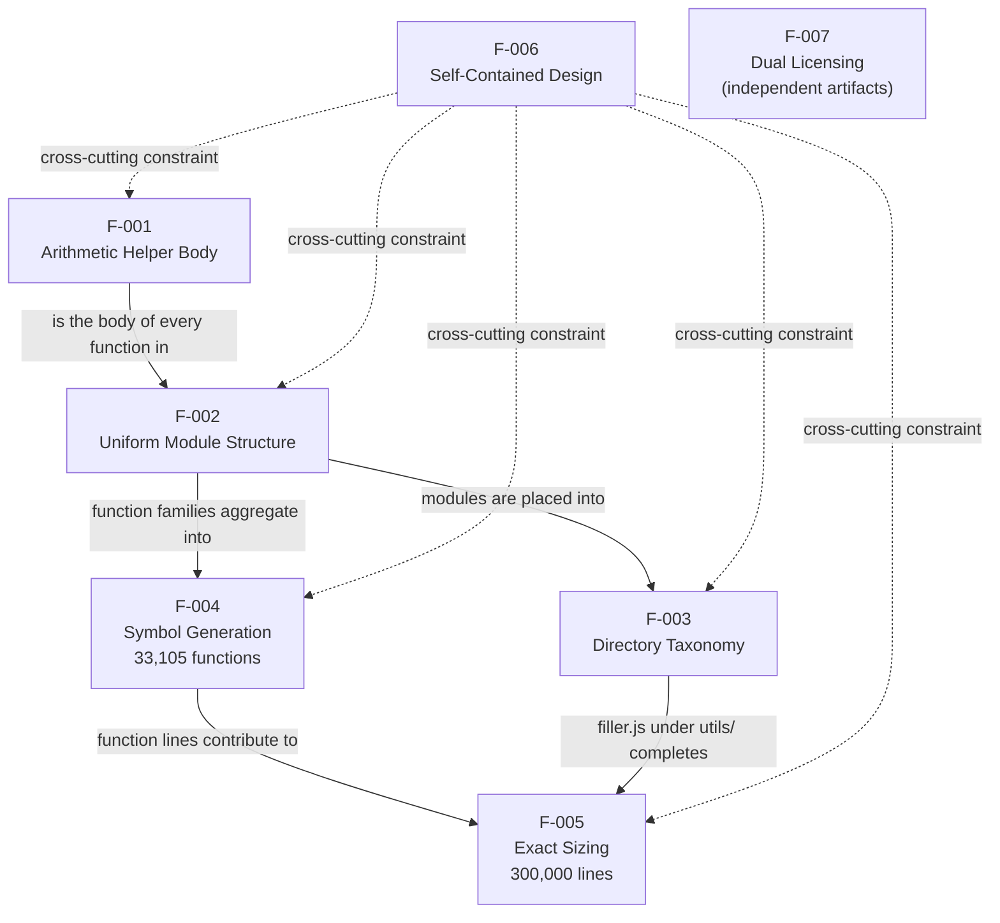

Each edge is grounded in a concrete, observable fact:

| Relationship | Type | Evidence in Source |
| --- | --- | --- |
| F-001 → F-002 | Composition (body-of) | Every `mod_<n>_<k>` body inside each module is the identical F-001 arithmetic template |
| F-002 → F-004 | Aggregation | The per-module function families constitute the corpus-wide 33,105-symbol population |
| F-002 → F-003 | Containment | Modules physically reside in the nine `src/` namespaces and the two `tests/` subtrees |
| F-003 + F-004 → F-005 | Composition (sizing) | 28 numbered files (298,001 lines) + `src/utils/filler.js` (1,999 lines) = exactly 300,000 |
| F-006 → F-001…F-005 | Cross-cutting constraint | Zero imports/exports/IO/manifests across all code and structure features |
| F-007 | Independent | Root Apache-2.0 and corpus MIT text with no reference from or to any code feature |

This composition diagram is the closest analogue to a "process flow" the corpus supports; there are **no runtime process flowcharts**, because nothing executes. For the physical directory layout that houses these relationships, see the layout diagram in Section 1.2.2 High-Level Description.

### 2.3.2 Integration Points

The corpus has **no internal or external runtime integration points**. There are no inter-module calls, no shared mutable state (the `const store = []` is never read or written), no network/database/message-queue endpoints, and no exported surface for a host program to bind to (Sections 1.2, 1.3). The only integration surfaces that exist are external to the code itself:

| Integration Surface | Nature | Basis |
| --- | --- | --- |
| Filesystem | Read-only consumption of `.js` text | Files are consumed as data, never executed (F-006) |
| Git repository | Version control of the corpus | Corpus delivered wholesale via commit `Add files via upload` |
| Static-analysis tooling (inferred) | Parses/indexes/searches the files | The uniform structure (F-002/F-004) is designed to be ingested by such tools |

### 2.3.3 Shared Components

Although there is no runtime linkage, several **generation-level components are shared verbatim across the corpus** and are the reason every file looks alike:

| Shared Component | Where It Recurs | Owning Feature |
| --- | --- | --- |
| Arithmetic body template (`let r=0; r+=x*1..3; parity +10; return r`) | All 33,105 functions | F-001 |
| `// mod_<n> - society module` header marker | Line 1 of all 28 numbered files | F-002 |
| Unused `const store = [];` binding | Line 2 of all 28 numbered files | F-002 |
| `file_<n>.js` / `mod_<n>_<k>` naming scheme | Every file and function corpus-wide | F-002 / F-004 |
| `filler.js` padding mechanism | Single file (`src/utils/`) controlling exact size | F-005 |

### 2.3.4 Common Services

The corpus contains **no common services and no service layer**. Despite the `src/services/` directory name, those files hold the same generated helpers as every other folder and expose nothing callable (Section 1.3 Out-of-Scope). The only element that is genuinely "common" to every file is the **deterministic generation process** that produced them — inferred from the byte-identical function bodies, the uniform per-file skeleton, and the consistent naming — but this is a build-time generator, not a runtime service, and it is not itself present in the repository (no generator script is committed).

## 2.4 Implementation Considerations

Because the artifact is generated and non-executing, "implementation considerations" concern **generation integrity and static-analysis consumption**, not runtime operations. The repository defines no operational SLAs, latency, throughput, or uptime targets (Section 1.2.3 Success Criteria); every performance and scalability note below is therefore framed around parsing/indexing the source and around re-generating the corpus while preserving its exact invariants. The five required dimensions are split across two tables to respect the four-column limit.

### 2.4.1 Technical Constraints, Performance & Scalability

| Feature | Technical Constraints | Performance & Scalability |
| --- | --- | --- |
| F-001 | Fixed eight-statement ES5 template; must remain pure, synchronous, single-parameter; the always-true parity branch must be preserved verbatim | O(1) to parse/evaluate per body; identical bodies compress and cache well; pattern regenerates trivially at any scale |
| F-002 | Fixed per-file order (header comment → unused `store` → function family); module scope only, no exports | Linear per-file parse; scales by adding more numbered modules without structural change |
| F-003 | Exact namespace names and per-folder file counts; folder names must stay cosmetic (no behavior) | Shallow tree traversable in a single directory walk; scaling means adding files/namespaces, currently fixed |
| F-004 | Exactly 33,105 globally-unique `mod_<n>_<k>` names; 1,200 per file with the single 705 exception | Symbol indexer must handle tens of thousands of declarations; linear in symbol count; horizontally extensible via more files |
| F-005 | Hard 300,000-line total; `file_27.js` (705 fns) and `filler.js` (1,999 lines) are load-bearing for the exact total | Single line-count pass over 300k lines; tools must tolerate 10,802-line files; line budget is a generation-side scaling lever |
| F-006 | No `import`/`export`/`require`/IO/framework/manifest may ever be introduced; must remain static and non-executable | No runtime cost (does not run); static ingestion needs no install/network/build; self-containment scales with zero dependency graph |
| F-007 | Two license files must persist (root Apache-2.0, corpus MIT); MIT body is an abbreviated stub | Negligible — a 201-line and a 5-line text file; unaffected by corpus scale |

### 2.4.2 Security Implications & Maintenance Requirements

| Feature | Security Implications | Maintenance Requirements |
| --- | --- | --- |
| F-001 | None — pure arithmetic, no I/O, secrets, or state; cannot affect a host | Any template change must be applied identically to all 33,105 functions |
| F-002 | None — closed module scope; nothing exported or reachable | Preserve the header/`store`/family convention in every numbered file; do not hand-edit individual modules |
| F-003 | None — static `.js` text only; no executable configuration | Keep namespace names and file counts in sync with any additions or removals |
| F-004 | Large symbol volume could stress a naive parser (size-based DoS on tooling) — the only security-adjacent note | Recompute the 33,105 total and per-file counts whenever files change; keep names globally unique |
| F-005 | None — filler lines are inert comments | Re-balance the 300,000-line invariant via `filler.js` after any code edit; maintain the `file_27.js` exception |
| F-006 | Zero-dependency design is the security posture: no supply-chain/CVE surface, no network, no filesystem access | Guard every edit against accidentally introducing imports, exports, or I/O |
| F-007 | None — text-only legal artifacts; permissive licenses reduce legal risk | Complete the abbreviated MIT body and keep copyright years current if strict full-text/SPDX compliance is required |

## 2.5 Traceability Matrix

This matrix traces every requirement to the source artifact that satisfies it and to a concrete, repeatable verification method. All seven features (F-001 – F-007) and all nineteen requirements are covered; because the corpus is deterministic and static, each verification is a single command or inspection that yields the same result on every run.

### 2.5.1 Requirement-to-Evidence Traceability Matrix

| Requirement ID | Feature | Source Evidence | Verification Method |
| --- | --- | --- | --- |
| F-001-RQ-001 | F-001 | Function bodies in all 28 numbered `.js` files | Grep the body sequence `r+=x*1; r+=x*2; r+=x*3` |
| F-001-RQ-002 | F-001 | Function bodies in all 28 numbered `.js` files | Grep `if(r%2===0){r+=10}` + return; known-answer eval (6·x+10) |
| F-001-RQ-003 | F-001 | Function signatures corpus-wide | Confirm single param `x`; grep shows no `store`/IO/`async` use |
| F-002-RQ-001 | F-002 | Line 1 of each numbered file | Match `// mod_<n> - society module`; enumerate `mod_0`…`mod_27` |
| F-002-RQ-002 | F-002 | Line 2 of each numbered file | Match `const store = [];`; grep confirms `store` unused |
| F-002-RQ-003 | F-002 | Function families per file | Verify contiguous `k` indices and blank-line separators |
| F-003-RQ-001 | F-003 | `society_mgmt_300k/src/` (nine namespaces) | Directory listing + per-folder file counts (25 total) |
| F-003-RQ-002 | F-003 | `society_mgmt_300k/tests/unit`, `.../integration` | Directory listing (2 + 2 files); confirm no test framework |
| F-004-RQ-001 | F-004 | All 29 `.js` files | Count `^function ` declarations = 33,105 |
| F-004-RQ-002 | F-004 | Function names corpus-wide | Regex `^mod_\d+_\d+$` + uniqueness check |
| F-004-RQ-003 | F-004 | Each numbered file | Per-file function count (1,200; 705 for `file_27.js`) |
| F-005-RQ-001 | F-005 | All 29 `.js` files | `wc -l` aggregate = 300,000 |
| F-005-RQ-002 | F-005 | `society_mgmt_300k/src/utils/filler.js` | Line count 1,999; all `// filler <N>`; 0 code lines |
| F-005-RQ-003 | F-005 | Each numbered file | Per-file `wc -l` (10,802; 6,347 for `file_27.js`) |
| F-006-RQ-001 | F-006 | All 29 `.js` files | Grep `import`/`require`/`export`/`module.exports` = 0 |
| F-006-RQ-002 | F-006 | Whole repository tree | Grep framework/IO = 0; `find` for manifests = 0 |
| F-006-RQ-003 | F-006 | All function declarations | Confirm no call sites and no entry point |
| F-007-RQ-001 | F-007 | Root `LICENSE` | Header `Apache License / Version 2.0`; 201 lines |
| F-007-RQ-002 | F-007 | `society_mgmt_300k/LICENSE/LICENSE.txt` | Header `MIT License` + `Copyright (c) 2026`; 5 lines |

### 2.5.2 Feature-to-Specification Cross-Reference

This table links each feature to its requirements and to the related sections elsewhere in this specification for navigation.

| Feature | Requirements | Related Specification Sections |
| --- | --- | --- |
| F-001 | F-001-RQ-001 … RQ-003 | 1.1; 1.2.2; 2.1.2; 2.2.1; 2.3.1; 2.4 |
| F-002 | F-002-RQ-001 … RQ-003 | 1.1; 1.2.2; 1.3.1; 2.1.3; 2.2.2; 2.3.3 |
| F-003 | F-003-RQ-001 … RQ-002 | 1.2.2; 1.3.1; 2.1.4; 2.2.3; 2.3.1 |
| F-004 | F-004-RQ-001 … RQ-003 | 1.1; 1.2.3; 2.1.5; 2.2.4; 2.3.1 |
| F-005 | F-005-RQ-001 … RQ-003 | 1.1; 1.2.2; 1.2.3; 2.1.6; 2.2.5 |
| F-006 | F-006-RQ-001 … RQ-003 | 1.2.1; 1.3.2; 2.1.7; 2.2.6; 2.3.2 |
| F-007 | F-007-RQ-001 … RQ-002 | 1.1; 1.2.2; 2.1.8; 2.2.7 |

## 2.6 References

The following repository files and folders were examined as the evidence base for this Product Requirements section. Paths are relative to the repository root. No external or web sources were used.

**Root-level artifacts**

- `README.md` — Established the landing name `Student_Mngt_29-Jun-2026` and confirmed placeholder/test content (informs the cosmetic-naming assumption in 2.1.1).
- `LICENSE` — Full Apache License 2.0 (201 lines); basis for F-007-RQ-001.

**Primary payload and source corpus**

- `society_mgmt_300k/` — Single substantive payload directory; children `src/`, `tests/`, `LICENSE/`.
- `society_mgmt_300k/src/` — Layered source tree of 25 `.js` files across nine namespaces; basis for F-003.
- `society_mgmt_300k/src/controllers/` — `file_0.js`, `file_11.js`, `file_22.js`; `file_0.js` sampled to confirm the `// mod_<n> - society module` header, unused `const store = []`, and the identical arithmetic body (basis for F-001, F-002).
- `society_mgmt_300k/src/services/`, `society_mgmt_300k/src/models/`, `society_mgmt_300k/src/routes/`, `society_mgmt_300k/src/domain/`, `society_mgmt_300k/src/repositories/`, `society_mgmt_300k/src/config/` — Confirmed the same uniform generated pattern and per-namespace file counts (services 3, models 3, routes 3, domain 2, repositories 2, config 2).
- `society_mgmt_300k/src/middleware/` — `file_5.js`, `file_16.js`, `file_27.js`; established the size/count exception `file_27.js` (6,347 lines / 705 functions) underpinning F-004-RQ-003 and F-005.
- `society_mgmt_300k/src/utils/` — `file_4.js`, `file_15.js`, `file_26.js`, and `filler.js`.
- `society_mgmt_300k/src/utils/filler.js` — 1,999 `// filler <N>` comment lines (298001–299999) with zero executable code; basis for F-005-RQ-002 (exact-size padding to 300,000 lines).

**Test fixtures**

- `society_mgmt_300k/tests/` — Test tree; `unit/` and `integration/` subtrees.
- `society_mgmt_300k/tests/unit/` — `file_9.js`, `file_20.js`; same helper pattern, no test framework/assertions/runner (basis for F-003-RQ-002).
- `society_mgmt_300k/tests/integration/` — `file_10.js`, `file_21.js`; `file_10.js` sampled and confirmed to carry the identical `// mod_10 - society module` header and body.

**License artifacts**

- `society_mgmt_300k/LICENSE/LICENSE.txt` — Abbreviated 5-line MIT notice (`MIT License`, `Copyright (c) 2026`, `Permission is hereby granted...`); basis for F-007-RQ-002 and the dual-licensing observations.

**Repository metadata**

- Git history and refs (repository `.git`) — Established the wholesale, generated origin (commit `Add files via upload`), the five-commit history, and the branch `01-Jul-2026-Br1-Br1.1`; basis for the Completed/as-built status and v1.0 baseline in 2.1.1.

**Corpus-wide verifications (aggregate, across all 29 `.js` files)**

- Symbol count (33,105 functions), per-file counts (1,200 / 705), and total line count (exactly 300,000) — basis for F-004 and F-005.
- Absence of any `import`/`export`/`require`/`module.exports`/framework/IO statement and of any build/package manifest anywhere in the tree — basis for F-006.
- Known-answer evaluation of the helper template (6·x+10 for integer `x`) — basis for F-001-RQ-002.

**Cross-referenced specification sections**

- 1.1 Executive Summary — Synthetic corpus framing, headline metrics, inferred stakeholders, and cosmetic naming.
- 1.2 System Overview (1.2.1 Project Context, 1.2.2 High-Level Description, 1.2.3 Success Criteria) — Component roles vs. actual content, the layout diagram, and structural (non-operational) success metrics.
- 1.3 Scope (1.3.1 In-Scope, 1.3.2 Out-of-Scope) — In-scope generated assets and the explicit exclusion of business logic, persistence, HTTP/API, auth, configuration, build, and runnable tests.
- 1.4 References — Introduction evidence base, consistent with the file inventory above.

# 3. Technology Stack

## 3.1 Programming Languages

This Technology Stack section documents only what is directly observable in the repository. As established in Sections 1.1 Executive Summary, 1.2 System Overview, and 1.3 Scope, the `society_mgmt_300k/` payload is a **synthetic, deterministically generated JavaScript corpus** with no manifests, configuration, or build files anywhere in the tree. Its language footprint is therefore extremely narrow and is derived entirely from the 29 `.js` files plus the repository's documentation and license artifacts. The "Default Technology Stack" supplied to this project (Python/Flask, React/TypeScript, native Swift/Kotlin/Objective-C, etc.) is treated strictly as a hint to validate; **none of those languages or platforms is present in this repository**, and only the technologies actually observed are documented below.

The overall technology footprint — what is present versus the layers that are verifiably absent — is summarized in the following diagram and elaborated across Sections 3.1–3.6.

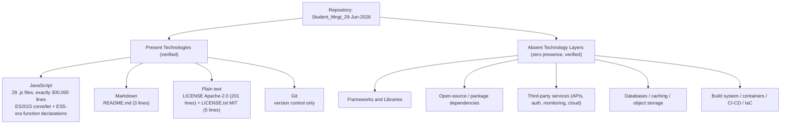

### 3.1.1 Language Inventory and Distribution

JavaScript is the **sole programming language** in the repository. The only other textual formats present are Markdown (the landing `README.md`) and plain text (the two license notices); these are documentation and legal artifacts, not programming or scripting languages, and contain no executable content.

| Language / Format | Role | Where Observed | Extent (as measured) |
| --- | --- | --- | --- |
| JavaScript (`.js`) | Sole programming language — every source and test file | `society_mgmt_300k/src/` (25 files) and `society_mgmt_300k/tests/` (4 files) | 29 files, exactly 300,000 lines total |
| Markdown (`.md`) | Repository landing/readme documentation (non-executable) | `README.md` (root) | 3 lines |
| Plain text | Legal/license notices (non-executable) | root `LICENSE` (Apache-2.0) and `society_mgmt_300k/LICENSE/LICENSE.txt` (MIT) | 201 lines + 5 lines |

Distribution across the nominal component layers is uniform: **every** `src/` namespace and **both** `tests/` namespaces contain exclusively JavaScript. As noted in Sections 1.2 and 2.1, the folder names (`controllers`, `services`, `models`, `routes`, `middleware`, `repositories`, `domain`, `config`, `utils`) are cosmetic labels only — there is no language or platform specialization per layer.

| Nominal Component (under `society_mgmt_300k/`) | Files | Language |
| --- | --- | --- |
| `src/controllers`, `src/services`, `src/models`, `src/routes` | 3 each (12) | JavaScript |
| `src/middleware` | 3 | JavaScript |
| `src/repositories`, `src/domain`, `src/config` | 2 each (6) | JavaScript |
| `src/utils` | 4 (incl. `filler.js`, a comment-only padding file) | JavaScript |
| `tests/unit`, `tests/integration` | 2 each (4) | JavaScript |

### 3.1.2 JavaScript Dialect and Language Features

The JavaScript used is a deliberately minimal, script-style dialect. A digit-normalized reduction of the entire 300,000-line body collapses to only **nine distinct source-line shapes** (Sections 1.1, 1.2), so the complete language-feature vocabulary of the corpus is directly enumerable and was verified by inspection across all files:

- **ES2015 block-scoped declarations are the only modern feature used**: `const` (a single unused `const store = [];` per code file — 28 occurrences) and `let` (one `let r = 0;` per function — 33,105 occurrences).
- **All remaining constructs are ES5-era**: traditional `function` declarations (33,105 of them), compound assignment (`+=`), multiplication (`*`), the modulo operator (`%`), strict equality (`===`, used 33,105 times with **zero** loose `==`), a single-branch `if` statement, and `return`.
- **No later or advanced JavaScript features appear anywhere**: verified absence of arrow functions (`=>`), `class`, `async`/`await`, `Promise`, template literals, destructuring, spread/rest, `for`/`while` loops, `try`/`catch`, the `new` operator, and regular-expression literals.
- **Non-modular**: there are **zero** `import`, `export`, `require`, or `module.exports` statements. The code is plain script-style JavaScript — neither ES Modules (ESM) nor CommonJS.
- **No platform APIs**: there are **zero** references to `process`, `console`, `window`, `document`, or any network/filesystem API, so the code carries no Node.js- or browser-specific coupling.

The canonical construct set is fully represented by the per-file header and a single helper body:

```javascript
const store = [];
function mod_0_0(x){ let r=0; r+=x*1; r+=x*2; r+=x*3; if(r%2===0){r+=10} return r; }
```

**Language version and its implications.** No language version is pinned anywhere in the repository — there is no `package.json` `"engines"` field, no `tsconfig.json`, no `.babelrc`, and no `.nvmrc`. The effective floor is therefore inferred from syntax rather than declared: because the corpus uses `const`/`let`, an **ES2015 (ECMAScript 6, 2015) or later** parser/engine is required to accept it, while every other construct remains within the ES5 statement and expression set. In practical terms this makes the corpus parseable by essentially any modern JavaScript/ECMAScript engine or AST tool without transpilation.

### 3.1.3 Selection Rationale and Constraints

The repository states no rationale for its language choice (there is no product documentation or design note anywhere in the tree), so the selection criteria below are **inferred from the artifact's form** and are consistent with the "code-analysis fixture" purpose established in Sections 1.1 and 1.3:

- **Universal parseability with zero configuration.** Plain, non-modular, function-syntax JavaScript can be read by virtually every JavaScript/ECMAScript parser, tokenizer, and AST/symbol-indexing tool without module resolution, transpilation, or dependency installation. This directly supports the self-contained, static-analysis role documented for feature F-006.
- **Determinism and uniformity.** A minimal construct vocabulary (nine line shapes) yields highly predictable, reproducible parse trees and token streams across all 33,105 functions — useful for validating and benchmarking tooling at scale (features F-001, F-004).
- **Engine-agnosticism.** The absence of Node.js- or browser-specific APIs keeps the corpus decoupled from any particular runtime, so it can be analyzed identically regardless of platform.

The language-level **constraints and dependencies** that follow from — and must be preserved for — this design are:

- **Plain function-syntax must be retained.** Per the maintenance/technical constraints recorded for F-006 in Section 2.4, no `import`, `export`, `require`, or I/O may be introduced; doing so would break the corpus's self-contained, non-executable property.
- **No TypeScript, JSX, or transpiled variants.** There are no `.ts`/`.tsx` files, no `tsconfig.json`, and no JSX — so, despite the "React with TypeScript" hint in the default stack, the corpus is untyped, uncompiled JavaScript only.
- **The sole consumption dependency is a JavaScript parser.** No runtime, package installation, build step, or network access is required to work with the language artifacts; a parser capable of ES2015 block-scoped declarations is sufficient.

## 3.2 Frameworks & Libraries

The repository uses **no application frameworks and no software libraries of any kind**. This is not an omission in the documentation but a verified, defining property of the artifact: as recorded for feature F-006 (Sections 2.1, 2.4) and summarized in Section 1.2, all 29 `.js` files contain zero `import`, `require`, `export`, or `module.exports` statements, zero framework calls, and no build/package manifest that could declare a framework or library dependency. Consequently there are no versions, no supporting libraries, and no compatibility matrices to report — every field the "Frameworks & Libraries" topic would normally populate resolves to "None / Not Applicable," and the justification for that state is provided in Section 3.2.3.

The table below records each framework/library category that was evaluated against the codebase and the corresponding finding.

| Category | Expected Evidence | Finding | Basis (as observed) |
| --- | --- | --- | --- |
| Web / backend framework (e.g., Express, Koa) | `require('express')`, route/middleware registration, server bootstrap | **None** | No imports/requires; `routes/`, `controllers/`, `middleware/` hold only generated arithmetic helpers |
| Frontend framework (e.g., React) | JSX, component/render calls, DOM APIs | **None** | No `.jsx`/`.tsx`, no `window`/`document`, no render calls |
| Test framework (e.g., Jest, Mocha) | assertions, `describe`/`it`, a runner config | **None** | `tests/` files repeat the same helper pattern; no assertions, mocks, or runner (Section 1.3) |
| Utility / general libraries (e.g., Lodash) | `require`/`import` of a package | **None** | No third-party symbols referenced anywhere |
| ORM / data-access library | model definitions, query builders, drivers | **None** | `models/`, `repositories/` contain only helpers; the `const store = []` is inert (Section 3.5) |
| Build/transpile tooling libraries (e.g., Babel, webpack) | config files, plugin imports | **None** | No `.babelrc`, bundler config, or manifest exists (Section 3.6) |

### 3.2.1 Application Frameworks

No application framework is present. The most notable point is that the directory taxonomy actively **implies** a layered web/backend framework — `src/routes/`, `src/controllers/`, `src/middleware/`, `src/services/`, and `src/repositories/` are conventional names associated with server frameworks such as Express or Koa — yet none of the behavior those names suggest exists. As established in feature F-003 and Section 1.3, the names are cosmetic: every file in those folders is the same generated module (a header comment, an unused `const store = []`, and a family of `mod_<n>_<k>(x)` arithmetic helpers). There is no server bootstrap, no route registration, no request/response handling, no middleware chain, and no HTTP or framework symbol anywhere in the tree. There is likewise no frontend framework — no React, no JSX, no component or DOM code — despite the "React with TypeScript" entry in the default stack hint.

### 3.2.2 Supporting Libraries

No supporting libraries are present. There are no third-party utility packages (such as Lodash, Axios, Moment, or similar), no logging or configuration libraries, no validation libraries, and no data-access/ORM libraries. This follows directly from the absence of any module or package system in the corpus: with zero `import`/`require` statements and no dependency manifest, there is no mechanism by which an external library could be referenced, and inspection confirms none is. The functions rely solely on built-in JavaScript arithmetic and control-flow constructs enumerated in Section 3.1.2.

### 3.2.3 Versioning, Compatibility, and Design Justification

**Versions and compatibility requirements.** Because no framework or library is used, there are no dependency versions to pin and no inter-component compatibility constraints to satisfy. The only versioning consideration for the corpus is the JavaScript language level itself — an ES2015-capable parser is required to accept the `const`/`let` syntax (Section 3.1.2) — and this is a property of the source syntax, not of any declared dependency. No `package.json`, lockfile, `"engines"` field, or `tsconfig.json` exists to record a version anywhere.

**Justification for the zero-framework design.** The absence of frameworks and libraries is the intended architectural characteristic of the artifact, not a gap. Per the analysis in Sections 1.1–1.3 and the F-006 constraints in Section 2.4, the corpus is designed to be a **self-contained, dependency-free, non-executable static fixture** whose value derives from being analyzable with no installation, resolution, build step, or network access. Introducing any framework or library would require imports/module wiring and a manifest, which would (a) break the "nine distinct line shapes"/deterministic uniformity that makes the corpus useful for tooling validation (features F-001, F-004), and (b) introduce a supply-chain surface that the design explicitly avoids (the F-006 security posture noted in Section 2.4). The zero-framework, zero-library state is therefore both the observed reality and the deliberate design choice.

## 3.3 Open Source Dependencies

The repository has **zero open-source or third-party package dependencies**. This was verified two independent ways: (1) there is no dependency-declaration mechanism anywhere in the tree — no `package.json`, no lockfile, and no `node_modules/` directory — and (2) the source itself references no external symbols, because all 29 `.js` files contain no `import`/`require` statements (Sections 3.1.2, 3.2, and feature F-006). There is therefore no dependency graph, no transitive closure, and no package registry involvement to document.

| Dependency Artifact / Signal | Purpose | Present? | Basis (as observed) |
| --- | --- | --- | --- |
| `package.json` | Declares direct dependencies and scripts | **No** | Not present at root or anywhere in the tree |
| `package-lock.json` / `yarn.lock` / `pnpm-lock.yaml` | Pins the resolved dependency tree | **No** | No lockfile of any kind exists |
| `node_modules/` | Installed dependency payload | **No** | Directory does not exist |
| Registry references (npm, GitHub Packages, etc.) | Source of installable packages | **No** | No registry URLs, scopes, or install metadata anywhere |
| Vendored/bundled third-party code | Inlined external code | **No** | Every file is generated first-party helper code (Sections 1.2, 2.1) |
| `import` / `require` of external packages | Runtime use of a dependency | **No** | Zero import/require statements across all files |

### 3.3.1 Package Dependencies, Registries, and Versions

There are no package dependencies (runtime, development, peer, or optional) and no package registries in use. Because no manifest or lockfile exists, there are also **no dependency version numbers to enumerate** — versioning applies only to declared packages, and none are declared. The corpus is consumed as raw source, so no `npm install`, `yarn`, `pnpm`, or equivalent resolution step is applicable, and there is nothing to fetch from any registry. This is consistent with the "essential integrations required to use it are effectively none beyond a filesystem and (optionally) Git" characterization in Section 1.3.

### 3.3.2 Open-Source Licensing of the Corpus Itself

The only open-source artifacts in the repository are the two **license texts that govern the corpus itself**, not any consumed dependency. These are documented in detail as feature F-007 (Section 2.1) and are summarized here for completeness of the technology-stack view:

| License Artifact | License | Extent | Notes (as observed) |
| --- | --- | --- | --- |
| Root `LICENSE` | Apache License 2.0 | 201 lines (full text) | Complete, canonical Apache-2.0 text; applies at the repository root |
| `society_mgmt_300k/LICENSE/LICENSE.txt` | MIT | 5 lines (abbreviated) | Title, `Copyright (c) 2026`, and a truncated `Permission is hereby granted...` line — an abbreviated/placeholder stub rather than the full MIT text |

Both licenses are permissive, which keeps the artifact redistribution-clean and friendly to automated license-scanning/SBOM workflows (Section 1.1). No source file carries an SPDX identifier header. It is important to distinguish these from dependency licenses: they express the terms under which *this* repository's content may be used, and there are no *inbound* open-source components whose licenses would need to be tracked.

### 3.3.3 Supply-Chain Security Implications

The zero-dependency design is, in effect, the corpus's supply-chain security posture (as noted for F-006 in Section 2.4): with no packages, lockfiles, or registries, there is **no supply-chain attack surface, no CVE exposure from third-party code, and no dependency-update or audit burden**. There is nothing to scan for vulnerable transitive packages, no risk of dependency confusion or typosquatting, and no need for tools such as `npm audit`. The only security-adjacent consideration recorded anywhere for the corpus is the sheer symbol volume (33,105 functions), which could stress a naive parser — a tooling-robustness concern rather than a dependency risk (Section 2.4, F-004).

## 3.4 Third-Party Services

The repository integrates with **no third-party or external services of any kind**. Section 1.2 establishes that the corpus is "fully self-contained and has no integration surface," and Section 1.3 confirms it "integrates with no external systems: no databases, caches, message queues, identity providers, third-party APIs, or package registries." This is corroborated at the code level: all 29 `.js` files perform no network or filesystem I/O, read no environment variables or configuration values, and reference no service SDK. The functions are pure arithmetic (feature F-001) and are never even invoked (Section 1.2). The `config/` directory, despite its name, contains only generated helper functions — it holds no endpoints, credentials, connection strings, or feature flags (feature F-003, Section 1.3).

| Service Category | Typical Evidence | Finding | Basis (as observed) |
| --- | --- | --- | --- |
| External APIs / integrations | HTTP clients, SDK imports, endpoint URLs | **None** | No network I/O, no `fetch`/`http`, no imports (Sections 1.2, 3.1.2) |
| Authentication / identity services | Auth0/OAuth/JWT libraries, token handling | **None** | No auth logic in `controllers/`/`middleware/` (Section 1.3) |
| Monitoring / observability | Telemetry SDKs, logging exporters | **None** | Zero `console.*` and no telemetry/logging calls anywhere |
| Cloud services | AWS/GCP/Azure SDKs, credentials, region config | **None** | No cloud SDK, no credentials, no environment reads |
| Messaging / queues | Broker clients, topic/queue config | **None** | No messaging clients or configuration present |

### 3.4.1 External APIs and Integrations

There are no external API integrations. The corpus contains no HTTP or network client code (no `fetch`, no `http`/`https`, no request library), no API endpoint URLs, and no service-client SDKs. Because there are no `import`/`require` statements (Section 3.1.2) and no I/O, there is no mechanism by which the code could call an external API, and none is present. The only "inputs" to the corpus are the integer parameters `x` that the helper functions declare but that are never actually supplied at runtime (Section 1.3).

### 3.4.2 Authentication and Authorization Services

There is no authentication or authorization anywhere in the repository. Despite the "Auth0" entry in the default stack hint and the presence of `controllers/` and `middleware/` folders (whose names commonly host auth logic in real applications), no identity provider, OAuth/OIDC flow, JWT handling, session management, API-key logic, or access-control check exists. Section 1.3 explicitly lists "Authentication, authorization, validation, error handling" as out-of-scope, grounded in the observation that those folders contain only the same generated arithmetic helpers.

### 3.4.3 Monitoring and Observability

No monitoring, observability, logging, tracing, metrics, or error-reporting service is integrated. The code emits no output at all: there are **zero** `console.*` calls, no logging library, and no telemetry/APM SDK (such as an OpenTelemetry, Sentry, or vendor agent). This is consistent with a non-executable static fixture — since nothing runs (Section 1.2), there is no runtime signal to observe, and the repository declares no operational KPIs, SLAs, or uptime targets to monitor (Section 1.2.3, Section 2.4).

### 3.4.4 Cloud Services

No cloud-platform services are used. There are no cloud SDKs or clients (no AWS, GCP, or Azure libraries — contrary to the "AWS" entry in the default stack hint), no cloud credentials or profiles, no region/endpoint configuration, and no environment-variable reads that a cloud client would require. The repository contains no infrastructure definitions of any kind (see Section 3.6 for the confirmed absence of Terraform, Docker, and CI/CD), so there is no provisioned or referenced cloud resource.

### 3.4.5 Integration Requirements

Because no external service exists, there are **no integration requirements, credentials, secrets, network configuration, or connectivity prerequisites** to satisfy in order to consume the corpus. As stated in Sections 1.2 and 1.3, the artifact's only touch points with the outside world are the **filesystem** (to read the `.js` files) and, optionally, **Git** (to obtain the repository). This complete lack of an integration surface is a deliberate property of the self-contained design (feature F-006) rather than an undocumented gap.

## 3.5 Databases & Storage

The repository employs **no database, no caching layer, and no storage service**. Section 1.3 lists "Data persistence / databases / data models" as explicitly out-of-scope, grounded in the observation that there are "no model fields, schemas, or DB access" and that "the `const store = []` is never used." The only durable persistence associated with the artifact is the storage of its own source files on the **filesystem** under **Git** version control — the corpus is consumed as static data, not backed by any datastore.

| Storage Concern | Typical Evidence | Finding | Basis (as observed) |
| --- | --- | --- | --- |
| Primary database | Driver/ORM, connection string, schema | **None** | No driver/ORM/connection anywhere; `models/`,`repositories/` are cosmetic (Section 1.3) |
| Secondary database | Additional datastore config | **None** | No datastore of any kind referenced |
| Caching layer | Redis/Memcached client, cache API | **None** | No cache client or in-memory cache logic |
| Object / file storage | S3/blob SDK, upload/download calls | **None** | No storage SDK; no file I/O |
| ORM / data-mapping | Entity/model definitions, migrations | **None** | No schemas, entities, or migration files |
| In-memory state | Used module/global collections | **Inert only** | `const store = []` is declared per file but never read or written |

### 3.5.1 Databases and Data Models

There is no primary or secondary database. No database driver, ORM, query builder, connection string, schema, entity definition, or migration file exists anywhere in the repository. This holds despite the "MongoDB" entry in the default stack hint and the presence of `src/models/` and `src/repositories/` directories — names that in a real application would host data models and data-access code. As documented for feature F-003 and in Sections 1.2/1.3, those folders contain only the uniform generated helper modules; they define no data domain, no records, and no persistence behavior. There is consequently no data model to document.

### 3.5.2 The Inert `store` Binding

The single storage-suggestive construct in the corpus is a module-scoped array declared at the top of each of the 28 code files:

```javascript
const store = [];
```

Despite its name, this binding is **completely inert**: it is declared exactly once per code file (28 occurrences total) and is **never read from or written to** anywhere — there are zero `store.push`, `store[...]`, or other references to it (Sections 1.2, 2.1). It carries no data, backs no in-memory cache or repository, and has no runtime effect. As recorded for feature F-002, it exists purely as a stable module-local fixture symbol for analysis tooling, not as a functioning data store.

### 3.5.3 Data Persistence, Caching, and Storage Services

**Persistence strategy.** The corpus implements no runtime data persistence. The only "persistence" in play is the storage of the repository's own files: the 29 `.js` files, `README.md`, and the two license texts are persisted on the **filesystem** and versioned in **Git** (see Section 3.6). No application data is created, stored, or retrieved because nothing executes (Section 1.2).

**Caching.** There is no caching solution — no Redis or Memcached client, no HTTP/response cache, and no in-application memoization. (The identical function bodies would compress and cache well *as text* for analysis tooling, per the Section 2.4 performance note, but that is a property of the source content, not an implemented caching layer.)

**Storage services.** There is no object, blob, or file-storage service (no S3-style SDK or bucket configuration) and no file upload/download logic. Consistent with Sections 1.2 and 1.3, the artifact has no data domains and requires no storage infrastructure to be consumed — a filesystem capable of holding the source tree is sufficient.

## 3.6 Development & Deployment

The development-and-deployment footprint is intentionally minimal. The **only tooling artifact in the entire repository is Git** version control; there is no build system, no containerization, no CI/CD pipeline, and no infrastructure-as-code. This was confirmed by scanning the whole tree: none of `package.json`, lockfiles, `Makefile`, bundler/transpiler configs, `Dockerfile`, `docker-compose.*`, `.github/workflows`, or `*.tf` files exist anywhere (consistent with the "Build, packaging, dependency management, CI/CD" out-of-scope entry in Section 1.3 and the F-006 constraints in Section 2.4). The artifact is not built or deployed in any conventional sense — it is consumed as static source, so its "deployment" is simply obtaining and reading the files.

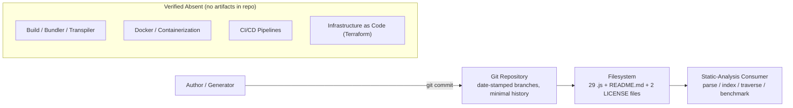

| Concern | Default-Stack Hint | Finding | Basis (as observed) |
| --- | --- | --- | --- |
| Version control | (implied) | **Git** | `.git` present; date-stamped branches; minimal commit history (Section 1.2) |
| Build system | — | **None** | No `Makefile`, bundler, transpiler, or npm scripts (no `package.json`) |
| Containerization | Docker | **None** | No `Dockerfile` or `docker-compose.*` anywhere |
| CI/CD | GitHub Actions | **None** | No `.github/workflows` or any pipeline configuration |
| Infrastructure as Code | Terraform | **None** | No `*.tf` or other IaC files |
| Deployment target | AWS | **None** | Not deployable; consumed as static data (Sections 1.2, 1.3) |

### 3.6.1 Development Tools and Version Control

**Git is the sole development tool** present. The repository is a Git working tree with a set of date-stamped branches — including `main`, `29-Jun-2026-Br1`, `01-Jul-2026-Br1`, `01-Jul-2026-Br1-Br1`, and `01-Jul-2026-Br1-Br1.1` (the checked-out branch) — that reflect a date-based branching convention rather than any migration from a prior system (Section 1.2). The commit history is minimal and linear: as documented in Section 1.2, it consists of only the `Initial commit`, `Add files via upload`, and `Update README.md` commits, indicating the corpus was introduced **wholesale in a single upload** (consistent with generated content) rather than evolved. Because all seven features were introduced in that one upload, their baseline is version 1.0 / "as-built" (Section 2.1). Beyond Git, there are no developer-experience tools of any kind: no linter or formatter configuration (no ESLint/Prettier/`.editorconfig`), no `.gitignore`-driven build hygiene for dependencies (none are needed), and no IDE/project metadata files.

### 3.6.2 Build System

There is **no build system**. No build orchestrator (`Makefile`, task runner), no JavaScript bundler (webpack, Rollup, esbuild, Vite), and no transpiler (Babel, `tsc`) is configured, and there are no npm scripts because there is no `package.json`. A build step is also **unnecessary** for this artifact: the source is plain, non-modular, dependency-free JavaScript (Sections 3.1–3.3), so there is nothing to compile, bundle, or resolve. The corpus is used directly in its source form by analysis tooling.

### 3.6.3 Containerization

There is **no containerization**. No `Dockerfile`, `.dockerignore`, `docker-compose.*`, or other container/orchestration manifest (e.g., Kubernetes YAML, Helm chart) exists anywhere in the tree — contrary to the "Docker" entry in the default stack hint. Because nothing executes and there is no runtime to package (Section 1.2), there is no container image to build or run.

### 3.6.4 CI/CD

There is **no continuous-integration or continuous-deployment pipeline**. No `.github/workflows/` directory and no CI configuration for any provider (GitHub Actions, GitLab CI, CircleCI, Jenkins, Travis, etc.) is present — contrary to the "GitHub Actions" entry in the default stack hint. There are no automated build, test, lint, or release jobs. This is consistent with the repository having no runnable test suite (the `tests/` directories contain the same generated helpers with no assertions or runner — Section 1.3) and nothing to build or deploy. Any regeneration of the corpus (for example, re-balancing the 300,000-line total or recomputing the 33,105-function count after an edit) is a generation-side activity described in Section 2.4, not an automated pipeline in this repository.

### 3.6.5 Infrastructure and Deployment Model

There is **no infrastructure-as-code and no deployment target**. No Terraform (`*.tf`), CloudFormation, Pulumi, or Ansible definitions exist, and no cloud platform is referenced (Section 3.4.4) — contrary to the "AWS/Terraform" entries in the default stack hint. The artifact is **not deployable**: it exposes no server, service, or executable entry point (Sections 1.2, 1.3), so there is no environment to provision or release into. The effective "deployment" and distribution model is source-level: cloning or downloading the Git repository and reading the `.js` files directly from the filesystem. This zero-infrastructure posture is the intended, self-contained design (feature F-006), and it means the corpus can be adopted with no installation, credentials, network access, or build/deploy machinery.

## 3.7 References

The following repository artifacts and specification sections were examined as evidence for Section 3. All technology-stack claims above are grounded in these sources; no external/web sources were required, as every determination was made by direct inspection of the repository.

**Repository files examined**

- `README.md` — Established the repository landing identity (H1 `Student_Mngt_29-Jun-2026`, 3 lines) and that it is placeholder/test content in Markdown; used in Section 3.1.
- `LICENSE` (repository root) — Confirmed the full Apache License 2.0 text (201 lines, plain text); used in Sections 3.1 and 3.3.
- `society_mgmt_300k/LICENSE/LICENSE.txt` — Confirmed the abbreviated 5-line MIT license stub (`Copyright (c) 2026`); used in Sections 3.1 and 3.3.
- `society_mgmt_300k/src/controllers/file_0.js` — Sampled to confirm the canonical file structure (header comment, `const store = []`, `mod_<n>_<k>(x)` helpers) and the exact JavaScript construct set; used in Sections 3.1, 3.2, 3.5.
- `society_mgmt_300k/src/middleware/file_27.js` — The 705-function / 6,347-line size exception; used in Sections 3.1 and 3.6.
- `society_mgmt_300k/src/utils/filler.js` — The comment-only padding file (1,999 `// filler N` lines); used in Sections 3.1 and 3.6.

**Repository folders examined**

- `society_mgmt_300k/` — Main payload directory; established the overall corpus scope.
- `society_mgmt_300k/src/` — Source tree containing the nine nominal namespaces (`controllers/`, `services/`, `models/`, `routes/`, `middleware/`, `repositories/`, `domain/`, `config/`, `utils/`), 25 `.js` files; used across Sections 3.1–3.6 to establish cosmetic layer naming and the absence of frameworks/DB/config values.
- `society_mgmt_300k/tests/unit/` and `society_mgmt_300k/tests/integration/` — The four test-labeled fixture files; established the absence of any test framework, assertions, or runner (Sections 3.2, 3.6).
- `society_mgmt_300k/LICENSE/` — Single-purpose MIT license container (Sections 3.1, 3.3).

**Version control**

- `.git` (repository metadata) — Confirmed Git as the sole development tool: date-stamped branches (`main`, `29-Jun-2026-Br1`, `01-Jul-2026-Br1`, `01-Jul-2026-Br1-Br1`, `01-Jul-2026-Br1-Br1.1`) and a minimal linear commit history; used in Section 3.6.

**Repository-wide verification (whole tree)**

- Full-tree file/type scan and JavaScript feature/count analysis — Established the exact 300,000-line total across 29 `.js` files, the 33,105-function count, the nine distinct line shapes, and the verified absence of any manifest, lockfile, `Dockerfile`, CI/CD, or IaC file; underpins Sections 3.1–3.6.

**Cross-referenced specification sections**

- `1.1 Executive Summary` — Corpus identity, scale (300,000 lines / 33,105 functions), dual licensing, and code-analysis-fixture framing.
- `1.2 System Overview` — Self-contained/no-integration-surface characterization, Git history, and structural success metrics.
- `1.3 Scope` — In-scope generated assets and the explicit out-of-scope list (databases, HTTP/API, auth, config, build/CI/CD, runnable tests).
- `2.1 Feature Catalog` — Feature definitions F-001–F-007 referenced throughout Section 3 (notably F-002, F-003, F-006, F-007).
- `2.4 Implementation Considerations` — Technical constraints, security implications (zero supply-chain surface), and maintenance requirements referenced in Sections 3.2, 3.3, and 3.6.

# 4. Process Flowchart

## 4.1 System Workflows

This section documents the process flows of the `society_mgmt_300k/` artifact. As established in Sections 1.2 System Overview, 1.3 Scope, and 2.1 Feature Catalog, this repository is a **synthetic, deterministically generated JavaScript corpus with no executable behavior** — it is consumed as static data, never run. A direct scan of all 29 `.js` files confirms **zero** module-system statements, framework calls, I/O, timers, event handlers, loops, or asynchronous constructs, and confirms that every one of the 33,105 functions is only *declared*, never invoked (Section 2.2, F-006-RQ-001/002/003). There is therefore **no runtime application, no server, and no request/response cycle** to diagram.

Consequently, the "workflows" documented throughout Section 4 are of two honest kinds, and no others are invented:

1. **Consumer-side workflows** — the static activities an external tool performs *on* the corpus (parsing, symbol indexing, directory traversal, search, benchmarking, and — inferred — the offline generation that produced the files). These are the only end-to-end processes the artifact participates in.
2. **The as-written computation** — the control flow *inside* each generated helper `mod_<n>_<k>(x)`. This is the only genuine algorithmic flow the source expresses, and its single parity branch `if(r%2===0)` is the **only decision point in the entire corpus** (verified: the count of `if(` occurrences equals the count of `function` declarations, 33,105 = 33,105 — exactly one branch per function).

Every workflow category requested by this section (business processes, integrations, state management, error handling) is addressed against this reality: where the code contains no such mechanism, the absence is stated explicitly with its evidence rather than fabricated. Because nothing executes, the artifact declares **no operational SLAs, latency, throughput, or uptime targets** (Section 1.2.3); all timing notes in Section 4 are therefore framed as *static parse/index cost*, not runtime service levels (Section 2.4).

The high-level flow below shows the three planes the corpus moves through — an inferred offline **Generation Plane**, the **Persistence Plane** (its only real interface: filesystem + Git), and the **Consumption Plane** (static-analysis tooling). These planes act as swim lanes for the actors/systems involved.

```mermaid
flowchart LR
    subgraph GEN["Generation Plane (offline, inferred — Section 2.1 F-005)"]
        T["Fixed arithmetic template<br/>body = 6x + 10"]
        G["Deterministic generator<br/>(numbers files &amp; functions)"]
        T --> G
    end
    subgraph STORE["Persistence Plane (filesystem + Git — only real interface)"]
        F["29 .js files<br/>300,000 lines exactly"]
        R["Git repository<br/>branches + commits"]
        F --> R
    end
    subgraph CONS["Consumption Plane (static-analysis tooling)"]
        P["Parse / build AST"]
        I["Index 33,105 symbols"]
        W["Traverse taxonomy &amp; search"]
        P --> I --> W
    end
    G -->|writes files| F
    R -->|read as static data| P
```

### 4.1.1 Core Business Processes

**There are no core business processes in this artifact.** Section 1.3.2 explicitly places society/student-management business logic, request handling, and all application behavior out of scope, and the folder names (`controllers/`, `services/`, `domain/`, etc.) are cosmetic labels only (Section 2.1, F-003). The paragraphs below map each element the prompt requests onto what the corpus actually contains.

- **End-to-end user journeys.** The corpus has **no application end users** and exposes no interface, so no user journey exists (Section 1.3.1: "no application end users"). The only actors are the *inferred consumer set* identified in Section 1.1/2.1 — code-analysis/indexing tooling and repository maintainers. Their end-to-end "journey" is the static-analysis pass shown below.
- **System interactions.** At runtime there are none: no function calls any other function, and there is no entry point (F-006-RQ-003). The sole interaction is a consumer **reading files from the filesystem/Git**.
- **Decision points.** The entire corpus contains exactly one class of decision: the parity check `if(r%2===0){r+=10}` inside every helper (Section 2.2, F-001-RQ-002). Because `x*1 + x*2 + x*3 = 6x` is always even for integer `x`, this branch is **always taken**, so the function is effectively unconditional (returns `6x + 10`). It is documented in detail in Section 4.2.1.
- **Error-handling paths.** None exist in the source (zero `try`/`catch`/`throw`/`finally`); see Section 4.5.

The diagram below models the only end-to-end process the artifact supports — a consumer performing static analysis over the tree — including its genuine decision points (whether a file is the `filler.js` padding, and whether more files remain).

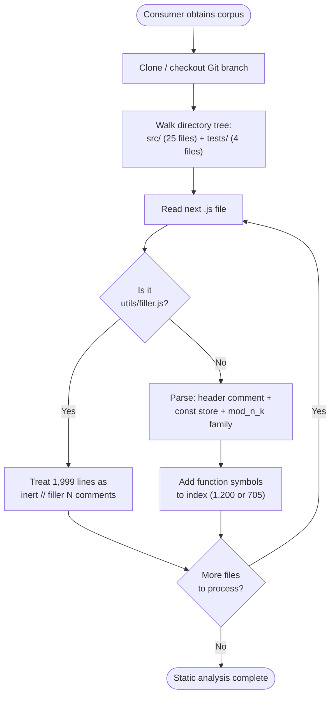

**Timing consideration (static, not runtime):** each helper body is a fixed eight-statement block, giving O(1) parse/evaluate cost per function and linear O(n) cost across the 33,105 declarations; there is no runtime SLA because nothing executes (Section 2.4, F-001).

### 4.1.2 Integration Workflows

**The artifact has no integration surface.** Section 1.3.2 ("Integration Points Not Covered") records that the corpus references **no databases, caches, message queues, identity providers, third-party APIs, or package registries**, and a keyword scan confirms zero `import`/`require`/`export`/`module.exports`, zero `fetch`/`http`/`fs`, and zero event constructs (`emit`, `on(`, `addEventListener`) across all files (F-006). Each requested integration dimension is therefore addressed as follows:

- **Data flow between systems.** None. The corpus is self-contained; the only data movement is a consumer reading bytes from the filesystem/Git.
- **API interactions.** None. There is no HTTP server, client, route handler, or API definition anywhere (Section 1.3.2).
- **Event processing flows.** None. There are no events, listeners, emitters, queues, or timers.
- **Batch processing sequences.** No *runtime* batch jobs exist. The only batch-shaped activities are (a) the inferred **offline generation** that produced the 300,000 lines in one pass (Section 4.2.3) and (b) a consumer's **batch static-analysis pass** over the whole tree (Section 4.2.4). Both are external to the artifact.

The diagram below depicts the artifact's real (filesystem + Git) touch points and, with dashed edges, the integration categories that are explicitly **absent**.

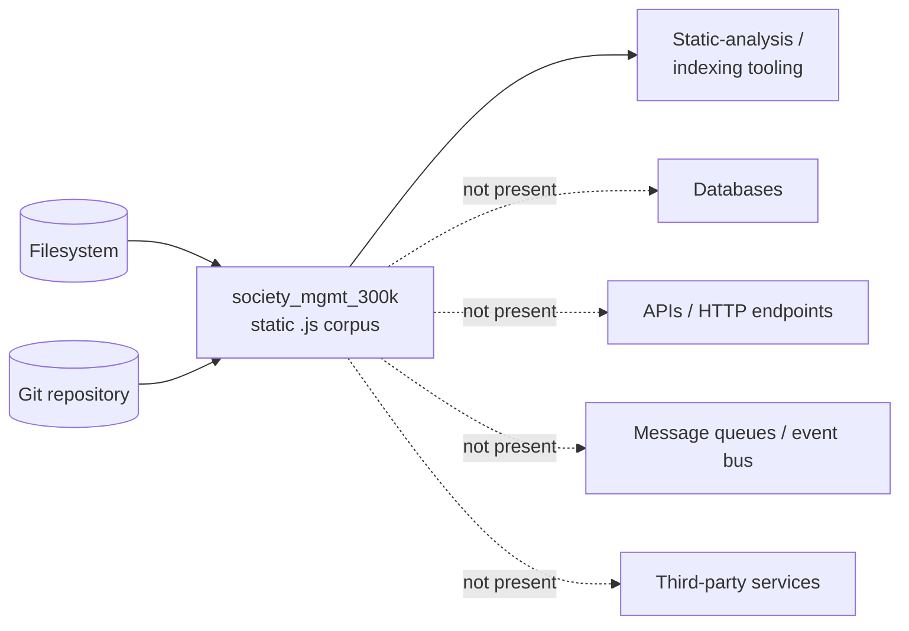

Integration sequence diagrams for the two real interaction patterns (consumption and inferred generation) are provided in Section 4.6.

## 4.2 Detailed Process Flows

The corpus decomposes into seven features (F-001–F-007, Section 2.1), but most are *static structural properties* rather than processes. This section provides detailed flows only for the four elements that have genuine process character: the **as-written computation** (F-001), **module parse and symbol extraction** (F-002/F-004), the **inferred corpus generation and assembly** (F-005), and **corpus consumption and traversal** (F-003/F-006). Feature F-007 (Dual Licensing) has no process flow — it comprises two static legal text files verified by inspection (Section 2.2, F-007) — and is not diagrammed here.

Every flow below annotates its start/end points, process steps, decision diamonds, and system boundary. User touchpoints are noted as *absent* where they do not exist, and timing is expressed as static parse/index cost per Section 2.4 (there is no runtime SLA).

### 4.2.1 Arithmetic Helper Evaluation Flow (F-001)

This is the **only genuine algorithmic control flow** the source expresses. It is the body shared byte-for-byte by all 33,105 helpers `mod_<n>_<k>(x)`, verified directly in `society_mgmt_300k/src/controllers/file_0.js` (lines 3–10) and required by F-001-RQ-001/002/003 (Section 2.2). The body accumulates `r = x*1 + x*2 + x*3 = 6x`, then applies the parity branch `if(r%2===0){r+=10}`, then returns `r`.

- **Start / end points.** Start = a (theoretical) call with integer argument `x`; end = the returned number `6x + 10`.
- **User touchpoint.** None — the function is never invoked and no input is ever supplied (F-006-RQ-003); `x` is theoretical (Section 2.1).
- **Decision diamond.** The single parity check `r % 2 === 0`. Because `6x` is always even for integer `x`, the true branch is **always taken** and the false branch is structurally present but **unreachable for integer input**.
- **System boundary.** Entirely within module scope; no `store` access, no I/O, no calls to other functions (F-001-RQ-003).
- **Error / recovery.** None; no validation or exceptions (see Section 4.5).
- **Timing.** Fixed eight-statement body → O(1) to parse or evaluate; byte-identical across all 33,105 instances (Section 2.4, F-001).

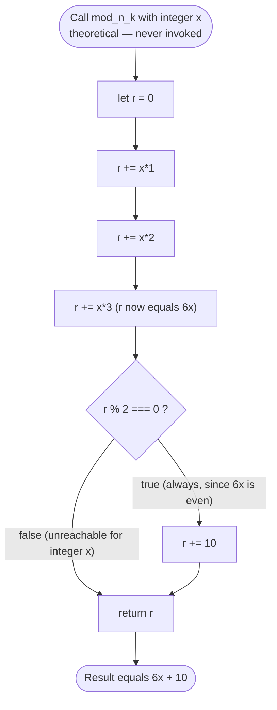

The deterministic result is confirmed by evaluating the body on representative inputs (Section 2.2, F-001-RQ-002):

| Input `x` | `6x` | Parity of `6x` | Branch taken | Return value |
| --- | --- | --- | --- | --- |
| 1 | 6 | even | `r += 10` | 16 |
| 2 | 12 | even | `r += 10` | 22 |
| 10 | 60 | even | `r += 10` | 70 |
| −4 | −24 | even | `r += 10` | −14 |

### 4.2.2 Module Parse and Symbol Extraction Flow (F-002, F-004)

This is the per-file process a consumer performs when reading one of the 28 numbered modules. Each module follows the fixed order verified in `file_0.js` and required by F-002-RQ-001/002/003: a header comment on line 1 (`// mod_<n> - society module`), an inert `const store = [];` on line 2, then a contiguous family of `mod_<n>_<k>` declarations. The extraction yields exactly 1,200 symbols per file, except `src/middleware/file_27.js` which yields 705 (F-004-RQ-003).

- **Decision diamonds.** (1) whether more function blocks remain, and (2) a structural-invariant validation — does the extracted count equal the expected 1,200 (or 705 for `file_27.js`)?
- **System boundary.** Consumer parser reading static text; the module never executes.
- **Timing.** Linear per file; a naive parser must tolerate 10,802-line files and tens of thousands of declarations (the only security-adjacent note, "size-based DoS on tooling," Section 2.4, F-004).

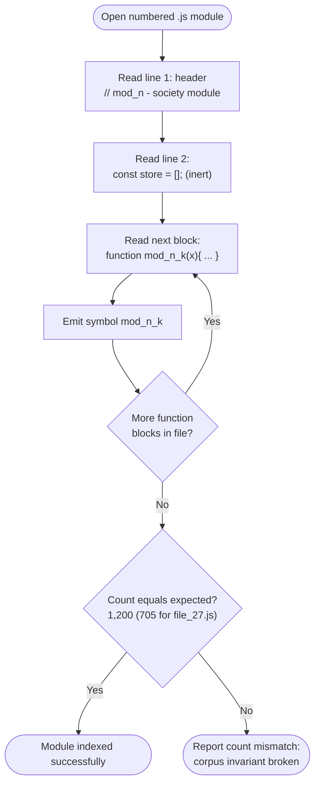

### 4.2.3 Corpus Generation and Assembly Flow (F-005) — Inferred

The generator itself is **not** part of the repository; only its output is present. This flow is therefore **inferred** from the artifact's exact, regular structure as described in Section 1.2.2 ("Core Technical Approach") and Section 2.1 (F-005), and is labeled as such. The process replicates one template into numbered functions, groups them into per-file modules, distributes them across the nine `src/` namespaces plus the two `tests/` namespaces, and finally pads with `filler.js` to land the total on exactly 300,000 lines.

- **Decision diamonds.** (1) have all 28 modules `mod_0..mod_27` been written, and (2) does the running total equal 300,000 lines? The 28 numbered files sum to 298,001 lines, so the padding branch always fires, appending 1,999 `// filler N` comment lines (verified `filler.js` runs `// filler 298001` … `// filler 299999`).
- **System boundary.** Generator (offline) writing into the filesystem; no part of this runs when the corpus is later consumed.
- **Invariants enforced (validation).** Exactly 33,105 functions (F-004-RQ-001), 1,200 per file with the single 705 exception for `file_27.js` (F-004-RQ-003), and a hard 300,000-line total (F-005-RQ-001).

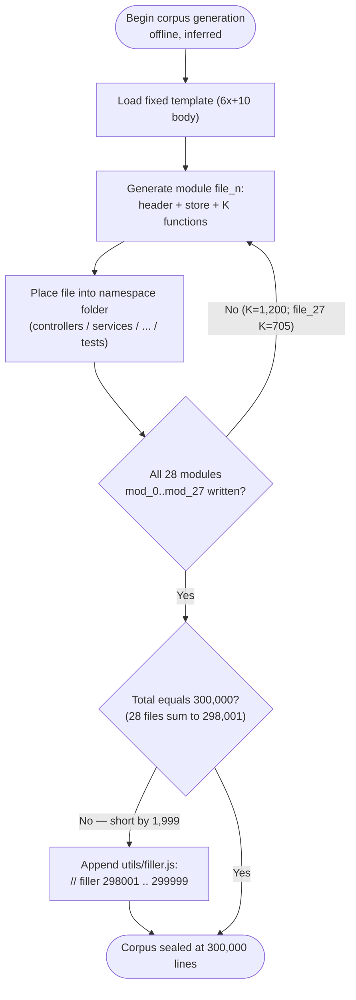

### 4.2.4 Corpus Consumption and Static-Analysis Traversal Flow (F-003, F-006)

This flow expands the high-level journey of Section 4.1.1 into a swim-lane view across two system boundaries — the **Analysis Tooling** (consumer) and the **Corpus** (filesystem + Git). It traverses the fixed taxonomy of nine `src/` namespaces plus `tests/unit` and `tests/integration` (F-003-RQ-001/002), treating `tests/` files identically to `src/` files because they share the same generated pattern (Section 2.1). Because the corpus is pure static data with no entry point (F-006), the "Corpus" lane only ever returns bytes — it never computes.

- **Decision diamond.** Whether more namespaces remain to traverse.
- **End state / benchmark.** A completed run can assert the corpus invariants: 33,105 symbols across exactly 300,000 lines (Section 2.1, F-004/F-005).
- **Timing.** A single directory walk over a shallow tree plus a linear parse; no install, network, or build step is required (Section 2.4, F-006).

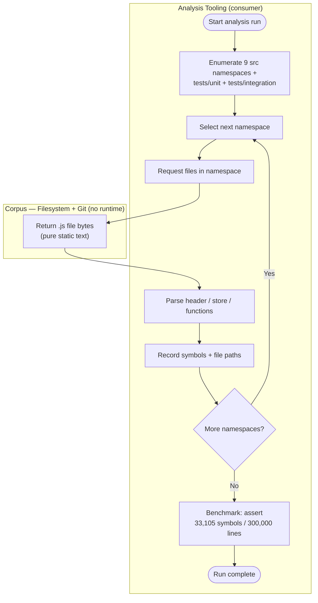

## 4.3 Validation Rules and Authorization Checkpoints

The prompt requests business rules at each step, data-validation requirements, authorization checkpoints, and regulatory-compliance checks. Because the corpus never executes, it contains **no runtime validation, no authorization, and no compliance logic**. A keyword scan across all `.js` files returns **zero** occurrences of `validate`, `verify`, `sanitize`, `auth`, `token`, `role`, `permission`, `login`, `session`, `jwt`, or `oauth`, and Section 1.3.2 explicitly lists authentication, authorization, validation, and error handling as out of scope. The Validation-Rules dimension of Section 2.2 records **"None"** for Data Validation and Security across every feature, and **"Not applicable"** for Compliance except licensing (F-007).

The only rules that genuinely govern this artifact are **generation-time structural invariants** — the "business rules" that define a well-formed corpus and that are re-checkable at any time as repeatable static checks (Section 2.2 Acceptance Criteria). These are the closest analog to "business rules at each step," and they are enforced when the corpus is generated, not when it is consumed.

| Validation Rule | Dimension | Enforcement Point | Basis (requirement / evidence) |
| --- | --- | --- | --- |
| Every helper body is the identical `6x + 10` template; no variant bodies permitted | Business rule | Generation time (static re-check) | F-001-RQ-001/002; verified in `src/controllers/file_0.js` |
| Header comment → `const store` → contiguous `mod_n_k` family, in that fixed order | Business rule | Generation time | F-002-RQ-001/002/003 |
| Nine `src/` namespaces with fixed file counts; `tests/` split into `unit`/`integration` | Business rule | Generation time | F-003-RQ-001/002 |
| Exactly 33,105 globally-unique `mod_<n>_<k>` names; 1,200/file except `file_27.js` = 705 | Business rule | Generation time | F-004-RQ-001/002/003 |
| Exactly 300,000 lines; `filler.js` is non-executable padding | Business rule | Generation time | F-005-RQ-001/002/003 |
| No `import`/`export`/`require`/I/O/manifest ever introduced | Architectural invariant | Static scan | F-006-RQ-001/002 (verified: all zero) |
| Input `x` is never range- or type-checked | Data validation | None present | F-001 (Data Validation: "None"); 0 `validate`/`verify` |
| No caller identity, role, or permission check | Authorization | None present | 0 `auth`/`token`/`role`/`session`; Section 1.3.2 |
| Dual licensing coverage (root Apache-2.0 + corpus MIT) | Compliance | Repository / file level | F-007; keeps corpus SBOM/scanner-friendly |

**Data validation requirements.** None exist. The single parameter `x` is never validated, range-checked, or type-guarded (Section 2.2, F-001: "`x` is never range-checked or type-guarded (no input is ever supplied)"), and the `const store` is never populated or validated (F-002). Directories carry no configuration or data payloads to validate (F-003).

**Authorization checkpoints.** None exist in the artifact. There is no caller, no session, and no protected resource — every binding is closed within module scope and nothing is exported (F-006, F-002). Any access control that applies does so **externally, at the Git/hosting layer** (repository permissions and the date-stamped branching workflow such as `01-Jul-2026-Br1-Br1.1`), not through code. The corpus itself enforces no authorization.

**Regulatory compliance checks.** None execute at runtime. The only compliance dimension present is **licensing**: a full Apache License 2.0 at the repository root and an abbreviated MIT stub at `society_mgmt_300k/LICENSE/LICENSE.txt` (F-007). This permissive dual licensing keeps the corpus redistribution-clean and friendly to automated license-scanning / SBOM workflows (Section 2.2, F-007), though the MIT body is a 5-line placeholder rather than the canonical full text and **no SPDX headers** appear in any source file (verified).

The only decision that maps onto "validation" as a *process* is the corpus-invariant verification a maintainer or CI-like check would perform. Each diamond below is one of the repeatable static checks from Section 2.2; any failure rejects the corpus as malformed.

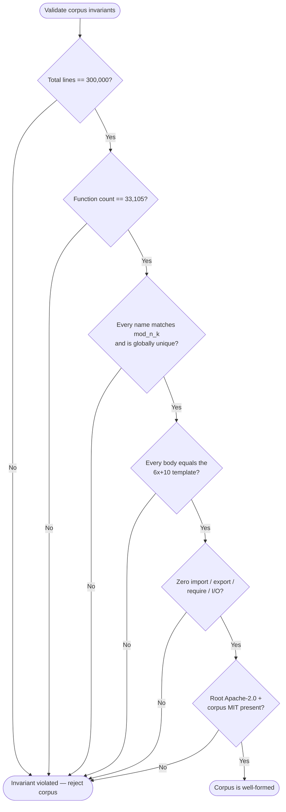

## 4.4 State Management and Transaction Boundaries

The corpus manages **no runtime state**. Every helper is pure, synchronous, and side-effect-free (Section 2.2, F-001-RQ-003), and Section 1.3.2 places data persistence, databases, and data models out of scope. The only state-shaped construct in the source is the module-scoped `const store = [];` present on line 2 of every numbered file — and it is completely **inert**: a scan for any read or write of `store` (`store.` or `store[`) returns **zero** matches, confirming it is declared but never referenced (Section 2.1, F-002). Each requested dimension maps onto this reality as follows.

| Dimension | In this artifact | Basis / evidence |
| --- | --- | --- |
| State transitions | Only the transient per-call accumulator `r` (`r=0` → `+6x` → `+10` → `return`); no shared or persistent state | F-001-RQ-003; modeled in Section 4.7 |
| Data persistence points | None at runtime; the only durable state is the 29 `.js` files on the filesystem, versioned by Git | Section 1.3.2; F-006 |
| Caching requirements | None at runtime; identical bodies "compress and cache well" — a benefit to consumer tooling, not a runtime cache | Section 2.4 (F-001) |
| Transaction boundaries | None at runtime; the only atomic unit is a Git commit | Section 1.3.2; Git history |

**State transitions.** The sole mutable value anywhere is the function-local accumulator `r`, which lives only for the (theoretical) duration of a single evaluation and is discarded on `return`. Because the functions are pure and never invoked, no state persists between "calls" and no two functions share state. The trivial lifecycle of `r` is modeled as a state-transition diagram in Section 4.7.

**Data persistence points.** There is no runtime persistence — no database, file write, cache, or session store (Section 1.3.2). The `const store = []` array, which its name might suggest is a data store, is never populated. The **only durable state** is the source text itself: the 29 `.js` files at rest on the filesystem, whose authoritative version is the Git repository. In other words, the corpus *is* data-at-rest; it holds no state that changes at runtime.

**Caching requirements.** None apply to the artifact, since it does not run. The only caching-relevant property is a **consumer-side** one noted in Section 2.4: because every function body is byte-identical, the corpus "compresses and caches well," which benefits parsers, indexers, and content-addressable storage — but this is a property tools may exploit, not a cache the corpus maintains.

**Transaction boundaries.** There are none at runtime — no ACID scope, no locking, no commit/rollback semantics in the code (no database exists). The **only atomic boundary that exists** is at the version-control layer: a Git commit. The entire 300,000-line corpus was introduced in a single atomic commit (`Add files via upload`), and subsequent commits modified only the `README.md`. The Git commit is therefore the sole "transaction" applicable to this artifact.

The diagram below models this stateless data model: a pure function that never touches the inert `store`, with the only durable state being the static files under Git.

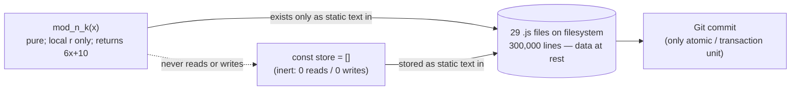

## 4.5 Error Handling and Recovery

The corpus contains **no error-handling machinery of any kind**. A direct scan of all 29 `.js` files returns **zero** occurrences of `try`, `catch`, `throw`, `finally`, `retry`, and `fallback`, and zero `console.`/logging or `process.` calls; Section 1.3.2 lists error handling as explicitly out of scope. Because the code never executes and no function is ever invoked (Section 2.2, F-006-RQ-003), there are no runtime failure modes to catch. Each requested dimension is addressed against that reality.

| Requested mechanism | Present? | Basis / evidence |
| --- | --- | --- |
| Retry mechanisms | No | 0 `retry`; no operations exist to retry (no I/O, no calls) |
| Fallback processes | No | 0 `fallback`; no alternate execution paths beyond the single parity branch |
| Error notification flows | No | 0 `console.`/logging/`throw`; nothing emits or reports errors |
| Recovery procedures | No runtime recovery | Only corpus-level recovery is Git revert/checkout (Section 4.4) |

**No runtime error surface.** The shared body is pure integer arithmetic with a single always-true branch (Section 4.2.1); it performs no I/O, allocation, parsing, or external call that could fail. There is no exception path, and — critically — the functions are never called, so even a hypothetical failure could never be reached.

**Theoretical (never-triggered) input behavior.** For completeness only: were a helper hypothetically invoked with a non-numeric argument, JavaScript coercion would drive the accumulator to `NaN` (the parity branch would then be skipped and `NaN` returned). This is a property of the language semantics, **not an actual code path** — no input is ever supplied and no invocation site exists (F-006-RQ-003), so it is documented as a theoretical note rather than a handled error state.

**Where failures can actually arise — and recovery.** The only real failure surfaces are *external boundaries*, not the artifact itself:

- **Generation boundary:** a malformed regeneration that breaks a structural invariant (line count, function count, naming, or template) is caught by the corpus-invariant checks documented in Section 4.3.
- **Consumption boundary:** a naive parser may be stressed by the 10,802-line files and 33,105 declarations — the "size-based DoS on tooling" note in Section 2.4 (F-004). This is a *tool-side* failure; the static corpus is unaffected.

The only recovery procedure applicable to the artifact is at the **version-control layer**: revert to a prior commit or check out a known-good branch (Section 4.4). There is no in-corpus recovery, retry, or notification. The flowchart below reflects this — the runtime path is a guaranteed no-error state, and the only real failure/recovery interactions live at the generation and consumption boundaries.

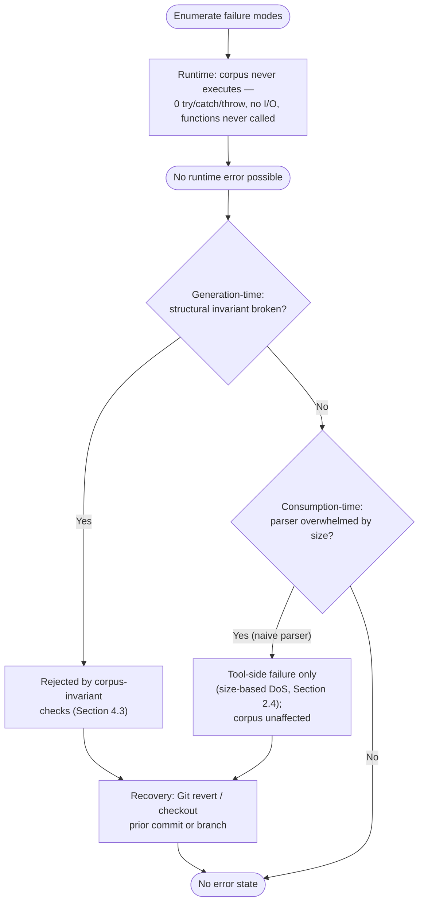

## 4.6 Integration Sequence Diagrams

There are **no runtime integration sequences** in this artifact. As established in Sections 1.3.2 and 2.2 (F-006), the corpus references no databases, caches, message queues, identity providers, third-party APIs, or package registries, and a scan confirms zero `import`/`require`/`fetch`/`http`/`emit`/`on(`/`addEventListener` constructs. There are therefore no services, endpoints, brokers, or event participants to sequence at runtime.

The only genuine interaction patterns are between an external actor and the artifact's two real touch points — the **filesystem** and **Git**. Two sequence diagrams capture them: (1) a consumer performing static analysis, and (2) the *inferred* offline generation that produced the corpus.

**Sequence 1 — Corpus Consumption (analysis tool ↔ filesystem/Git).** This is the primary supported interaction (Section 1.3.1). The "Corpus" side only ever returns static text; it never computes.

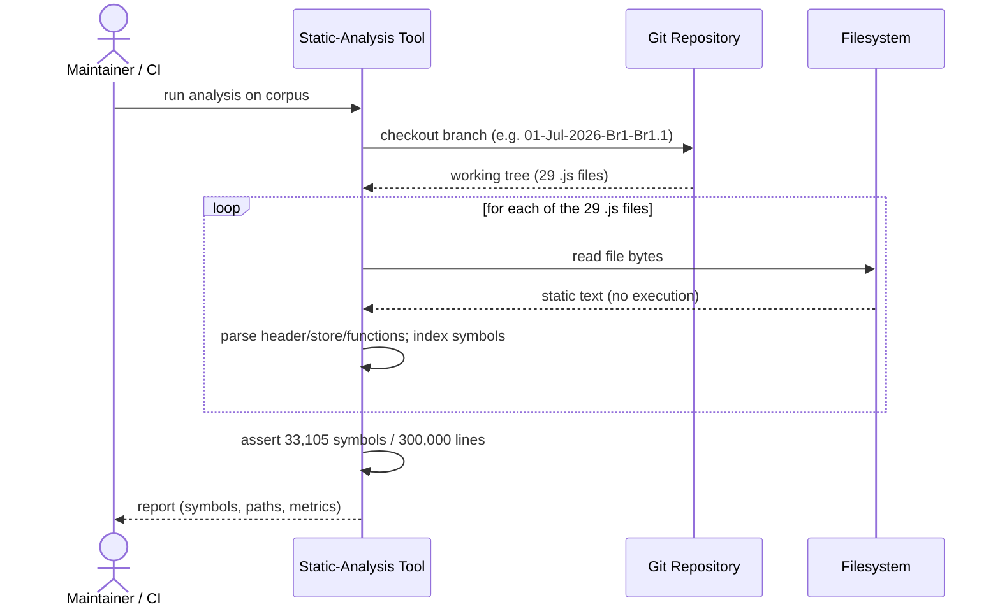

**Sequence 2 — Corpus Generation and Assembly (inferred, offline).** The generator is not part of the repository; this sequence is inferred from the artifact's exact structure (Section 2.1, F-005) and labeled as such. It ends with the single atomic Git commit that introduced the whole corpus.

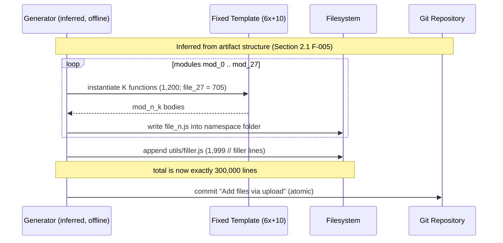

**Absent runtime sequences.** No request/response, publish/subscribe, RPC, database-transaction, or authentication handshake sequence is documented, because none of the required participants exist in the code (Section 1.3.2). Any such diagram would be fabricated and is therefore intentionally omitted.

## 4.7 State Transition Diagrams

This artifact has **no runtime entity, session, or workflow state machines**. There is no persistent state to transition (Section 4.4): the `const store` is inert, the functions are pure, and the corpus never executes (F-006). A scan confirms zero `switch` statements and exactly one `if` per function (33,105 `if(` = 33,105 functions), so there is no finite-state logic anywhere in the code. Only two genuine state lifecycles exist and are modeled below: (1) the transient accumulator inside a single helper evaluation, and (2) the corpus artifact's lifecycle in Git.

**State Machine 1 — Arithmetic Helper Evaluation Lifecycle (F-001).** This models the transient life of the local accumulator `r` during one (theoretical) evaluation of `mod_<n>_<k>(x)`. It is the only algorithmic state progression in the source; the false side of the parity branch is unreachable for integer input (Section 4.2.1).

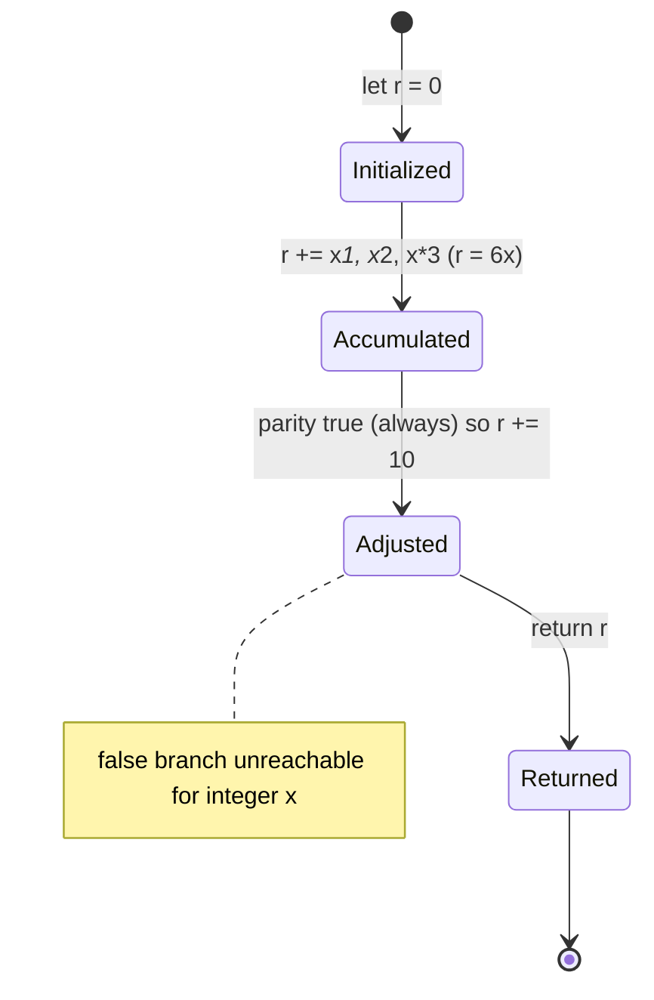

**State Machine 2 — Corpus Artifact Lifecycle (Git).** The only durable, transitioning state in the project is the repository itself (Section 4.4). The 300,000-line corpus was sealed in a single atomic `Add files via upload` commit; every subsequent commit modified only the `README.md`, and the work uses a date-stamped branching convention (`29-Jun-2026-Br1`, `01-Jul-2026-Br1`, `01-Jul-2026-Br1-Br1`, `01-Jul-2026-Br1-Br1.1`).

```mermaid
stateDiagram-v2
    [*] --> EmptyRepo: Initial commit
    EmptyRepo --> CorpusSealed: Add files via upload (300,000 lines, atomic)
    CorpusSealed --> DocUpdated: Update README.md
    DocUpdated --> DocUpdated: further README-only commits
    CorpusSealed --> Branched: create date-stamped branch
    Branched --> CorpusSealed: checkout / merge
    DocUpdated --> [*]
    note right of CorpusSealed: corpus content frozen after upload; only README changes
```

**Absent state machines.** No order, account, request, job, or session lifecycle is documented, because the corpus models no domain entities and holds no runtime state (Sections 1.3.2, 4.4). Any such diagram would be fabricated and is intentionally omitted.

## 4.8 References

The following repository artifacts and Technical Specification sections were examined as evidence for Section 4. All process, state, integration, and error-handling claims are grounded in these sources; no external web sources were used.

**Repository files and folders inspected**

- `README.md` — established the repository's minimal, placeholder identity (`# Student_Mngt_29-Jun-2026` plus a test line); confirmed the "branch blocking test" text exists only in commit messages, not in the README body.
- `LICENSE` — root Apache License 2.0 (compliance dimension, Section 4.3).
- `society_mgmt_300k/` — corpus root; established the three-child layout (`src/`, `tests/`, `LICENSE/`).
- `society_mgmt_300k/src/` — the nine cosmetic layered namespaces (`controllers`, `services`, `models`, `routes`, `middleware`, `repositories`, `domain`, `config`, `utils`) traversed in the consumption/traversal flows (Sections 4.1, 4.2.4).
- `society_mgmt_300k/src/controllers/file_0.js` — verified (lines 1–40) the exact function template `mod_<n>_<k>(x)`, the `// mod_<n> - society module` header, and the inert `const store = [];`; basis for Sections 4.2.1, 4.3, 4.4, 4.7.
- `society_mgmt_300k/src/utils/filler.js` — verified 1,999 pure `// filler N` comment lines (`298001`…`299999`); basis for the padding step in Sections 4.2.3 and 4.6.
- `society_mgmt_300k/src/middleware/file_27.js` — the 705-function / 6,347-line size exception used to hit the exact 300,000-line total (Sections 4.2.2, 4.2.3).
- `society_mgmt_300k/tests/` — `unit/` (`file_9.js`, `file_20.js`) and `integration/` (`file_10.js`, `file_21.js`) fixtures; confirmed identical generated pattern and no test framework/assertions/runner (Section 4.2.4).
- `society_mgmt_300k/LICENSE/LICENSE.txt` — abbreviated 5-line MIT stub (`Copyright (c) 2026`); compliance dimension, Section 4.3.
- Whole-tree keyword scans across all 29 `.js` files — established the definitive absence of `import`/`require`/`export`/`module.exports`, `try`/`catch`/`throw`/`finally`, `retry`/`fallback`, `for`/`while`/`switch`/`class`/`async`/`await`/`=>`, `fetch`/`http`/`fs`/`console`/`process`, `emit`/`on(`/`addEventListener`, `auth`/`token`/`role`/`permission`/`session`/`validate`/`verify`/`sanitize`, and SPDX headers; and confirmed 33,105 `if(` = 33,105 `function` declarations and 0 `store` reads/writes (basis for Sections 4.1, 4.3, 4.4, 4.5, 4.7).
- Git repository metadata (branches and commit history) — established the corpus/artifact lifecycle: 5 commits with the corpus introduced wholesale in the atomic `Add files via upload` commit and only `README.md` changed thereafter; date-stamped branches (`29-Jun-2026-Br1`, `01-Jul-2026-Br1`, `01-Jul-2026-Br1-Br1`, `01-Jul-2026-Br1-Br1.1`, `main`); basis for Sections 4.4 and 4.7.

**Technical Specification cross-references**

- `1.2 System Overview` — corpus nature, layered-namespace layout, non-executable/self-contained framing, and absence of operational KPIs/SLAs.
- `1.3 Scope` — explicit out-of-scope list (business logic, persistence, HTTP/API, auth/validation/error handling, config, build/CI/CD, runnable tests) and "Integration Points Not Covered"; the grounding for all absence statements.
- `2.1 Feature Catalog` — the seven features (F-001–F-007) referenced throughout Section 4.
- `2.2 Functional Requirements` — requirement IDs (F-001-RQ-* … F-007-RQ-*), the always-true parity branch, purity/side-effect-free properties, and the per-feature Validation-Rules dimensions cited in Sections 4.3–4.5.
- `2.4 Implementation Considerations` — "no operational SLAs," O(1)/linear static parse cost, the compress/cache note, and the "size-based DoS on tooling" note cited in Sections 4.2, 4.4, and 4.5.

# 5. System Architecture

## 5.1 High-Level Architecture

The `society_mgmt_300k` artifact is **not a runtime application** — it is a deterministically generated, static JavaScript **code corpus** intended to be read and analyzed as data rather than executed. This section documents the architecture that actually exists: a layered directory taxonomy that houses uniform, self-contained modules. Where a conventional runtime concern (data flow between services, external integrations, data stores, caches) does not exist, that absence is stated explicitly and grounded in evidence rather than inferred as if present. This framing is consistent with Sections 1.2, 1.3, 2.3, 3.4, and 4.5 of this specification.

### 5.1.1 System Overview

**Architecture style and rationale.** The corpus adopts a **layered-taxonomy static-fixture** style: a flat population of module-scoped JavaScript files distributed across nine directory names borrowed from a conventional layered backend (`controllers`, `services`, `models`, `routes`, `middleware`, `repositories`, `domain`, `config`, `utils`), plus `tests/unit` and `tests/integration`. The directory names are **cosmetic organizational labels** — none of the layers implements its nominal behavior. Every file instead contains the same family of arithmetic helper functions. The rationale, inferred directly from the artifact's structure (exactly 300,000 lines, 33,105 uniformly named functions, zero dependencies), is to provide a large, high-symbol-density, fully reproducible surface suited to code-analysis, indexing, parsing, traversal, and search tooling rather than to serve application traffic.

**Key architectural principles and patterns.** Five observable principles govern the corpus:

- **Determinism** — every one of the 33,105 functions is byte-identical except for its name, computing `f(x) = 6x + 10` (the parity branch `if(r%2===0)` is always taken for integer inputs). Verified in `society_mgmt_300k/src/controllers/file_0.js`.
- **Uniform module skeleton** — each of the 28 code files opens with a `// mod_<n> - society module` header comment and an inert `const store = [];` binding, followed by a contiguous `mod_<n>_<k>(x)` helper family.
- **Self-containment / zero coupling** — a keyword scan of all 29 `.js` files returns **zero** `import`, `require`, `export`, or `module.exports` statements and no framework, network, or filesystem calls, so no module depends on or is depended upon by any other (feature F-006).
- **Exact sizing** — the line total is engineered to precisely 300,000 lines, with `society_mgmt_300k/src/utils/filler.js` supplying 1,999 `// filler N` comment lines as the final padding (feature F-005).
- **Structural regularity** — consistent `file_<n>.js` / `mod_<n>_<k>` naming and a fixed per-file layout maximize predictability for tooling.

**System boundaries and major interfaces.** The system boundary encloses only the `society_mgmt_300k/` corpus and its two license artifacts. Because there are no imports/exports and no I/O, the code exposes **no programmatic interface** — the helper functions declare a single integer parameter `x` but are never invoked and export nothing a host program could bind to. The only genuine interfaces to the outside world are the **filesystem** (reading the `.js` files as UTF-8 text) and **Git** (obtaining or versioning the corpus). The diagram below shows this boundary and its external consumers; for the internal directory-composition view see Section 1.2.2.

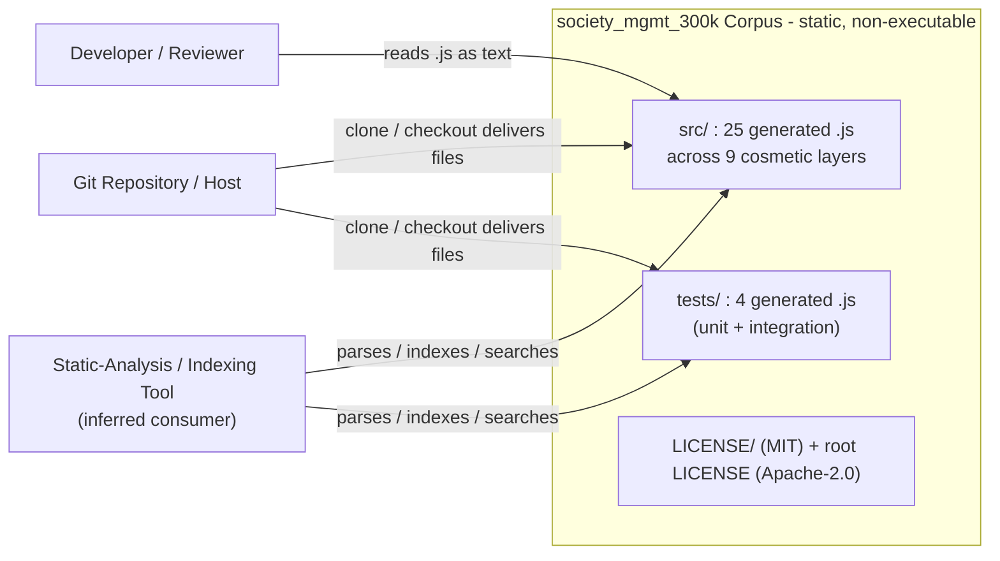

### 5.1.2 Core Components Table

The prompt's requested five-attribute layout is presented within the four-column limit by folding the *Integration Points* attribute into the prose that follows the table (it is uniform across every component and therefore does not vary row-by-row). Each row is a genuine architectural constituent observed in the repository.

| Component | Primary Responsibility | Key Dependencies | Critical Considerations |
| --- | --- | --- | --- |
| Generated code modules (`src/**/file_<n>.js`) | Encapsulate one `mod_<n>_<k>` helper family under a `// mod_<n>` header + inert `const store` | None (zero imports/exports) | 27 modules hold 1,200 helpers each; `src/middleware/file_27.js` holds 705; byte-uniform except names |
| Arithmetic helper functions (`mod_<n>_<k>(x)`) | The atomic unit; computes deterministic `f(x)=6x+10` | None; independent of `store` and of each other | 33,105 total; never invoked; single parity `if` is the only branch in the corpus |
| Layered `src/` namespaces (9 directories) | Provide the conventional layered-backend directory taxonomy that houses modules | Contain modules only (no cross-layer references) | Names are cosmetic; no layer implements its nominal behavior (F-003) |
| Test namespaces (`tests/unit`, `tests/integration`) | Mirror the module pattern in test-labeled directories | Same generated modules | No test framework, assertions, mocks, or runner; not executable tests |
| Corpus sizing mechanism (`src/utils/filler.js`) | Pad the corpus to exactly 300,000 lines | None | 1,999 `// filler N` comments (`298001`..`299999`); contains no functions |
| Licensing artifacts (root `LICENSE`; `society_mgmt_300k/LICENSE/LICENSE.txt`) | Provide redistribution terms | None | Dual license: Apache-2.0 (root, full) + MIT (corpus, 5-line stub) |
| `README.md` | Human-facing identity marker | None | Placeholder content only; H1 name (`Student_Mngt_29-Jun-2026`) differs from the folder name |

**Integration Points (uniform across all components):** every component's only integration surface is the **filesystem** (for reading) and, transitively, **Git** (for delivery). No component integrates with another at runtime, and none integrates with any external system — there are no inter-module calls, no shared mutable state, and no network/database/message endpoints (Sections 2.3.2, 3.4).

### 5.1.3 Data Flow Description

**Primary data flows between components.** At runtime there are **none**. No module imports, calls, or passes data to another; the per-module `const store = []` is never read or written (0 usages across the corpus), so there is no shared-state channel either. Consequently the classic request → controller → service → repository → model flow implied by the directory names does not occur — those directories hold identical arithmetic helpers, not collaborating layers. The only data movements that genuinely exist are outside the executing-code plane:

- **Build-time generation flow (inferred, not committed):** a single arithmetic template is instantiated into `mod_<n>_<k>` functions, grouped into per-file modules, distributed across the layer folders, and topped off by `filler.js` to reach exactly 300,000 lines. No generator script is present in the repository, so this flow is inferred from the byte-identical outputs (Section 2.3.4).
- **Consumption-time flow (real):** Git delivers the files to a filesystem, and a reader or analysis tool ingests the `.js` text one file at a time, parsing/indexing symbols. This is a one-way, read-only flow from files to consumer.

**Integration patterns and protocols.** The corpus uses no runtime integration pattern (no request/response, publish/subscribe, streaming, or batch messaging). The consumption pattern is a plain **offline file read** over the local filesystem; the transport for obtaining the corpus is the **Git protocol**.

**Data transformation points.** The only transformation expressed anywhere in the corpus is the arithmetic accumulation inside each helper (`x → x*1 + x*2 + x*3 → +10 → 6x+10`), and even that is never executed because no function is invoked. The meaningful transformation is the build-time template-to-corpus expansion, which is external to the repository.

**Key data stores and caches.** There are **none**. The corpus has no database, no cache, and no object store; the inert `const store = []` is a syntactic artifact, not a data store (Sections 3.5, 4.4). The only durable persistence is the **filesystem and the Git object store** that hold the source text itself. Any caching that occurs is on the consuming tool's side (the byte-identical function bodies compress and cache trivially), not a property of the corpus.

### 5.1.4 External Integration Points

The corpus has **no networked or service-level integrations of any kind** — no external APIs, authentication/identity providers, monitoring/telemetry endpoints, cloud services, or messaging brokers (Section 3.4). The `config/` directory, despite its name, contains only generated helpers and holds no endpoints, credentials, connection strings, or feature flags. There are therefore **no protocol/format negotiations to perform and no service-level agreements (SLAs) declared anywhere** in the repository (Sections 1.2.3, 2.4). The only external touchpoints are the read/delivery surfaces summarized below.

| External Touchpoint | Integration Type | Data Exchange Pattern | Protocol / Format |
| --- | --- | --- | --- |
| Filesystem | Read-only file access | One-way batch read of source text | POSIX filesystem; UTF-8 JavaScript source |
| Git repository / host | Version control & delivery | Clone / fetch / checkout | Git protocol; commits and date-stamped branches |
| Static-analysis tooling | Offline ingestion (inferred) | One-way parse / index / search | AST / token stream over `.js` text (tool-defined) |

**SLA requirements.** None are defined. The repository declares no uptime, latency, throughput, or availability targets because nothing executes to produce or be measured against such metrics; the only quantifiable expectations are the *structural* invariants (exact line/function counts, uniform naming) enumerated in Sections 1.2.3 and 4.3.


## 5.2 Component Details

This section details each major component along the five requested dimensions — purpose, technologies, interfaces/APIs, data persistence, and scaling. Because the corpus is non-executable and dependency-free, several dimensions resolve to a deliberate "none," which is reported explicitly. All components share one technology baseline: **plain, script-style JavaScript** using ES2015 block-scoped declarations (`const`/`let`) with ES5-era `function` declarations, and **no framework, runtime, transpiler, or build step** (Sections 3.1, 3.2).

### 5.2.1 Arithmetic Helper Function (Atomic Component)

- **Purpose and responsibilities:** The `mod_<n>_<k>(x)` function is the atomic unit of the corpus. It computes the deterministic value `f(x) = 6x + 10` via the shared template `let r=0; r+=x*1; r+=x*2; r+=x*3; if(r%2===0){r+=10} return r;`. All 33,105 functions are byte-identical except for their names.
- **Technologies and frameworks used:** Pure JavaScript integer arithmetic (`+=`, `*`, `%`, `===`); no library, no runtime API.
- **Key interfaces and APIs:** Signature `mod_<n>_<k>(x): number`, a single unnamed integer parameter. The function is **never exported and never invoked** — the declaration count (33,105) equals the invocation-site count of zero for external callers, so it exposes no callable API in practice.
- **Data persistence requirements:** None. The function is pure and side-effect-free; it does not touch the module-level `const store` or any external state.
- **Scaling considerations:** O(1) to parse and to (hypothetically) evaluate. The design goal is symbol *volume*, not execution throughput; scaling means adding more identical functions, which is why the population reaches 33,105 (feature F-004).

### 5.2.2 Generated Code Module (`file_<n>.js`)

- **Purpose and responsibilities:** Each of the 28 numbered files is a self-contained module that groups one `mod_<n>_<k>` helper family under a `// mod_<n> - society module` header and an inert `const store = [];` binding.
- **Technologies and frameworks used:** Script-style JavaScript only; no module system (zero `import`/`export`/`require`/`module.exports`).
- **Key interfaces and APIs:** None exposed. With no `export`/`module.exports`, a module publishes nothing; it cannot be imported as a library.
- **Data persistence requirements:** None. The declared `const store = []` is never read or written across the entire corpus (0 usages).
- **Scaling considerations:** 27 modules carry exactly 1,200 helpers (10,802 lines); `src/middleware/file_27.js` carries 705 (6,347 lines). A naive parser must tolerate 10,802-line files — the "size-based DoS on tooling" caution noted in Section 2.4 (F-004).

### 5.2.3 Layered `src/` Namespaces and Test Namespaces

- **Purpose and responsibilities:** The nine `src/` directories (`controllers`, `services`, `models`, `routes`, `middleware`, `repositories`, `domain`, `config`, `utils`) provide a conventional layered-backend taxonomy that physically houses the modules; `tests/unit` and `tests/integration` mirror the same pattern in test-labeled directories.
- **Technologies and frameworks used:** Filesystem directories only. Notably, **no web/application framework** backs `controllers`/`routes`/`middleware`, **no ORM** backs `models`/`repositories`, and **no test framework/assertions/runner** backs `tests/` (Sections 3.2, 3.4).
- **Key interfaces and APIs:** None. The directory names are cosmetic labels; no layer implements its nominal behavior, and there is no routing, request handling, persistence, or validation logic anywhere (feature F-003).
- **Data persistence requirements:** None beyond the source files themselves on disk.
- **Scaling considerations:** The taxonomy scales horizontally by adding files to folders. The fixed distribution (controllers 3, services 3, models 3, routes 3, middleware 3, repositories 2, domain 2, config 2, utils 4; tests 2+2) yields the 25+4 file layout.

### 5.2.4 Sizing, Identity, and Legal Components

- **Purpose and responsibilities:** `src/utils/filler.js` controls exact corpus size (1,999 `// filler N` comment lines, numbered `298001`..`299999`); `README.md` is the human-facing identity marker; the root `LICENSE` (Apache-2.0) and `society_mgmt_300k/LICENSE/LICENSE.txt` (MIT) provide redistribution terms.
- **Technologies and frameworks used:** Plain-text comments (`filler.js`), Markdown (`README.md`), and plain-text license documents.
- **Key interfaces and APIs:** None. `filler.js` defines zero functions; `README.md` carries only an H1 title and one placeholder sentence; the MIT text is a 5-line abbreviated stub.
- **Data persistence requirements:** None; these are static files.
- **Scaling considerations:** `filler.js` is the exact-size "shim" — it absorbs the remainder needed to hit precisely 300,000 lines (feature F-005), so any change to the numbered files is compensated here.

### 5.2.5 Component Interaction, State, and Sequence Diagrams

**Component interaction (build-time composition; no runtime edges).** Components relate only by *composition* at generation time — a module aggregates helpers, a namespace contains modules, and the sizing shim completes the corpus. There are **no runtime call edges** because no module imports or invokes another (Section 2.3.1).

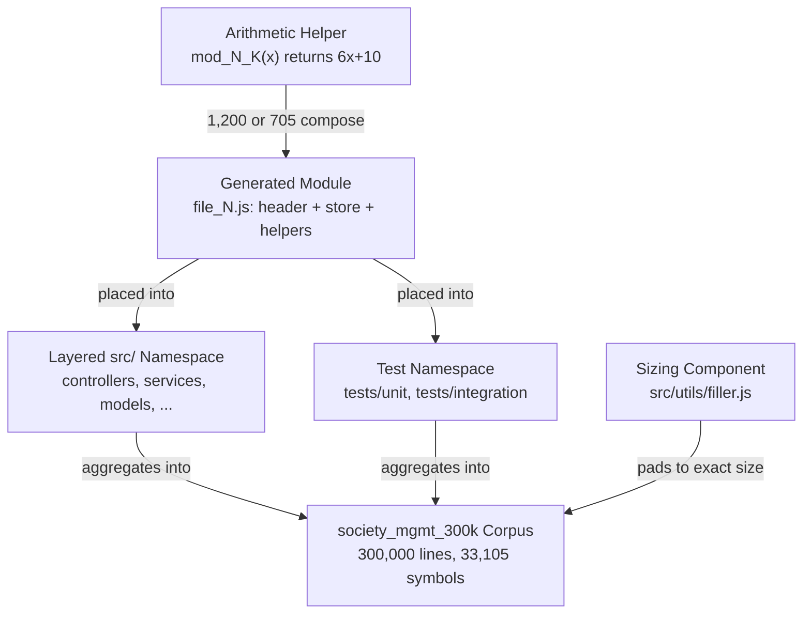

**State transition (arithmetic helper).** In the corpus a helper is parsed and then remains uninvoked forever (`Declared → Idle`). The computational states below (`Init → Summed → Adjusted`) describe a *hypothetical* single evaluation only; the parity branch is always taken for integer inputs, so the odd path is unreachable.

```mermaid
stateDiagram-v2
    [*] --> Declared
    Declared --> Idle: parsed by tooling; no call site exists
    Idle --> [*]

    Declared --> Init: hypothetical invocation only
    Init --> Summed: r = x*1 + x*2 + x*3 = 6x
    Summed --> Adjusted: parity r%2===0 always true, r += 10
    Adjusted --> [*]: return 6x + 10
```

**Sequence (key flow — corpus consumption).** The only real interaction sequence is a consumer/tool reading and indexing the files; the corpus executes nothing and initiates no I/O of its own.

```mermaid
sequenceDiagram
    participant Tool as Analysis Tool
    participant FS as Filesystem
    participant Mod as Module file_N.js
    participant Idx as Symbol Index

    Tool->>FS: request .js files under society_mgmt_300k/
    FS-->>Tool: file handles (UTF-8 text)
    loop each of 29 files
        Tool->>Mod: read and tokenize lines
        Mod-->>Tool: header + const store + mod_N_K bodies
        Tool->>Idx: register symbols (up to 1,200 per file)
    end
    Note over Tool,Idx: 33,105 symbols indexed, corpus executes nothing
```

## 5.3 Technical Decisions

The repository ships no design documents, manifests, or configuration, so the decisions below are **reconstructed from the artifact as-built** — each is grounded in an observable property of the code. Several decisions are deliberate *negatives* (no communication layer, no data store, no caching, no security mechanism); these are documented as real, defensible choices for a static analysis fixture rather than as gaps.

### 5.3.1 Architecture Style Decisions and Tradeoffs

| Decision Area | Choice (observed) | Rationale | Tradeoff / Consequence |
| --- | --- | --- | --- |
| Overall style | Static, generated code corpus (not a runtime app) | Provide a large, reproducible surface for code tooling | Cannot execute, serve, or hold data — by design |
| Code origin | Deterministic template generation over authored logic | Byte-identical bodies maximize uniformity and reproducibility | No business behavior; single template repeated 33,105× |
| Directory design | Cosmetic layered taxonomy (9 `src/` layers) over a flat dump | Mimic a realistic backend shape so tools exercise namespace handling | Layer names mislead unless documented as cosmetic (F-003) |
| Sizing | Exact 300,000 lines via `filler.js` shim | Predictable, controlled corpus size for benchmarking | Requires a non-functional padding file in `utils/` |
| Dependency posture | Zero external dependencies; non-executable | No install/build/network needed to consume | No framework features, no runtime, no reuse as a library |

### 5.3.2 Communication Pattern Choices

The observed decision is **no inter-component communication of any kind**. There are zero `import`/`require`/`export`/`module.exports` statements and zero function invocation sites across all 29 files, so modules neither call one another nor exchange messages, events, or shared state. The rationale is that **module independence maximizes parse-time isolation and uniformity** — each file can be analyzed on its own without resolving a dependency graph, which suits indexing and traversal tooling. The tradeoff is that no composition, reuse, or orchestration is possible; this is acceptable because coordinated behavior is explicitly out of scope (Sections 1.3, 2.3.2). No synchronous (request/response), asynchronous (publish/subscribe, streaming), or batch messaging pattern is present anywhere.

### 5.3.3 Data Storage and Caching Decisions

- **Data storage rationale:** The decision is to implement **no persistence** — no database, ORM, driver, or object store exists (Section 3.5). Each module declares `const store = []`, but this binding is **never read or written** (0 usages corpus-wide); it is a structural token that mirrors what a stateful module *would* declare, not an actual store. The rationale is that a static fixture needs no data layer; the **filesystem and Git object store** are the only persistence, holding the source text itself (Section 4.4). The tradeoff — inability to hold or query domain data — is not a goal of the artifact.
- **Caching strategy justification:** The corpus implements **no caching**, and the rationale is direct: nothing executes, so there is no computed result, session, or query to cache. A beneficial *side effect* of the byte-identical function bodies (nine distinct line shapes across 300,000 lines) is that **consumer-side compression and content caches are extremely effective** — but that efficiency lives in the consuming tool, not in the corpus. No in-corpus cache, memoization, or TTL policy exists or is warranted.

### 5.3.4 Security Mechanism Selection

The observed decision is **no in-corpus security mechanism**, justified by the absence of any runtime attack surface. A scan confirms zero occurrences of `auth`, `token`, `role`, `permission`, `login`, `session`, `jwt`, `oauth`, `validate`, `verify`, or `sanitize` across all `.js` files — there is no authentication, authorization, input validation, sanitization, or secret handling (Sections 3.4.2, 4.3). Because the code performs no I/O, reads no input, and never executes, it presents **no injection, deserialization, or network-exposure risk**. Two security-adjacent facts remain:

- **Tooling resource exhaustion:** the 10,802-line files and 33,105 symbols could stress a naive parser — a *tool-side* "size-based DoS" caution (Section 2.4, F-004), not a corpus vulnerability.
- **Access control at the VCS layer only:** any real access governance lives in the **Git host** (repository permissions and the date-stamped branch/branch-protection workflow), external to the corpus.

### 5.3.5 Decision Tree

The tree below reconstructs the design logic that yields this corpus given the goal of a large, analyzable JavaScript fixture.

```mermaid
flowchart TD
    Goal{"Goal: large, reproducible<br/>JS fixture for analysis?"}
    Goal -->|Yes| Exec{"Must it execute<br/>or serve traffic?"}
    Exec -->|"No"| Gen["Generate deterministic code<br/>(no runtime, no dependencies)"]
    Exec -->|"Yes"| RealApp["Out of scope:<br/>build a real application"]
    Gen --> Shape{"Need a realistic<br/>project shape?"}
    Shape -->|"Yes"| Layers["Adopt layered directory taxonomy<br/>controllers / services / models / ..."]
    Shape -->|"No"| Flat["Use a flat file layout"]
    Layers --> Size{"Exact size target?"}
    Flat --> Size
    Size -->|"Yes: 300,000 lines"| Filler["Add filler.js padding shim"]
    Size -->|"No"| ShipAsIs["Ship without padding"]
    Filler --> Final["Corpus finalized:<br/>29 files, 33,105 symbols"]
    ShipAsIs --> Final
```

### 5.3.6 Architecture Decision Records (ADRs)

Each ADR has **Status: Accepted (as-built)** — inferred from the committed artifact rather than a written proposal. The table summarizes the decisions, their context, and consequences.

| ADR | Decision | Context / Rationale | Consequences |
| --- | --- | --- | --- |
| ADR-01 | Generate code deterministically from one arithmetic template | Need uniform, reproducible symbols at scale | 33,105 identical bodies; trivial to verify, meaningless to run |
| ADR-02 | House modules in a cosmetic layered taxonomy | Exercise tooling against a realistic backend shape | Layer names must be documented as non-behavioral (F-003) |
| ADR-03 | Zero dependencies, non-executable, no build | Consume without install, network, or credentials | No framework/runtime features; not runnable or importable |
| ADR-04 | No communication, persistence, caching, or security in code | No runtime; nothing to coordinate, store, or protect | Absences are intentional, not defects (Sections 3.4, 4.4, 4.5) |
| ADR-05 | Dual licensing: Apache-2.0 (root) + MIT (corpus) | Provide clear redistribution terms at both levels | MIT text is an abbreviated 5-line stub; both must be retained |

**ADR narrative highlights.** *ADR-01* is evidenced by the byte-identical `mod_<n>_<k>` bodies in `society_mgmt_300k/src/controllers/file_0.js` and every other module. *ADR-02* is evidenced by the nine `src/` directories whose contents are indistinguishable in kind. *ADR-03* is evidenced by the zero-import/zero-export keyword scan and the absence of any manifest. *ADR-04* aggregates the deliberate negatives documented in 5.3.2–5.3.4. *ADR-05* is evidenced by the root `LICENSE` (full Apache-2.0) and `society_mgmt_300k/LICENSE/LICENSE.txt` (MIT stub).


## 5.4 Cross-Cutting Concerns

Cross-cutting concerns are addressed against the reality that the corpus **never executes**: there is no runtime plane on which to monitor, log, trace, authenticate, or recover. Each concern below states what is present, the evidence, and the *effective* mechanism (if any) that operates at the artifact or version-control layer. None of these values are invented — where a concern is absent, that is reported as a deliberate property of a static fixture (features F-006, and Sections 3.4, 4.5).

| Cross-Cutting Concern | Present in Corpus? | Basis (evidence) | Effective Mechanism |
| --- | --- | --- | --- |
| Monitoring & observability | No | 0 telemetry/APM SDK; nothing runs | Deterministic re-computation of structural invariants |
| Logging & tracing | No | 0 `console.*`/logging calls corpus-wide | Git commit history as the change audit trail |
| Error handling | No | 0 `try`/`catch`/`throw`/`finally` | Generation/consumption boundary checks; Git recovery |
| Authentication & authorization | No | 0 `auth`/`token`/`jwt`/`session`/`role` | Git host permissions & branch protection |
| Performance & SLAs | None declared | 0 latency/throughput/uptime targets | Static parse/index cost; exact-size invariant |
| Disaster recovery | VCS-based only | No runtime state to lose | Git clone/revert/checkout; exact regeneration |

### 5.4.1 Monitoring, Observability, Logging, and Tracing

The corpus has **no monitoring, observability, logging, or tracing**. There are zero telemetry or APM SDKs, and a scan confirms **zero `console.*` calls** and no logging library across all 29 files (Section 3.4.3). This is consistent with a non-executable fixture: because nothing runs, there is no runtime signal (metrics, spans, log lines) to emit or collect, and the repository declares no operational dashboards or alerts. The only observability that meaningfully applies is **static and deterministic** — any consumer can recompute the corpus's verifiable properties (300,000 lines, 33,105 functions, nine distinct line shapes, per-file counts) at any time and compare them against the expected invariants (Sections 1.2.3, 4.3). The closest analogue to an audit/change trail is the **Git history** (five commits, date-stamped branches), which records how the artifact evolved.

### 5.4.2 Error Handling Patterns

The corpus contains **no error-handling machinery**: zero `try`, `catch`, `throw`, `finally`, `retry`, or `fallback` tokens exist anywhere (Section 4.5). The shared function body is pure integer arithmetic with a single always-true parity branch and performs no I/O, allocation, parsing, or external call that could fail; moreover, no function is ever invoked, so even a hypothetical failure path is unreachable. (For completeness, a non-numeric argument would coerce the accumulator to `NaN` under JavaScript semantics, but no call site exists to supply one — this is a language note, not a handled state.) Real failure surfaces exist only at two **external boundaries**, with Git as the sole recovery mechanism:

```mermaid
flowchart TD
    Start(["Enumerate failure surfaces"])
    Start --> RT{"Runtime: does the<br/>corpus execute?"}
    RT -->|"No - 0 try/catch/throw,<br/>no I/O, never invoked"| RTNone(["No runtime error possible"])

    Start --> Gen{"Generation boundary:<br/>structural invariant broken?"}
    Gen -->|"Yes"| GenReject["Reject build - fails line / function /<br/>naming invariant checks (Section 4.3)"]
    Gen -->|"No"| GenOK(["Corpus structurally valid"])

    Start --> Cons{"Consumption boundary:<br/>parser overwhelmed by size?"}
    Cons -->|"Yes (naive parser)"| ConsFail["Tool-side failure only:<br/>size-based DoS (Section 2.4)"]
    Cons -->|"No"| ConsOK(["Parse / index succeeds"])

    GenReject --> Recover["Recovery: Git revert / checkout<br/>known-good commit or branch"]
    ConsFail --> Mitigate["Mitigation: use a streaming/robust parser;<br/>corpus itself unaffected"]
    Recover --> Restored(["Known-good corpus restored"])
```

### 5.4.3 Authentication and Authorization Framework

There is **no authentication or authorization framework in the corpus**. A keyword scan returns zero occurrences of `auth`, `token`, `role`, `permission`, `login`, `session`, `jwt`, or `oauth` across all `.js` files, and the `controllers/`/`middleware/` directories (which host such logic in real applications) contain only the generated arithmetic helpers (Section 3.4.2). No identity provider, OAuth/OIDC flow, JWT handling, session, API-key, or access-control check exists. To the extent access governance applies at all, it lives entirely at the **Git host layer** — repository permissions and the date-stamped branch workflow (with the branch-protection/"branch blocking" activity referenced in the later commit messages). That governance is external to the corpus and is not implemented in code.

### 5.4.4 Performance Requirements and SLAs

The repository declares **no operational performance requirements or SLAs** — there are no latency, throughput, uptime, or availability targets anywhere, because nothing executes to be measured (Sections 1.2.3, 2.4). Performance is therefore meaningful only as **static processing cost** for a consumer:

- **Per-function cost:** O(1) to parse and (hypothetically) evaluate — a fixed 8-line body.
- **Per-file cost:** proportional to file length — 10,802 lines for standard modules, 6,347 for `src/middleware/file_27.js`.
- **Corpus-wide cost:** O(n) over exactly 300,000 lines and 33,105 symbols; the only *requirement* the artifact enforces is the **structural invariant** (exact line/function counts and uniform naming), not a time budget.

The single caution is tool-side: a naive parser must handle 10,802-line files without exhausting memory (the size-based DoS note in Section 2.4). This is a consumer capacity consideration, not a corpus SLA.

### 5.4.5 Disaster Recovery Procedures

Because the corpus holds **no runtime state, database, or in-memory data**, disaster recovery does not involve backups of live data — it reduces to **version-control operations** on static text (Section 4.4). Two complementary recovery paths exist:

- **Version-control recovery:** the complete corpus is restored by a Git `clone`, `checkout` of a known-good branch, or `revert` to a prior commit. The artifact was introduced wholesale in a single commit (`Add files via upload`), so any point-in-time state is fully retrievable from the Git object store.
- **Deterministic regeneration:** because every function derives from one fixed template and the layout follows fixed rules, the entire 300,000-line corpus can be **reproduced exactly** from the generation process (inferred; the generator itself is not committed — Section 2.3.4). Determinism means a regenerated corpus is byte-comparable against the expected invariants for validation.

Conventional RPO/RTO figures are **not defined** and are not applicable: there is no transactional state to lose, and recovery latency is bounded only by the speed of a Git operation or regeneration, neither of which the repository specifies.


## 5.5 References

The following repository artifacts and specification sections were examined and cited as evidence for Section 5. All architectural claims derive from direct inspection of these files or from the cross-referenced sections, which were independently verified against the same source.

**Repository files and folders**

- `society_mgmt_300k/` — the code corpus that constitutes the documented system; established scale (300,000 lines, 29 `.js` files) and top-level layout.
- `society_mgmt_300k/src/` — primary source tree; established the nine layered namespaces (`config`, `controllers`, `domain`, `middleware`, `models`, `repositories`, `routes`, `services`, `utils`) and the 25-file distribution.
- `society_mgmt_300k/src/controllers/file_0.js` — representative module; established the uniform module skeleton (`// mod_<n>` header, inert `const store = []`) and the `mod_<n>_<k>(x)` arithmetic template `f(x)=6x+10`.
- `society_mgmt_300k/src/middleware/file_27.js` — established the 705-helper / 6,347-line exception to the 1,200-helper / 10,802-line norm.
- `society_mgmt_300k/src/utils/filler.js` — established the exact-sizing padding mechanism (1,999 `// filler N` comment lines, `298001`..`299999`, zero functions).
- `society_mgmt_300k/tests/` (with `unit/` and `integration/`) — established the test namespaces that mirror the src module pattern with no framework/assertions/runner.
- `society_mgmt_300k/LICENSE/LICENSE.txt` — established the corpus-level MIT license (abbreviated 5-line stub).
- `LICENSE` (repository root) — established the root Apache-2.0 license (full text).
- `README.md` (repository root) — established the human-facing identity marker (H1 `Student_Mngt_29-Jun-2026` + placeholder line) and the name mismatch with the folder.
- Git metadata (`.git/`) — established the only genuine state/lifecycle surface: five commits and date-stamped branches used for version-control recovery and access governance.

**Cross-referenced specification sections**

- `1.2 System Overview` — corpus characterization, directory layout, and structural success metrics (no operational KPIs/SLAs).
- `1.3 Scope` — explicit out-of-scope list grounding the absence statements (no business logic, persistence, HTTP, auth, config, build, runnable tests).
- `2.3 Feature Relationships` — build-time composition (not runtime) relationships; external integration surfaces; absence of a service layer.
- `2.4 Implementation Considerations` — the tool-side "size-based DoS" caution and the absence of operational SLAs.
- `3.1 Programming Languages` / `3.2 Frameworks & Libraries` — JavaScript baseline and the confirmed absence of any framework/build.
- `3.4 Third-Party Services` — confirmed absence of external APIs, auth/identity, monitoring, cloud, and messaging integrations.
- `3.5 Databases & Storage` — confirmed absence of databases, caches, and object stores (inert `const store`).
- `4.3 Validation Rules and Authorization Checkpoints` — structural-invariant checks and the absence of runtime validation/authorization.
- `4.4 State Management and Transaction Boundaries` — stateless/pure functions and Git/filesystem as the only persistence.
- `4.5 Error Handling and Recovery` — absence of error-handling machinery and the generation/consumption failure boundaries with Git recovery.


# 6. SYSTEM COMPONENTS DESIGN

## 6.1 Core Services Architecture

### 6.1.1 Applicability Assessment

**Core Services Architecture is not applicable for this system.**

The `society_mgmt_300k` artifact is not a microservices system, a distributed system, or a multi-service application. It is a single, static, deterministically generated JavaScript **code corpus** that never executes and exposes no runtime plane on which services could exist, communicate, scale, or fail. Every concern a Core Services Architecture would document — independently deployable service components, inter-service communication, service discovery, load balancing, horizontal/vertical scaling, and runtime resilience — is **verifiably absent** from the repository. This determination is grounded in first-hand inspection of all 29 `.js` files and is consistent with the High-Level Architecture (Section 5.1), System Overview (Section 1.2), Development & Deployment (Section 3.6), Cross-Cutting Concerns (Section 5.4), and Error Handling and Recovery (Section 4.5).

The directory names under `society_mgmt_300k/src/` — including `services/`, `controllers/`, `routes/`, `middleware/`, `repositories/`, `domain/`, `models/`, and `config/` — resemble a layered service backend, but they are **cosmetic organizational labels only** (feature F-003). Each directory contains the same family of numbered arithmetic helper functions rather than any service behavior. For example, `society_mgmt_300k/src/services/file_1.js`, `file_12.js`, and `file_23.js` hold nothing but `mod_n_k(x)` helpers identical to those in every other namespace; none defines, exposes, or invokes a service.

The table below evaluates each precondition that a Core Services Architecture presupposes. None is satisfied.

| Prerequisite for Core Services Architecture | Present? | Basis (observed evidence) |
| --- | --- | --- |
| Independently deployable service components | No | Cosmetic layer names only; every namespace holds identical `mod_n_k` helpers (F-003; Sections 5.1.1, 1.2.2) |
| Inter-service communication (network / RPC / messaging) | No | 0 `import` / `export` / `require`; 0 HTTP/gRPC/socket/queue calls across all 29 `.js` files (Section 5.1.3) |
| A service runtime or executable entry point | No | Functions are only declared, never invoked; no `main`, server, or wiring; corpus cannot execute (Sections 1.2, 5.1.1) |
| Deployment & orchestration infrastructure | No | No `package.json`, Dockerfile, compose, Kubernetes, CI/CD, or IaC anywhere; Git is the only tool (Section 3.6) |
| Persistent runtime state / data stores to protect | No | No database, cache, or object store; per-file `const store = []` is inert and never read or written (Sections 5.1.3, 3.5) |

**Why the absence is by design.** The corpus is a self-contained, zero-dependency, non-executable fixture (feature F-006) built to a precise structural specification — exactly 300,000 lines across 29 files and 33,105 uniformly named functions, each computing the deterministic `f(x) = 6x + 10` (Sections 1.2.3, 5.1.1). Its inferred purpose is code analysis, indexing, parsing, and traversal tooling, not the servicing of application traffic. There is therefore no distributed topology to describe.

**How this section is organized.** For completeness and traceability, the three thematic areas requested for a Core Services Architecture are each documented in the sub-sections that follow — Service Components (Section 6.1.2), Scalability Design (Section 6.1.3), and Resilience Patterns (Section 6.1.4). In each, every requested topic is addressed explicitly, marked not applicable, and supported with the specific evidence and cross-references that justify the finding. Where a mechanism genuinely operates at the artifact or version-control layer (filesystem access and Git), it is identified as such rather than reframed as a service capability. Section 6.1.5 lists all cited evidence.

### 6.1.2 Service Components

There are **no service components** in this system. The corpus contains no independently deployable services, no service runtime, and no communication fabric. The `src/` namespaces that carry service-oriented names hold only the uniform `mod_n_k(x)` arithmetic helpers and never call, import, or expose one another. Each requested service-component concern is addressed below and marked not applicable, with its evidentiary basis.

| Service-Component Concern | Applicable? | Basis (observed evidence + reference) |
| --- | --- | --- |
| Service boundaries and responsibilities | No | No services exist; `src/services/`, `controllers/`, etc. are cosmetic labels holding identical helpers (F-003; Sections 5.1.1, 1.2.2) |
| Inter-service communication patterns | No | 0 `import` / `export` / `require`; no HTTP, gRPC, socket, or message-queue calls; no runtime data flow between modules (Section 5.1.3) |
| Service discovery mechanisms | No | Nothing to register or resolve; 0 discovery libraries (Consul / Eureka / ZooKeeper) in any file (Sections 3.4, 3.6) |
| Load balancing strategy | No | No server, listener, port, or request traffic; the corpus is not deployable (Sections 3.6.5, 5.4.4) |
| Circuit breaker patterns | No | No remote or network dependencies to protect; 0 circuit-breaker constructs (e.g., Hystrix) (Sections 4.5, 5.4.2) |
| Retry and fallback mechanisms | No | 0 `retry` / `fallback` tokens; functions are never invoked, so there is no fallible operation to retry (Sections 4.5, 5.4.2) |

The only genuine "interaction" in the system is the one-way, read-only consumption of the `.js` files from the filesystem, with Git serving as the delivery and versioning channel (Section 5.1.4). No module invokes, imports from, or shares state with another module; the per-file `const store = []` binding is inert and provides no shared-state channel (Section 5.1.3). The diagram below depicts this actual interaction surface — note the deliberate absence of any edges between the modules, which represents the zero inter-module communication verified across the corpus.

**Figure 6.1.2-1 — Actual Module Interaction Surface (No Inter-Service Communication)**

```mermaid
flowchart TB
    Git["Git repository<br/>clone / checkout / fetch"]
    Consumer["Reader / static-analysis tool<br/>(inferred consumer)"]

    subgraph Corpus["society_mgmt_300k - 29 static, non-communicating .js modules"]
        Svc["services/ modules<br/>file_1, file_12, file_23"]
        Ctrl["controllers/ modules<br/>file_0, file_11, file_22"]
        Other["routes, middleware, models,<br/>repositories, domain, config, utils"]
        Iso["Isolation invariant:<br/>0 imports, 0 exports, 0 calls;<br/>modules never reference each other"]
    end

    Git -->|"delivers .js text (one-way)"| Consumer
    Consumer -->|"reads and parses"| Svc
    Consumer -->|"reads and parses"| Ctrl
    Consumer -->|"reads and parses"| Other
```

Because no service topology exists, the remaining Core Services Architecture concerns — scalability (Section 6.1.3) and resilience (Section 6.1.4) — are likewise evaluated against the reality of a static, non-executable corpus rather than a running service mesh.

### 6.1.3 Scalability Design

There is **no scalability design** for this system in the conventional sense, because nothing executes and there is no compute tier, request load, or elastic infrastructure to scale. The corpus is immutable static text of a precisely fixed size — exactly 300,000 lines across 29 files and 33,105 functions (Sections 1.2.3, 5.1.1). The only "scale" dimension that exists is that fixed structural volume itself, and the only capacity concern that genuinely applies is on the **consuming** analysis tool, not the corpus. Each requested scalability topic is addressed below.

| Scalability Concern | Applicable? | Basis (observed evidence + reference) |
| --- | --- | --- |
| Horizontal / vertical scaling approach | No | Not deployable; no server, process, or instance to scale; corpus volume is fixed at 300,000 lines / 33,105 functions (Sections 3.6.5, 1.2.3) |
| Auto-scaling triggers and rules | No | No runtime, no emitted metrics, and no orchestrator; 0 Kubernetes / HPA / autoscaler configuration anywhere (Sections 5.4.1, 3.6.3) |
| Resource allocation strategy | No | No infrastructure to provision; consumption is a plain local filesystem read (Section 3.6.5) |
| Performance optimization techniques | No | No runtime performance surface; only static parse/index cost O(n) over 300,000 lines; byte-identical function bodies compress and cache trivially on the consumer side (Section 5.4.4) |
| Capacity planning guidelines | Consumer-side only | The sole capacity consideration is the analysis tool's ability to parse 10,802-line files and 33,105 declarations without exhausting memory (Sections 5.4.4, 2.4) |

The diagram below contrasts the actual scale surface (a fixed-size static corpus delivered by Git and read by a single consumer process) with the runtime scaling plane that a distributed system would provide and that is verified absent here.

**Figure 6.1.3-1 — Scalability Surface: Fixed Static Corpus vs. Absent Runtime Scaling Plane**

```mermaid
flowchart TB
    subgraph Actual["Actual scale surface - static, fixed-size corpus"]
        Fixed["Fixed corpus size<br/>300,000 lines / 33,105 functions / 29 files"]
        Deliver["Git clone / checkout<br/>(one-time delivery)"]
        Parse["Single consumer process<br/>O(n) parse and index, one file at a time"]
        Fixed --> Deliver
        Deliver --> Parse
    end

    subgraph Absent["Verified absent - no runtime scaling plane"]
        LB["Load balancer"]
        Inst["Horizontal instances / replicas"]
        Auto["Auto-scaler (HPA / ASG)"]
        VScale["Vertical resource tuning (CPU / memory)"]
    end
```

The only planning guideline that follows from the evidence is a **consumer capacity** note: a tool that ingests the corpus should use a streaming or memory-robust parser so that the largest files (27 files of 10,802 lines each) do not overwhelm it — the "size-based DoS on tooling" consideration recorded for feature F-004 in Section 2.4. This is a property of the consumer, not a scaling behavior of the corpus, which never changes at run time (Section 5.4.4).

### 6.1.4 Resilience Patterns

There are **no runtime resilience patterns** in this system, because the corpus never executes and therefore has no runtime failure modes to tolerate, no live state to protect, and no services to degrade. The shared function body is pure integer arithmetic with a single always-true parity branch, performs no I/O, and is never invoked, so no failure path is reachable (Section 4.5). The only resilience that meaningfully applies operates at the **version-control layer**: Git recovery combined with the corpus's deterministic reproducibility. Each requested resilience topic is addressed below.

| Resilience Concern | Applicable? | Basis (observed evidence + reference) |
| --- | --- | --- |
| Fault tolerance mechanisms | No | No runtime failure modes; 0 `try` / `catch` / `throw`; pure arithmetic never invoked (Sections 4.5, 5.4.2) |
| Disaster recovery procedures | VCS-based only | Recovery is Git `clone` / `checkout` / `revert` to a known-good commit, plus deterministic regeneration; no RPO/RTO defined (Sections 5.4.5, 4.4) |
| Data redundancy approach | No app data; VCS copies only | No database, cache, or store; `const store = []` is inert; the only durable copies are the filesystem, the local Git object store, and the remote origin (Sections 5.1.3, 5.4.5) |
| Failover configurations | No | No servers, instances, replicas, or clustering exist to fail over between (Sections 3.6, 5.4) |
| Service degradation policies | No | No services and no request load; there is nothing to shed or degrade gracefully (Section 5.4) |

The diagram below shows the actual resilience surface — recovery of the static text through Git and deterministic regeneration — alongside the runtime resilience patterns that a distributed system would implement and that are verified absent here.

**Figure 6.1.4-1 — Resilience Surface: Version-Control Recovery vs. Absent Runtime Resilience**

```mermaid
flowchart TB
    Incident["Corpus loss, corruption, or<br/>invalid regeneration"]

    subgraph Recovery["Actual resilience - version control and regeneration"]
        Remote["Git remote (origin) +<br/>date-stamped branches"]
        Local["Local .git object store<br/>(all commits)"]
        Restore["git clone / checkout / revert<br/>to a known-good commit"]
        Regen["Deterministic regeneration<br/>(byte-identical; inferred)"]
        Verified["Corpus restored and<br/>structural invariants re-validated"]
        Remote --> Restore
        Local --> Restore
        Restore --> Verified
        Regen --> Verified
    end

    subgraph NoRuntime["Verified absent - no runtime resilience"]
        Fail["Failover / standby instances"]
        Redund["Live data replication"]
        CB["Circuit breakers / retries"]
        Degrade["Graceful service degradation"]
    end

    Incident --> Restore
    Incident --> Regen
```

Because the corpus holds no runtime state, disaster recovery reduces to version-control operations on static text; conventional RPO/RTO figures are **not defined and not applicable** (Section 5.4.5). The corpus was introduced wholesale in the single `Add files via upload` commit, so any point-in-time state is fully retrievable from the Git object store, and its determinism means a regenerated copy can be byte-compared against the expected structural invariants (Sections 5.4.5, 1.2.3). The remote `origin` and the date-stamped branches (`main`, `29-Jun-2026-Br1`, `01-Jul-2026-Br1`, `01-Jul-2026-Br1-Br1`, `01-Jul-2026-Br1-Br1.1`) constitute the only data redundancy that exists (Section 3.6.1).

### 6.1.5 References

The following repository files and folders were inspected as the evidentiary basis for this section:

- `society_mgmt_300k/` — the complete code corpus; established that the entire system is a single static, non-executable artifact rather than a set of services.
- `society_mgmt_300k/src/` — the nine cosmetically named layer namespaces (`config`, `controllers`, `domain`, `middleware`, `models`, `repositories`, `routes`, `services`, `utils`); confirmed every namespace holds identical arithmetic helpers, not service behavior (F-003).
- `society_mgmt_300k/src/services/file_1.js`, `file_12.js`, `file_23.js` — the "service"-named modules; confirmed they contain only `mod_n_k(x)` helpers with no service definition, communication, or invocation.
- `society_mgmt_300k/src/controllers/file_0.js`, `file_11.js`, `file_22.js` — the "controller"-named modules; confirmed the same uniform helper pattern.
- `society_mgmt_300k/src/middleware/file_27.js` — the sole size outlier (705 functions / 6,347 lines); used for the capacity/parsing note.
- `society_mgmt_300k/src/utils/filler.js` — 1,999 `// filler N` comment lines; confirmed non-executable padding.
- `society_mgmt_300k/tests/` (`unit/`, `integration/`) — synthetic test namespaces; confirmed no framework, assertions, runner, or executable services.
- `README.md` — placeholder identity content; confirmed no architecture or service description.
- `LICENSE` (root, Apache-2.0) and `society_mgmt_300k/LICENSE/LICENSE.txt` (MIT) — the only legal artifacts.
- `.git/` (metadata; branches and commit history) — established Git as the only development tool and the only data-redundancy/recovery surface (remote `origin` plus date-stamped branches).

Absence of service, orchestration, and deployment artifacts was verified by a full-tree scan confirming no `package.json`, Dockerfile, `docker-compose`, Kubernetes/Helm, Terraform, CI/CD, or service-discovery/messaging configuration exists anywhere.

Cross-referenced sections of this Technical Specification:

- Section 1.2 (System Overview) — corpus identity, structural success criteria, absence of operational KPIs/SLAs.
- Section 2.4 (Implementation Considerations) — the size-based parsing consideration for feature F-004.
- Section 3.4 (Third-Party Services) — confirmed no external APIs, identity providers, monitoring, or cloud services.
- Section 3.5 (Databases & Storage) — confirmed no database, cache, or object store.
- Section 3.6 (Development & Deployment) — confirmed no build, containerization, CI/CD, IaC, or deployment target.
- Section 4.4 (State Management and Transaction Boundaries) — inert `const store`; Git/filesystem as the only persistence.
- Section 4.5 (Error Handling and Recovery) — no retry/fallback/error handling; Git as the only recovery path.
- Section 5.1 (High-Level Architecture) — corpus boundary, absence of runtime data flow and external integrations.
- Section 5.4 (Cross-Cutting Concerns) — absence of monitoring, performance/SLAs, failover; VCS-based disaster recovery; RPO/RTO not applicable.

No external or web sources were required; every statement in this section is grounded in direct repository evidence.

## 6.2 Database Design

### 6.2.1 Applicability Assessment

**Database Design is not applicable to this system.**

The `society_mgmt_300k/` repository is a synthetic, deterministically generated JavaScript code corpus that is **consumed as static data, not executed as an application**. It contains no database, no object-relational mapper (ORM) or database driver, no connection or connection pool, no schema, entity, table, index, constraint, or migration, and no caching layer. The only durable persistence associated with the artifact is the storage of its own **29 `.js` source files on the filesystem, versioned by Git**; the corpus *is* data-at-rest and is backed by no datastore. This aligns with Section 3.5 (Databases & Storage), which records "no database, no caching layer, and no storage service"; with Section 1.3.2, which lists "Data persistence / databases / data models" as explicitly out-of-scope; and with Section 4.4, which finds no runtime state and no persistence points.

**First-hand verification.** A direct scan of all 29 `.js` files (under `society_mgmt_300k/src/` and `society_mgmt_300k/tests/`) returned zero occurrences of every database, ORM, connection, schema, migration, and caching construct searched for. The repository additionally contains no manifest, lockfile, `*.sql`, `*.env`, or ORM configuration file of any kind.

| Database Prerequisite | Typical Evidence | Finding (all 29 `.js` files) |
| --- | --- | --- |
| Primary / secondary database | Driver + connection string / URI | **None** — 0 matches for mongodb, postgres, mysql, sqlite, mssql, oracledb, cassandra, dynamodb, couchdb, neo4j |
| ORM / data mapper | Entity / model / schema definitions | **None** — 0 matches for mongoose, sequelize, prisma, typeorm, knex; 0 `schema` / `.model(` / `@Entity` |
| Connection / pool | `connect()`, `createPool()`, pool config | **None** — 0 matches for connect, createConnection, createPool, pool, DATABASE_URL |
| Caching layer | Redis / Memcached client, cache API | **None** — 0 matches for redis, memcached, cache, ttl, expire |
| Schema objects | Tables, indexes, keys, constraints | **None** — 0 matches for table, index, constraint, primary/foreign key |
| Migrations / data versioning | Migration files or tooling | **None** — 0 migration/migrate matches; no `*.sql`, manifest, or lockfile anywhere |
| In-memory store | Populated module / global collection | **Inert** — `const store = []` declared 28× (once per code file); 0 reads (`store.`), 0 writes (`store[`) |

**Nominal vs. actual.** The corpus borrows a conventional layered-backend taxonomy whose names *suggest* persistence — `src/models/` (3 files), `src/repositories/` (2 files), and `src/config/` (2 files) would, in a real application, host data models, data-access code, and connection settings respectively. In this artifact they contain only the uniform arithmetic-helper pattern: each file opens with a `// mod_<n> - society module` header and an inert `const store = [];`, followed by ~1,200 identical `mod_<n>_<k>(x)` helpers that compute `6x + 10`. No data domain, record, or persistence behavior is defined (features F-002, F-003, F-006; Section 5.2.3). The single storage-suggestive symbol, `const store = []`, is declared once per code file (28 occurrences) and is never read or written — it is completely inert (feature F-002; Section 4.4).

**Section roadmap.** Because a database design does not exist, the remaining sub-sections (6.2.2–6.2.5) walk each requested area — schema design, data management, compliance considerations, and performance optimization — to confirm non-applicability with cited evidence and, where a genuine persistence-adjacent surface *does* exist (the filesystem and the Git repository), to document it accurately. The mandated diagrams (entity-relationship, data-flow, and replication-architecture) are rendered to depict this reality honestly rather than to fabricate a schema.

### 6.2.2 Schema Design

No database schema exists in the corpus, so there are no entities, relationships, data structures, indexes, constraints, partitions, or replication targets to define. Each requested Schema Design dimension is mapped to its finding below, and the mandatory entity-relationship and replication-architecture diagrams are rendered to document that reality rather than to invent one.

| Schema Aspect | Status | Basis (first-hand) |
| --- | --- | --- |
| Entity relationships | Not applicable | 0 `entity` / `@Entity` / `.model(`; no associations defined |
| Data models & structures | Not applicable | Sole data-shaped construct is the inert, empty `const store = []` |
| Indexing strategy | Not applicable | 0 `index` / `createIndex`; nothing to index |
| Partitioning approach | Not applicable | No tables/collections; only static source-file layout across folders |
| Replication configuration | Not applicable (DB) | No DB nodes; Git remote is the only replication surface (Figure 6.2.2-2) |
| Backup architecture | Git-based (source only) | No DB backups; the source corpus is backed up via Git remote and clones |

**Entity relationships and data models.** No entities or relationships are declared anywhere. The nominal data layer — `src/models/{file_2,file_13,file_24}.js` and `src/repositories/{file_7,file_18}.js` — contains only the arithmetic-helper pattern and defines no fields, records, keys, or associations (Section 5.2.3). The one data-shaped symbol in the source, the per-file `const store = []`, holds no data and is never populated (feature F-002; Section 4.4). Figure 6.2.2-1 documents exactly this: the sole storage-shaped construct is an empty, relationship-less array.

```mermaid
erDiagram
    INERT_STORE_BINDING {
        array store "empty array literal"
        int declarations "28 one per code file"
        int reads "0 never accessed"
        int writes "0 never assigned"
    }
```

*Figure 6.2.2-1 — Entity-Relationship Diagram. No tables, entities, keys, or relationships exist anywhere in the corpus. The only storage-shaped construct is the module-scoped `const store = []`, declared once in each of the 28 code files and never read or written.*

**Indexes and constraints.** No schema objects of any kind are defined. The output requirement to "document all indexes and constraints" is satisfied by recording that every category is empty, verified by first-hand keyword scan:

| Schema Object | Defined Count | Evidence |
| --- | --- | --- |
| Tables / collections | 0 | No DDL and no ORM models anywhere |
| Indexes (any type) | 0 | 0 `index` / `createIndex` matches |
| Primary keys | 0 | No entities or tables defined |
| Foreign keys / constraints | 0 | 0 `constraint` / `foreign key` / `primary key` matches |
| Unique / check constraints | 0 | No schema objects of any kind exist |

**Partitioning approach.** Because there are no tables or collections, data partitioning (range, hash, or list) does not apply. The only "partitioning" analog is the static **source-layout distribution** of the 29 files across nine `src/` namespaces plus `tests/unit` and `tests/integration` — an organizational convenience for the corpus, not a data partition (Section 5.2.3).

**Replication configuration and backup architecture.** No database nodes exist, so there is no primary/replica topology, no streaming or logical replication, and no database backup schedule, retention window, or restore procedure. The only redundancy and backup surface for the artifact is **Git**: the working tree is committed to a local `.git` object store and pushed to a hosted `origin` remote that carries `main` plus four date-stamped branches (`29-Jun-2026-Br1`, `01-Jul-2026-Br1`, `01-Jul-2026-Br1-Br1`, `01-Jul-2026-Br1-Br1.1`). The 300,000-line corpus was introduced wholesale in a single commit (`Add files via upload`). Figure 6.2.2-2 contrasts the absent database-replication tier with this version-control redundancy surface.

```mermaid
flowchart TD
    subgraph AbsentDB["Database Replication Tier - ABSENT"]
        Pri[("No primary DB node")]
        Rep[("No read replica")]
    end
    subgraph VCS["Only Redundancy Surface - Git"]
        WT["Working tree<br/>29 .js files + docs"]
        OBJ["Local .git object store"]
        ORG["origin (hosted remote)"]
        BR["Branches: main + 4 date-stamped"]
    end
    Pri -. "no streaming / logical replication" .-> Rep
    WT -->|"git commit"| OBJ
    OBJ -->|"git push"| ORG
    ORG -->|"git clone / fetch"| OBJ
    ORG --- BR
```

*Figure 6.2.2-2 — Replication Architecture. There is no database replication tier; the sole redundancy mechanism is Git distribution (local object store plus a hosted `origin` remote with `main` and four date-stamped branches).*

### 6.2.3 Data Management

No application data is ever created, stored, or retrieved, so datastore-oriented data-management concerns do not apply. The only genuine data-management activities that exist operate on the **source text itself**: version control via Git and read-only file access by external consumers. Each requested dimension is mapped below, followed by the mandatory data-flow diagram.

| Data Management Aspect | Status | Basis (first-hand) |
| --- | --- | --- |
| Migration procedures | Not applicable | No schema or records to migrate; 0 migration tooling; no `*.sql` files |
| Versioning strategy | Git (source only) | 3 commits on current branch; corpus uploaded wholesale; no data/schema versioning |
| Archival policies | Not applicable | No data records to archive; Git history retains every source revision |
| Data storage & retrieval | Read-only filesystem | Consumers read `.js` files; no DB read/write path; `store` never populated |
| Caching policies | Not applicable (runtime) | No cache; identical bodies compress/cache well for consumer tooling only (Section 2.4) |

```mermaid
flowchart LR
    Consumer["Static-Analysis / Indexing Tool<br/>(external consumer)"]
    Index["Symbol Index<br/>33,105 symbols"]
    subgraph Persisted["Only Persistence - Filesystem under Git"]
        FS["29 .js files<br/>300,000 lines (data-at-rest)"]
        Git["Git object store"]
    end
    subgraph Absent["Database / Cache Tier - ABSENT"]
        DB[("No DB / driver / connection")]
        Cache[("No cache client")]
    end
    Consumer -->|"read-only file I/O"| FS
    FS -->|"UTF-8 text"| Consumer
    Consumer -->|"register symbols"| Index
    FS -. "commit / checkout" .-> Git
    Consumer -. "no query / no write" .-> DB
    Consumer -. "no get / no set" .-> Cache
```

*Figure 6.2.3-1 — Data Flow. The only data flow is an external tool reading the static `.js` files from the filesystem (versioned by Git) and building a symbol index. No data flows to or from a database or cache because none exists.*

**Migration procedures.** There are no schemas, records, or datastores, hence nothing to migrate. No migration framework, migration directory, or `*.sql` script exists anywhere in the repository. Any change to the corpus is a code-generation and file-replacement operation captured as a Git commit, not a data migration.

**Versioning strategy.** The only versioning applied to the artifact is **Git version control over the source files**. The current branch carries three commits (`Initial commit` → `Add files via upload` → `Update README.md`), and the remote publishes `main` alongside four date-stamped branches. There is no row-, document-, or schema-level data versioning and no schema-version tracking table, because no data or schema exists (Section 4.4).

**Archival policies.** No data lifecycle exists, so there are no archival tiers, expiration windows, or cold-storage rules. The Git history functions as the de-facto archive of the source corpus: every committed revision remains retrievable, and nothing is aged out or tiered.

**Data storage and retrieval mechanisms.** The sole storage-and-retrieval mechanism is **read-only file access**: a consumer opens each `.js` file and reads its UTF-8 text. There is no query path, no write path, and no transaction — the pure `mod_<n>_<k>(x)` helpers compute `6x + 10` without touching any store, and the inert `const store = []` is never populated (Sections 4.4, 5.2). The corpus *is* the data-at-rest; retrieving it means reading files, not querying a database.

**Caching policies.** No runtime cache is defined or used (0 `cache`/`ttl`/`expire` matches). As noted in Section 2.4, the byte-identical function bodies compress and cache extremely well — but that is a property that consumer tooling (parsers, indexers, content-addressable storage) may exploit, not a caching layer the corpus itself maintains.

### 6.2.4 Compliance Considerations

Because the corpus stores no application data and executes nothing, database-oriented compliance controls do not apply. The only compliance-relevant surfaces that genuinely exist operate at the **version-control layer**: Git commit history (a change-audit trail for the source) and the repository/branch permission model (access governance). A first-hand keyword scan across all 29 `.js` files returned zero matches for `auth`, `token`, `role`, `permission`, `login`, `session`, `jwt`, `oauth`, `encrypt`, `hash`, `audit`, `log`, `email`, `phone`, `ssn`, `password`, `secret`, and `credential`.

| Compliance Aspect | Status | Basis (first-hand) |
| --- | --- | --- |
| Data retention rules | Not applicable | No application data collected or stored; Git retains source history |
| Backup & fault tolerance | Git-based (source only) | Redundancy via Git remote + clones (Figure 6.2.2-2); no DB failover/RPO/RTO |
| Privacy controls | Not applicable | No PII/personal data; 0 email/phone/ssn/password fields; inputs are unsupplied integers |
| Audit mechanisms | Git commit history | No runtime audit logs (0 `audit`/`log`/`console`); Git records author + timestamp |
| Access controls | VCS / hosting layer only | No in-code authn/authz (0 `auth`/`token`/`role`/`permission`) |

**Data retention rules.** No records are collected, generated, or stored at runtime, so there is nothing to retain, expire, or purge under a retention policy, and no regulatory retention obligation attaches to the artifact. The Git repository indefinitely retains every committed revision of the source text, which is the only "retention" in play.

**Backup and fault tolerance policies.** With no database there is no failover topology, and no Recovery Point Objective (RPO) or Recovery Time Objective (RTO) is defined (consistent with Section 5.4). Fault tolerance for the artifact is limited to **Git redundancy** — the local `.git` object store, the hosted `origin` remote, and any number of clones — as depicted in Figure 6.2.2-2. Recovery means cloning or checking out the source again, not restoring a database.

**Privacy controls.** No personal, sensitive, or regulated data exists anywhere in the corpus: the keyword scan found zero PII-suggestive fields, and the only conceptual "inputs" are integers passed to the pure `mod_<n>_<k>(x)` helpers — inputs that are never actually supplied because the functions are never invoked (Sections 1.3.1, 5.2.1). Consequently, no encryption-at-rest, encryption-in-transit, masking, or consent mechanism is required, and none is present (0 `encrypt`/`decrypt`/`hash`).

**Audit mechanisms.** There is no runtime audit or logging capability (0 `audit`/`log`/`console` across all files; Section 5.4). The only audit trail is the **Git commit history**, which records the author, timestamp, and message for each change to the source (for example, the corpus was introduced in the `Add files via upload` commit). This is a source-change audit, not an application/data-access audit.

**Access controls.** The corpus implements no in-code authentication or authorization — zero matches for `auth`, `token`, `role`, `permission`, `login`, `session`, `jwt`, and `oauth` (consistent with Sections 4.3 and 5.4). Access is governed entirely at the **VCS/hosting layer** through repository and branch permissions and the branching workflow (`main` plus four date-stamped branches). No database-level users, roles, grants, or row-level security exist because no database exists.

### 6.2.5 Performance Optimization

There is no query engine, database connection, or datastore, so database performance-optimization techniques do not apply. The only genuine performance dimension is the **static parse/index cost** incurred by an external consumer reading the source; no runtime latency, throughput, or uptime SLAs are defined (Sections 1.2.3, 5.4).

| Optimization Technique | Status | Basis (first-hand) |
| --- | --- | --- |
| Query optimization | Not applicable | No query engine or queries; 0 `.query(` / `SELECT` |
| Caching strategy | Not applicable (runtime) | No cache; identical bodies aid consumer-side caching (Section 2.4) |
| Connection pooling | Not applicable | No connections to pool; 0 `pool` / `createPool` |
| Read/write splitting | Not applicable | No primary/replica pair and no writes; read-only source consumption |
| Batch processing | Not applicable (runtime) | No jobs/queues; consumers may batch-read 29 files / 33,105 symbols |

**Query optimization patterns.** No query language, query planner, or execution engine is present, and no queries are issued (0 `.query(`/`SELECT`/`find`). The pure `mod_<n>_<k>(x)` helpers are `O(1)` arithmetic that returns `6x + 10` and are never invoked, so there is no execution plan, no join, and no predicate to optimize.

**Caching strategy.** No runtime caching layer exists (0 `cache`/`ttl`/`expire`). The only caching-relevant property is a consumer-side one: because every function body is byte-identical, the corpus deduplicates, compresses, and caches extremely well in content-addressable or compressed stores used by analysis tooling (Section 2.4). This benefits the *consumer*, not the corpus, which maintains no cache of its own.

**Connection pooling.** There are no network or database connections, so there is nothing to pool (0 `pool`/`createConnection`/`createPool`). The artifact opens no sockets and establishes no sessions.

**Read/write splitting.** No primary/replica pairs exist and no write operations occur — the corpus is **read-only static data** consumed from the filesystem. There is therefore no read/write routing, no replica lag to manage, and no write-path/read-path separation to configure.

**Batch processing approach.** No runtime batch jobs, ETL pipelines, or message queues exist. The only "batch" activity is on the consumer side: a tool may choose to read and parse all 29 files (300,000 lines, 33,105 symbols) in a single pass. The relevant capacity consideration, per Section 2.4 (feature F-004), is that a naive parser must tolerate large files — up to 10,802 lines each (`src/middleware/file_27.js` is the exception at 6,347 lines) — which is a size-based load caution on tooling rather than a database batch-throughput target.

### 6.2.6 References

The following repository artifacts and specification sections were examined as evidence for this section.

**Repository files and folders**

- `society_mgmt_300k/` — the generated JavaScript corpus; the artifact under documentation.
- `society_mgmt_300k/src/` — primary source tree (25 `.js` files across nine namespaces); confirmed none implement persistence.
- `society_mgmt_300k/src/models/` — nominal data-model layer (`file_2.js`, `file_13.js`, `file_24.js`); contains only arithmetic helpers, no entities/schemas.
- `society_mgmt_300k/src/repositories/` — nominal data-access layer (`file_7.js`, `file_18.js`); contains only arithmetic helpers, no data-access logic.
- `society_mgmt_300k/src/config/` — nominal configuration layer (`file_6.js`, `file_17.js`); no connection strings, credentials, or values.
- `society_mgmt_300k/src/models/file_2.js` — representative model file (10,802 lines, 1,200 helpers, inert `const store = []`).
- `society_mgmt_300k/src/repositories/file_7.js` — representative repository file (10,802 lines, 1,200 helpers).
- `society_mgmt_300k/src/config/file_6.js` — representative config file (10,802 lines, 1,200 helpers).
- `society_mgmt_300k/src/middleware/file_27.js` — size-exception file (6,347 lines, 705 helpers); basis for the batch/capacity note.
- `society_mgmt_300k/tests/` — test-labeled fixtures (`unit/`, `integration/`); same generated pattern, no data.
- `README.md`, `LICENSE`, `society_mgmt_300k/LICENSE/LICENSE.txt` — non-source artifacts on the filesystem (identity and licensing).
- Git metadata (`.git`) — branches (`main`, `29-Jun-2026-Br1`, `01-Jul-2026-Br1`, `01-Jul-2026-Br1-Br1`, `01-Jul-2026-Br1-Br1.1`) and commit history (`Initial commit` → `Add files via upload` → `Update README.md`); the only persistence, redundancy, and audit surface.

**Cross-referenced specification sections**

- Section 1.2 System Overview — self-contained corpus; structural success metrics; no operational KPIs/SLAs.
- Section 1.3 Scope — "Data persistence / databases / data models" explicitly out-of-scope; no data domains.
- Section 2.1 Feature Catalog — features F-002 (uniform module structure incl. inert `store`), F-003 (cosmetic layered taxonomy), F-004 (high-density symbol generation), F-006 (self-contained, non-executable).
- Section 2.4 Implementation Considerations — consumer-side compression/caching property; F-004 size-based load caution.
- Section 3.5 Databases & Storage — "no database, no caching layer, and no storage service."
- Section 4.3 Validation Rules and Authorization Checkpoints — no authorization checkpoints in the corpus.
- Section 4.4 State Management and Transaction Boundaries — no runtime state; inert `store`; Git commit as the only atomic unit.
- Section 5.2 Component Details — no ORM backs `models`/`repositories`; every component's data-persistence requirement is "None."
- Section 5.4 Cross-Cutting Concerns — no monitoring/logging/auth; no RPO/RTO or performance SLAs.

**Web sources**

- None. No external facts (for example, dependency versions) were required, because the corpus declares no databases, drivers, or dependencies to verify.

## 6.3 Integration Architecture

### 6.3.1 Applicability Assessment

**Integration Architecture is not applicable for this system.**

The `society_mgmt_300k` repository is a static, deterministically generated JavaScript **code corpus** — not a running application, service, or platform — and it exposes **no integration surface** of any kind. It neither offers an interface that an external system could call, nor contains any client that calls an external system. Every mechanism an Integration Architecture would document — inbound and outbound APIs, the authentication and authorization that guard them, rate limiting, API versioning, message queues, event/stream/batch processing, third-party integrations, legacy interfaces, and API gateways — is **verifiably absent** from the repository.

This determination is grounded in first-hand inspection of all 29 `.js` files (exactly 300,000 lines, 33,105 functions) and is consistent with Third-Party Services (Section 3.4), High-Level Architecture (Section 5.1), Core Services Architecture (Section 6.1), and Integration Sequence Diagrams (Section 4.6), each of which independently reached the same conclusion.

**Evidence base.** Every module under `society_mgmt_300k/src/` and `society_mgmt_300k/tests/` consists solely of a header comment (`// mod_n - society module`), an inert `const store = []` binding, and a family of numbered arithmetic helpers `mod_n_k(x)` that each compute the deterministic `f(x) = 6x + 10` and are **never invoked**. A full-tree keyword scan across all 29 files returned **zero** matches for module-system constructs (`import`, `require`, `export`, `module.exports`), web/transport constructs (`http`, `express`, `.listen(`, `createServer`, `app.`, `req`/`res`, `fetch`), messaging/eventing (`emit`, `.on(`, `addEventListener`, `publish`, `subscribe`, `kafka`, `amqp`, `queue`), scheduling (`cron`, `setInterval`, `setTimeout`), and configuration or secrets (`process.env`, `dotenv`, `apiKey`, `bearer`, `/v1/`). There are no package manifests, no configuration files, no environment files, and no infrastructure definitions anywhere in the repository, so there is no location in which an endpoint, credential, connection string, or broker address could even be declared.

**Table 6.3.1-1 — Integration Preconditions Evaluated Against the Repository**

| Integration Precondition | Present? | Basis (observed evidence) |
| --- | --- | --- |
| Interface exposed for external callers (REST / gRPC / GraphQL / socket) | No | 0 server/transport constructs; helpers are only declared, never bound to a transport or invoked |
| Outbound client to any external system | No | 0 `import` / `require` / `fetch`; no SDKs; no network or filesystem I/O in any module |
| Message broker / queue / event-bus participation | No | 0 `emit` / `.on(` / `publish` / `subscribe` / `kafka` / `amqp` / `queue` across all 29 files |
| Configuration for endpoints, credentials, or connections | No | No manifests or config files; `config/` holds only arithmetic helpers (feature F-003) |
| An external dependency to integrate against | No | Zero-dependency corpus (feature F-006); no `package.json`, lockfile, or registry reference |

**The only real touch points are artifact delivery, not integration.** The corpus's sole interaction with anything outside itself is the **one-way, read-only consumption of its `.js` text from the local filesystem**, with **Git** acting as the optional delivery and versioning channel (Sections 5.1.4, 2.3). These are internal delivery mechanisms for a static artifact, not integrations with external systems or services: they involve no protocol negotiation, no authentication handshake, no data-exchange contract, and no runtime coupling. The diagram below depicts this minimal actual interaction surface alongside the integration channels verified to be absent.

**Figure 6.3.1-1 — System Boundary and Integration Flow (Actual Touch Points vs. Verified-Absent Channels)**

```mermaid
flowchart TB
    Actor["Maintainer / static-analysis tool<br/>(inferred consumer)"]
    Git["Git repository<br/>clone / checkout (optional delivery)"]
    FS["Local filesystem"]

    subgraph Boundary["society_mgmt_300k - closed, self-contained corpus (F-006)"]
        SrcMods["src/ - 25 static .js files<br/>across 9 cosmetically named folders (F-003)"]
        TestMods["tests/ - 4 static .js files"]
        Inv["Isolation invariant:<br/>0 imports / exports / requires;<br/>0 network or filesystem I/O;<br/>functions declared, never invoked"]
    end

    subgraph Absent["Verified absent - no integration channel crosses this boundary"]
        InAPI["Inbound APIs<br/>REST / gRPC / GraphQL / WebSocket"]
        OutCli["Outbound clients<br/>HTTP / SDK"]
        Msg["Message brokers / queues / streams"]
        Data["Databases / caches / object stores"]
        Ext["Third-party services / identity providers / gateways"]
    end

    Git -->|"delivers static .js text (one-way)"| Actor
    Actor -->|"reads file bytes"| FS
    FS -->|"returns static text"| SrcMods
    FS -->|"returns static text"| TestMods
```

**Section organization.** Because the determination is negative, the three thematic areas requested for an Integration Architecture are each documented in the sub-sections that follow — API Design (Section 6.3.2), Message Processing (Section 6.3.3), and External Systems (Section 6.3.4). In each, every requested topic is addressed explicitly, marked not applicable, and supported with the specific evidence that justifies the finding. Where a mechanism genuinely operates at the artifact-delivery layer (the filesystem and Git), it is identified as such rather than reframed as an integration capability. Section 6.3.5 consolidates all cited evidence.

### 6.3.2 API Design

**No application programming interface (API) is defined, exposed, or consumed by this system**, so each API-design concern below has nothing to specify. The directory names most associated with an HTTP API in a layered backend — `routes/`, `controllers/`, and `middleware/` under `society_mgmt_300k/src/` — are **cosmetic labels only** (feature F-003): each holds the same `mod_n_k(x)` arithmetic helpers found in every other namespace, defines no route, handler, or middleware, and is never wired to a server. Inspection of `routes/file_3.js`, `routes/file_14.js`, `routes/file_25.js`, `controllers/file_0.js`, and `middleware/file_5.js` (representative of all such files) reveals no `app.`, `.get(`/`.post(`, `.route`, `req`/`res`, `express`, `.listen(`, or `createServer` construct anywhere.

The table below evaluates each requested API-design dimension against the observed code. None is satisfied.

**Table 6.3.2-1 — API Design Concerns**

| API Design Concern | Applicable? | Basis (observed evidence) |
| --- | --- | --- |
| Protocol specifications (REST / gRPC / GraphQL / WebSocket) | No | No transport of any kind; 0 `http` / `express` / `.listen(` / `createServer` / socket / `grpc` / `graphql` across all 29 files |
| Authentication methods (JWT / OAuth / API key / session) | No | 0 `auth` / `token` / `jwt` / `oauth` / `login` / `session` in any file (Section 3.4.2) |
| Authorization framework (RBAC / scopes / policies) | No | 0 `role` / `permission` / scope / policy constructs; no access-control check in code (Sections 4.3, 5.4.3) |
| Rate limiting strategy | No | No request path exists to throttle; 0 rate-limit / throttle constructs; `middleware/` holds only helpers |
| Versioning approach | No | No API to version; 0 `/v1/`-style route markers; the only versioning that exists is Git branches and commits |
| Documentation standards (OpenAPI / Swagger / WSDL) | No | No interface to describe; 0 `swagger` / `openapi` / WSDL; no schema or contract artifact anywhere |

**Figure 6.3.2-1 — API Architecture (Nominal Layer Folders vs. Verified-Absent API Plane)**

```mermaid
flowchart LR
    subgraph Nominal["Nominal src/ layer folders - cosmetic names only (F-003)"]
        R["routes/<br/>file_3, file_14, file_25"]
        C["controllers/<br/>file_0, file_11, file_22"]
        M["middleware/<br/>file_5, file_16, file_27"]
        S["services/<br/>file_1, file_12, file_23"]
    end

    Reality["Actual content of every folder:<br/>identical mod_n_k(x) helpers computing f(x) = 6x + 10<br/>no route, handler, or middleware; never invoked"]

    subgraph AbsentAPI["Verified absent - application API plane"]
        Proto["Protocol endpoints<br/>REST / gRPC / GraphQL / WebSocket"]
        AuthN["Authentication<br/>JWT / OAuth / API key / session"]
        AuthZ["Authorization<br/>RBAC / scopes / policies"]
        Rate["Rate limiting / throttling"]
        Ver["Versioning + documentation<br/>OpenAPI / Swagger"]
    end

    R --> Reality
    C --> Reality
    M --> Reality
    S --> Reality
```

**Access control lives only at the version-control layer.** Because no API endpoint, request pipeline, or client exists, there is nothing to authenticate, authorize, throttle, version, or document at the application layer. Any access control that applies to the material operates solely at the version-control and repository-hosting layer — for example, branch and repository permissions — and is external to the corpus itself (Sections 4.3, 5.4.3). No external dependency is required to build, expose, or consume an API here, because none exists (feature F-006).

### 6.3.3 Message Processing

**No message-based processing exists in this system.** The corpus performs no event handling, hosts or connects to no message broker or queue, defines no stream or batch pipeline, and contains no error-handling machinery. Every `mod_n_k(x)` helper is a pure, synchronous arithmetic function that accepts a single integer `x`, computes `f(x) = 6x + 10`, and returns immediately; it emits no message, publishes no event, and awaits nothing. This is confirmed by a scan of all 29 `.js` files that returned **zero** occurrences of `emit`, `.on(`, `addEventListener`, `EventEmitter`, `publish`, `subscribe`, `kafka`, `rabbit`, `amqp`, `queue`, `stream`, `pipe(`, `cron`, `setInterval`, `setTimeout`, `async`, `await`, `Promise`, `try`, `catch`, and `throw`.

The table below evaluates each requested message-processing dimension against the observed code.

**Table 6.3.3-1 — Message Processing Concerns**

| Message Processing Concern | Applicable? | Basis (observed evidence) |
| --- | --- | --- |
| Event processing patterns (pub/sub, event sourcing) | No | 0 `emit` / `.on(` / `addEventListener` / `EventEmitter`; helpers are synchronous and emit nothing |
| Message queue architecture (Kafka / RabbitMQ / SQS / Redis) | No | 0 broker or queue clients; no `kafka` / `amqp` / `queue`; no connection settings anywhere |
| Stream processing design | No | 0 `stream` / `pipe(`; no data pipeline; each function processes one scalar `x` and returns |
| Batch processing flows (scheduled / cron jobs) | No | 0 `cron` / `setInterval` / scheduler; no job runner; no entry point to trigger a batch (Section 4.1.2) |
| Error handling strategy | No | 0 `try` / `catch` / `throw` / retry / fallback; no failure path is reachable (Section 4.5) |

**Figure 6.3.3-1 — Message Flow (Actual Synchronous Computation vs. Verified-Absent Message Plane)**

```mermaid
flowchart TB
    Actual["society_mgmt_300k modules<br/>pure synchronous arithmetic - no events, no I/O<br/>mod_n_k(x) returns f(x) = 6x + 10 immediately"]
    Scan["Keyword scan across all 29 .js files:<br/>0 emit / on( / publish / subscribe /<br/>kafka / amqp / queue / stream / cron / async"]
    Actual --- Scan

    subgraph Absent["Verified absent - message-processing plane"]
        Prod["Event producers / emitters"]
        Broker["Message broker / queue<br/>Kafka / RabbitMQ / SQS / Redis"]
        Cons["Consumers / subscribers"]
        Strm["Stream processors"]
        Batch["Batch / scheduled (cron) jobs"]
        Dlq["Dead-letter queue / retry handler"]
    end
```

**Error handling.** Because there is no message flow, there is no message-level error handling — no dead-letter queue, no redelivery, no retry with backoff, and no poison-message policy — and none is present. More broadly, the corpus has no runtime error surface at all: the single branch in each helper, `if (r % 2 === 0)`, is always true for integer input (because `6x` is always even), so it introduces no error path, and the functions are never invoked (Sections 4.5, 6.1.4). The only recovery mechanism relevant to the material operates at the corpus level through Git — checkout or revert to a known-good commit — as documented in Sections 4.4 and 4.5. No external messaging dependency exists, so there is nothing to fail over to or reconcile against (feature F-006).

### 6.3.4 External Systems

**This system integrates with no external systems or services.** It calls no third-party API, bridges to no legacy system, sits behind no API gateway, and honors no external service contract. As established in Third-Party Services (Section 3.4), the corpus references no external APIs, identity providers, monitoring/observability services, cloud SDKs, or messaging systems, and its `config/` directory (`config/file_6.js`, `config/file_17.js`) contains no endpoints, credentials, connection strings, or feature flags — only the same arithmetic helpers found in every other namespace. There are **zero external dependencies**: no `package.json`, lockfile, `node_modules`, or package-registry reference exists anywhere in the repository (feature F-006).

The table below evaluates each requested external-systems dimension against the observed repository.

**Table 6.3.4-1 — External Systems Concerns**

| External Systems Concern | Applicable? | Basis (observed evidence) |
| --- | --- | --- |
| Third-party integration patterns | No | 0 SDKs, HTTP clients, or `import` / `require`; no external API is ever called (Section 3.4.1) |
| Legacy system interfaces | No | No adapters, connectors, file-drop, or protocol bridge; no I/O of any kind in the corpus |
| API gateway configuration | No | No gateway, proxy, or ingress artifact (no nginx / envoy / Kong config; no `.yml` / `.conf`) anywhere |
| External service contracts | No | No OpenAPI / WSDL / `.proto` / schema; nothing is published or consumed to contract against |

**All external dependencies documented.** In satisfaction of the requirement to document every external dependency, the complete and verified list of this system's external runtime and build dependencies is: **none.** The only components the material touches are its own delivery substrate — the local **filesystem** that stores the `.js` text and, optionally, **Git** for retrieval and versioning (Sections 2.3, 5.1.4). Neither is an integration with an external system in the architectural sense; both are inert delivery channels for a static artifact and require no protocol, authentication, or contract.

**Figure 6.3.4-1 — The Only Cross-Boundary Interaction: Read-Only Corpus Consumption**

The interaction below is the sole flow that crosses the system boundary. It is a one-way retrieval of static text; the corpus never executes and returns no computed result. The complete consumption and (inferred) generation sequences are documented in Section 4.6.

```mermaid
sequenceDiagram
    actor Consumer as Maintainer / analysis tool
    participant Git as Git repository
    participant FS as Filesystem (29 .js files)
    Consumer->>Git: clone / checkout branch (optional)
    Git-->>FS: materialize 29 .js files
    loop for each of the 29 .js files
        Consumer->>FS: read file bytes
        FS-->>Consumer: static text (no execution)
    end
    Note over Consumer,FS: read-only#59; no API call, no auth,<br/>no external service, no contract
```

**Why the absence is by design.** The corpus is a self-contained, zero-dependency, non-executable fixture whose inferred purpose is code analysis, indexing, and traversal tooling rather than the servicing or exchange of data with other systems (features F-006 and F-001; Sections 1.2, 1.3). Its complete lack of an integration surface is therefore a deliberate property of the design, not an undocumented gap (Section 3.4.5).

### 6.3.5 References

The following repository files and folders were inspected first-hand as the evidentiary basis for this section:

- `society_mgmt_300k/` — the complete code corpus; established that the entire system is a single static, non-executable artifact with no integration surface.
- `society_mgmt_300k/src/` — the nine cosmetically named layer namespaces (`config`, `controllers`, `domain`, `middleware`, `models`, `repositories`, `routes`, `services`, `utils`); confirmed every namespace holds identical arithmetic helpers rather than integration behavior (feature F-003).
- `society_mgmt_300k/src/routes/file_3.js`, `file_14.js`, `file_25.js` — the "routes"-named modules; confirmed no route, HTTP verb, or server binding — only `mod_n_k(x)` helpers.
- `society_mgmt_300k/src/controllers/file_0.js`, `file_11.js`, `file_22.js` — the "controllers"-named modules; confirmed no request handler or `req`/`res` usage.
- `society_mgmt_300k/src/middleware/file_5.js`, `file_16.js`, `file_27.js` — the "middleware"-named modules; confirmed no middleware, rate limiting, or authentication; `file_27.js` is the size outlier (705 functions / 6,347 lines).
- `society_mgmt_300k/src/services/file_1.js`, `file_12.js`, `file_23.js` — the "services"-named modules; confirmed no service client or outbound call.
- `society_mgmt_300k/src/config/file_6.js`, `file_17.js` — the "config"-named modules; confirmed no endpoints, credentials, connection strings, or feature flags.
- `society_mgmt_300k/src/utils/filler.js` — 1,999 `// filler N` comment lines; confirmed non-executable padding.
- `society_mgmt_300k/tests/` (`unit/`, `integration/`) — synthetic test namespaces; confirmed the same helper pattern with no integration test harness or external stub.
- `README.md` — placeholder identity content; confirmed no architecture or integration description.
- `LICENSE` (root, Apache-2.0) and `society_mgmt_300k/LICENSE/LICENSE.txt` (MIT) — the only legal artifacts; no bearing on integration.
- `.git/` (metadata; branches and commit history) — established Git as the only artifact-delivery and versioning channel.

The absence of API, gateway, messaging, and external-service artifacts was further verified by a full-tree scan confirming that no `package.json`, lockfile, `.env`, Dockerfile, `.yml`/`.yaml`, `.json`, `.toml`, `.conf`, `.proto`, `.graphql`, OpenAPI/Swagger/WSDL, or gateway/proxy configuration exists anywhere in the repository, and by keyword scans across all 29 `.js` files returning zero matches for transport, authentication, messaging, scheduling, and configuration constructs.

Cross-referenced sections of this Technical Specification:

- Section 1.2 (System Overview) — corpus identity and the absence of any integration surface.
- Section 1.3 (Scope) — HTTP/API, authentication, and external integrations explicitly out of scope; filesystem and Git as the only touch points.
- Section 2.3 (Feature Relationships) — filesystem, Git, and the inferred analysis tool as the only external surfaces; no common services.
- Section 3.4 (Third-Party Services) — no external APIs, identity providers, monitoring, cloud services, or messaging; `config/` holds no endpoints or credentials.
- Section 4.1 (System Workflows) — absence of integration workflows (Section 4.1.2).
- Section 4.3 (Validation Rules and Authorization Checkpoints) — no in-code authorization or access control.
- Section 4.4 (State Management and Transaction Boundaries) — the Git commit as the only atomic and recovery unit.
- Section 4.5 (Error Handling and Recovery) — no runtime error handling; Git as the only recovery path.
- Section 4.6 (Integration Sequence Diagrams) — no runtime integration sequences; consumption and inferred-generation sequences.
- Section 5.1 (High-Level Architecture) — corpus boundary; filesystem and Git as the only external interfaces; no runtime data flow.
- Section 5.4 (Cross-Cutting Concerns) — no authentication/authorization framework; VCS-based recovery.
- Section 6.1 (Core Services Architecture) — not applicable; zero inter-service or inter-module communication.

No external or web sources were required; every statement in this section is grounded in direct repository evidence.

## 6.4 Security Architecture

### 6.4.1 Security Architecture Applicability and Standard Practices

**Detailed Security Architecture is not applicable for this system.**

The `society_mgmt_300k/` repository is a synthetic, deterministically generated JavaScript **code corpus** that is consumed as static text and **never executes**. It has no runtime process, no users, no sessions, no network or filesystem I/O, no data store, and no secrets — so the three pillars a Security Architecture would define (an Authentication Framework, an Authorization System, and Data Protection controls) have **nothing to protect and no plane on which to operate**. Every security construct such an architecture presupposes is verifiably absent from the code, which is consistent with Section 4.3 (no authorization checkpoints), Section 5.4.3 (no authentication/authorization framework), Section 6.2.4 (no privacy or encryption controls), and Section 6.3.2 (API authentication and authorization not applicable).

**Evidence base.** A case-insensitive scan across all 29 `.js` files (exactly 300,000 lines, 33,105 functions) returned **zero** occurrences of every security-relevant keyword searched — `password`, `secret`, `token`, `credential`, `crypto`, `encrypt`/`decrypt`, `cipher`, `hash`, `bcrypt`, `salt`, `jwt`, `oauth`, `session`, `cookie`, `ssl`, `tls`, `https`, `cert`, `auth`, `login`, `permission`, `role`, `acl`, `rbac`, `policy`, `audit`, `sanitize`, and `validate`. A full-tree file scan found no `.env`, `*.pem`, `*.key`, `*.crt`, `*.p12`, `*.keystore`, or `.npmrc` secret/credential artifact, and a construct scan found no `eval(`, `Function(`, `exec(`, or `child_process`. There is therefore no authentication or authorization logic, no cryptography, no key material, no input-validation or injection-defense code, and no code-execution or deserialization sink anywhere in the corpus. Every module is the same inert pattern: a `// mod_n - society module` header, an unused `const store = []`, and pure `mod_n_k(x)` helpers computing `f(x) = 6x + 10` that are never invoked (features F-001, F-002, F-006).

**Standard security practices that apply instead.** Because the artifact carries no security logic of its own, its security posture is provided by (a) the inherent properties of the material and (b) the surrounding boundaries in which it is stored, delivered, and consumed. The practices below — standard hygiene rather than a bespoke security architecture — are what govern this system. Each is labeled *Present* (verifiable inside the repository) or *External* (a standard practice at the Git-hosting boundary, outside the artifact and not implemented in code, per Section 5.4.3).

| Practice Area | Standard Practice Applied | Locus | Evidence |
| --- | --- | --- | --- |
| Supply-chain security | Zero-dependency corpus; no third-party packages, manifests, or lockfiles to compromise | Present | Feature F-006; 0 `require`/`import`; no `package.json` |
| Code-execution safety | Non-executable, side-effect-free arithmetic; no dynamic evaluation | Present | 0 `eval`/`Function`/`exec`/`child_process`; pure `f(x)=6x+10` |
| Secrets management | No secrets, keys, or credentials stored in the repository | Present | 0 `secret`/`token`/`key`; no `.env`/`.pem`/`.key` files |
| Change auditability | Git commit history (author, timestamp, message) as the change-audit trail | Present | Section 5.4.1; 5 commits by a single author |
| License compliance | Dual open-source licensing governs reuse (Apache-2.0 + MIT) | Present | `LICENSE`; `society_mgmt_300k/LICENSE/LICENSE.txt` |
| Repository access control | Account authentication, MFA, and repository/branch permissions at the Git host | External | Section 5.4.3; branch-protection "branch blocking" in commit messages |
| Transport security | TLS-encrypted Git transport (HTTPS/SSH) for clone, fetch, and push | External | Standard Git-host practice; Section 6.2.4 |

**Security domain applicability.** The matrix below records, for each domain a Security Architecture would normally address, whether it applies to the corpus, the zero-match evidence behind that finding, and the only control surface (if any) on which the concern genuinely operates. All application-layer security domains are *not applicable*; the residual controls live at the version-control/hosting layer and are external to the artifact.

| Security Domain | Applies to Corpus? | Basis (observed evidence) | Effective Control Surface |
| --- | --- | --- | --- |
| Authentication (identity, MFA, session, token, password) | No | 0 `auth`/`login`/`session`/`jwt`/`token`/`password` | Git-host account sign-in (external) |
| Authorization (RBAC, permissions, policy enforcement) | No | 0 `role`/`permission`/`acl`/`rbac`/`policy` | Repository & branch permissions (external) |
| Data protection (encryption, key management, masking) | No | 0 `crypto`/`encrypt`/`hash`; no data or PII | TLS in transit at host (external); none at rest |
| Audit logging | No (runtime) | 0 `audit`/`log`/`console` | Git commit history (VCS layer) |
| Input validation / injection defense | No (none required) | 0 `validate`/`sanitize`/`eval`/`exec`; inputs never supplied | Pure functions, never invoked |
| Secrets / key management | No | 0 `secret`/`key`/`credential`; no key files | Nothing to manage |

**Residual attack surface.** With no runtime, no network listener, no dependency, and no secret, the corpus presents essentially no application attack surface. The single security-adjacent consideration recorded in Section 2.4 (feature F-004) is on the **consuming** side: the large, uniform symbol volume — 33,105 functions across files as long as 10,802 lines — could stress a naive parser and constitute a size-based denial-of-service risk for analysis tooling. The mitigation is a streaming or memory-robust parser; the corpus itself, being static text, is unaffected.

**Security zones.** The diagram below documents the only trust boundaries that exist. Access decisions and transport protection occur entirely at the external Git-hosting zone; the local environment is a conventional trusted workstation/CI zone; and the corpus itself makes no trust decisions and holds no secrets. The application security control plane (authentication, authorization, encryption, masking) is shown as a distinct, verified-absent zone — no control from that plane is implemented anywhere in the artifact.

```mermaid
flowchart TB
    Dev["Maintainer / static-analysis tool<br/>(inferred consumer)"]

    subgraph Z1["Zone 1: Untrusted - Git hosting platform (external)"]
        Origin["Remote origin repository<br/>account auth + MFA + branch protection"]
        Transport["TLS-encrypted Git transport<br/>(HTTPS / SSH)"]
    end

    subgraph Z2["Zone 2: Trusted local environment"]
        FS["Local filesystem working tree<br/>29 .js files (data-at-rest)"]
        GitObj["Local .git object store<br/>commit history = change-audit trail"]
    end

    subgraph Z3["Zone 3: Static corpus - no trust decisions, no secrets"]
        Src["src/ + tests/ static .js<br/>pure f(x)=6x+10; never executes"]
        Inv["Isolation invariant:<br/>0 secrets, 0 auth, 0 I/O, 0 eval"]
    end

    subgraph Z4["Verified absent: application security control plane"]
        AuthN["Authentication framework"]
        AuthZ["Authorization / RBAC"]
        Crypto["Encryption + key management"]
        Mask["Data masking / DLP"]
    end

    Dev -->|"1: authenticate to host (external)"| Origin
    Origin --> Transport
    Transport -->|"2: clone / fetch (read-only text)"| FS
    FS --> GitObj
    FS -->|"3: read-only parse"| Src
    Src --- Inv
```

*Figure 6.4.1-1 — Security Zone Diagram. Trust and transport controls exist only in the external Git-hosting zone; the static corpus (Zone 3) makes no trust decisions and stores no secrets. The application security control plane (Zone 4) is verified absent and connected to nothing.*

### 6.4.2 Authentication Framework

**No authentication framework exists in this system.** Identity, credentials, and session state are concepts that require a runtime and users — neither of which the corpus has. A keyword scan across all 29 `.js` files returned zero occurrences of `auth`, `login`, `logout`, `session`, `cookie`, `jwt`, `oauth`, `token`, `bearer`, `password`, and every related term (`user`, `account`, `ldap`, `oidc`, `saml`, `otp`, `totp`, `mfa`, `webauthn`, `hash`, `bcrypt`, `salt` — all 0). The `controllers/` and `middleware/` namespaces, which host authentication logic in a real backend, contain only the uniform `mod_n_k(x)` arithmetic helpers (feature F-003; Section 6.3.2). The only point at which authentication occurs anywhere in the workflow is when a consumer authenticates to the **Git hosting platform** before retrieving the artifact — an external control that is not implemented in the repository (Section 5.4.3). Each requested authentication concern is addressed below against that reality.

**Identity management.** No identity provider, user store, account model, or directory integration exists (0 `user`/`account`/`ldap`/`oidc`/`saml`); the `models/` and `domain/` namespaces hold only arithmetic helpers and define no principal, subject, or account entity (Section 6.2.2). The only identity attribute present anywhere in the project is the **Git commit author** recorded in history (a single author across five commits) — an artifact-provenance attribute, not an authenticated application identity.

**Multi-factor authentication.** No MFA, one-time-password, TOTP, or WebAuthn logic exists in the corpus (0 `otp`/`totp`/`mfa`/`2fa`/`webauthn`). Multi-factor authentication is meaningful only for the external Git-hosting account used to clone or push; enabling account-level MFA on that platform is the applicable standard practice and is external to the artifact.

**Session management.** No sessions exist (0 `session`/`cookie`). The corpus never executes, so there is no session lifecycle, session identifier, timeout, fixation risk, or invalidation to manage. Every `mod_n_k(x)` helper is pure and stateless, and the per-file `const store = []` is inert and never populated (Section 6.2.4).

**Token handling.** No tokens are issued, validated, signed, stored, or refreshed (0 `jwt`/`bearer`/`token`/`apikey`/`refresh`). There is no signing key, expiry, or revocation list because there is no token. The only bearer-style credential relevant to the workflow is the Git-host access token or SSH key a consumer presents to the platform, which is held and validated externally and never appears in the repository (no `.env`/`.npmrc`/key files exist).

**Password policies.** No passwords are collected, hashed, stored, or verified (0 `password`/`passwd`/`bcrypt`/`scrypt`/`argon`/`salt`/`hash`). Consequently, no password-strength, rotation, lockout, or reuse policy is defined or required in the corpus. The only password policy that applies is the one the Git-hosting provider enforces on the maintainer's account (external).

**Table 6.4.2-1 — Authentication Control Matrix**

| Authentication Concern | Implemented in Corpus? | Basis (observed evidence) | Standard Practice / Effective Mechanism |
| --- | --- | --- | --- |
| Identity management | No | 0 `user`/`account`/`ldap`/`oidc`; `models`/`domain` hold only helpers | Git commit author = provenance; host account identity (external) |
| Multi-factor authentication | No | 0 `otp`/`totp`/`mfa`/`webauthn` | Account-level MFA at the Git host (external) |
| Session management | No | 0 `session`/`cookie`; corpus never executes | None needed; stateless, pure functions |
| Token handling | No | 0 `jwt`/`bearer`/`token`/`apikey`; no key files | Host access token / SSH key validated externally |
| Password policies | No | 0 `password`/`hash`/`bcrypt`/`salt` | Provider account password policy (external) |

**Authentication flow.** Because the corpus implements no authentication, the only authentication event in the end-to-end workflow is the consumer proving identity to the Git host before the artifact is delivered. The flow below shows that event, the host-enforced permission decision, and the fact that reading and parsing the corpus itself requires — and performs — no authentication.

```mermaid
flowchart TD
    Start(["Consumer needs the corpus"]) --> Q{"Retrieve via Git host<br/>or local filesystem?"}
    Q -->|"Git host (remote)"| AuthN["Authenticate to Git host<br/>account credentials + MFA (external)"]
    AuthN --> Decide{"Host validates identity<br/>and repo permission?"}
    Decide -->|"Denied"| Reject["Access denied by host<br/>(not by the corpus)"]
    Decide -->|"Granted"| Clone["TLS clone / fetch<br/>read-only .js text"]
    Q -->|"Local filesystem"| Local["Open .js files directly"]
    Clone --> Read["Read / parse corpus"]
    Local --> Read
    Read --> NoAuth["Corpus performs NO authentication<br/>0 auth / login / session / token"]
    NoAuth --> Done(["Static text consumed"])
```

*Figure 6.4.2-1 — Authentication Flow. All authentication is performed by the external Git-hosting platform prior to artifact delivery; the corpus neither authenticates nor requires authentication to be read.*

### 6.4.3 Authorization System

**No authorization system exists in this system.** There are no principals, no protected operations, and no access-control checks anywhere in the corpus. A keyword scan across all 29 `.js` files returned zero occurrences of `role`, `permission`, `acl`, `rbac`, `policy`, `scope`, `grant`, `privilege`, `entitlement`, `authorize`, `forbidden`, `deny`, `guard`, `owner`, and `tenant`. As established in Section 4.3, the corpus contains no authorization checkpoints; the sole conditional in the entire artifact — `if (r % 2 === 0)` inside each helper — is an arithmetic parity test, not an access decision. Any authorization that applies to the material operates entirely at the **Git repository-hosting layer** and is external to the code (Sections 5.4.3, 6.3.2). Each requested concern is addressed below.

**Role-based access control.** No roles, groups, or role-to-permission mappings exist (0 `role`/`rbac`/`acl`). There is no principal to assign a role to and no gated operation to protect. In a real backend the `middleware/` namespace would host RBAC guards; here `middleware/file_5.js`, `file_16.js`, and `file_27.js` contain only arithmetic helpers (feature F-003; Section 4.3). Role-based access to the repository itself (for example, read vs. maintainer roles) is a feature of the Git host, not of the artifact.

**Permission management.** No permission model, scope, grant, or privilege construct exists (0 `permission`/`scope`/`grant`/`privilege`/`entitlement`). There is nothing to grant, revoke, or evaluate. Repository and branch permissions — the only permissions that meaningfully govern the material — are configured and managed at the Git host (external).

**Resource authorization.** No resource is exposed for programmatic access: there is no API, endpoint, record, or object to authorize against (0 `authorize`/`forbidden`/`owner`/`tenant`; Section 6.3.2). The only "resource" is the static `.js` text on the filesystem, and access to it is decided by repository/branch read-write permissions at the Git host, not by any in-code check.

**Policy enforcement points.** The corpus contains **no policy enforcement point** — no guard, filter, interceptor, or decision function that evaluates a subject against a policy before allowing an action (0 `guard`/`policy`). The only enforcement point that operates on the material is the **Git host's permission and branch-protection check**; the repository's own history shows this governance being exercised, with a "branch blocking" activity referenced in commit messages `7217044` and `d471df4`. That enforcement point is external to the artifact and is not implemented in code.

**Audit logging.** No runtime audit or logging capability exists (0 `audit`/`log`/`logger`/`console`). The only audit trail is the **Git commit history**, which records the author, timestamp, and message for every change to the source (five commits, introduced by a single author, with the corpus added wholesale in `Add files via upload`). This is a source-change audit, not an application or data-access audit (Sections 5.4.1, 6.2.4).

**Table 6.4.3-1 — Authorization Control Matrix**

| Authorization Concern | Implemented in Corpus? | Basis (observed evidence) | Effective Control Surface |
| --- | --- | --- | --- |
| Role-based access control | No | 0 `role`/`rbac`/`acl`; `middleware` holds only helpers | Repository role model at Git host (external) |
| Permission management | No | 0 `permission`/`scope`/`grant`/`privilege` | Repo & branch permissions at Git host (external) |
| Resource authorization | No | 0 `authorize`/`owner`/`tenant`; no API or record | Repo read/write permission on `.js` files (external) |
| Policy enforcement points | No | 0 `guard`/`policy`; sole `if()` is arithmetic parity | Git branch-protection / "branch blocking" (external) |
| Audit logging | No (runtime) | 0 `audit`/`log`/`console` | Git commit history — author + timestamp (VCS layer) |

**Authorization flow.** Since the corpus enforces no authorization, the only authorization decisions in the workflow are made by the Git host when an authenticated consumer attempts to read (clone/fetch) or write (push). The flow below shows those decisions, the branch-protection enforcement point for writes, and the commit-history audit record — none of which the corpus itself implements.

```mermaid
flowchart TD
    Subject(["Authenticated consumer"]) --> Op{"Requested operation?"}
    Op -->|"Read (clone / fetch)"| ReadChk{"Git host: repo read<br/>permission granted?"}
    Op -->|"Write (push to branch)"| PushChk{"Git host: branch protection<br/>and write permission?"}
    ReadChk -->|"No"| DenyR["Denied by Git host<br/>(not by the corpus)"]
    ReadChk -->|"Yes"| Deliver["Deliver read-only .js text"]
    PushChk -->|"Blocked"| BlockMsg["Push rejected<br/>branch blocking (external)"]
    PushChk -->|"Allowed"| Commit["Branch updated / commit recorded"]
    Deliver --> NoAuthZ["Corpus enforces NO authorization<br/>0 role / permission / policy"]
    Commit --> Audit["Git records author + timestamp<br/>(change-audit trail)"]
    NoAuthZ --> Done(["Consumption proceeds"])
    Audit --> Done
```

*Figure 6.4.3-1 — Authorization Flow. All access decisions are enforced by the external Git-hosting platform (repository permissions and branch protection); the corpus contains no policy enforcement point, and its only audit surface is the Git commit history.*

### 6.4.4 Data Protection

**No data-protection subsystem exists in this system, and none is required.** The corpus stores no sensitive, personal, or regulated data, holds no secrets, and performs no runtime data flow that could be intercepted. A keyword scan across all 29 `.js` files returned zero occurrences of every cryptographic and privacy construct searched — `crypto`, `encrypt`/`decrypt`, `cipher`, `hash`, `aes`, `rsa`, `sha`, `md5`, `hmac`, `pbkdf2`, `key`, `kms`, `vault`, `mask`, `redact` — and zero occurrences of any personal-data field — `email`, `phone`, `ssn`, `dob`, `address`, and even `name`. This matches Section 6.2.4, which found no privacy controls, no encryption, and no PII anywhere in the artifact. The material is public, non-secret source text; the only data-protection concern that genuinely applies is protecting the artifact **in transit** during delivery, which the Git transport handles at the hosting layer. Each requested concern is addressed below.

**Encryption standards.** No cryptography of any kind is implemented (0 `crypto`/`encrypt`/`decrypt`/`cipher`/`aes`/`rsa`/`sha`/`md5`/`hmac`/`pbkdf2`/`hash`). **Encryption at rest** is not required because the corpus stores no confidential data — it is a public code corpus, not sensitive information. **Encryption in transit** is provided by the standard Git transport (TLS over HTTPS or SSH) when the artifact is cloned or fetched, which operates at the hosting layer and is external to the code.

**Key management.** No keys, key stores, certificates, or key-management service exist (0 `key`/`kms`/`vault`/`privatekey`), and a file scan found no `*.pem`, `*.key`, `*.crt`, `*.p12`, or `*.keystore` artifact. There is nothing to generate, distribute, rotate, escrow, or revoke. The only cryptographic keys involved in the workflow are the SSH keys or access tokens a consumer registers with the Git host, which are managed entirely on that external platform.

**Data masking rules.** No masking or redaction logic exists (0 `mask`/`redact`), and there is nothing to mask: the corpus contains no PII, financial, or sensitive fields (0 `email`/`phone`/`ssn`/`dob`/`address`/`name`). The only conceptual "inputs" are integers passed to the pure `mod_n_k(x)` helpers, and those functions are never actually invoked (Sections 6.2.4, 5.2). No masking, tokenization, or anonymization rule is therefore defined or required.

**Secure communication.** The corpus opens no sockets and makes no network or filesystem calls (0 `http`/`https`/`fetch`/`net`; Section 6.3). Because no code communicates, there is no in-code TLS configuration, cipher suite selection, or certificate handling to document. The sole communication in the workflow is the delivery of the static text from the Git host, secured by TLS-encrypted Git transport as a standard hosting practice (external; Section 6.2.4).

**Compliance controls.** Two categories apply. First, **data-privacy and industry regimes** (for example, GDPR, CCPA, HIPAA, PCI-DSS) have **no in-scope data**: the artifact collects, processes, and stores no personal, health, or payment data (0 `gdpr`/`hipaa`/`pci`/`ccpa`; 0 PII fields), so there is no data subject or regulated record to protect. Second, **open-source license compliance** is the genuine, present compliance obligation for this repository: reuse and redistribution are governed by the root `LICENSE` (full Apache License 2.0, 201 lines) and the `society_mgmt_300k/LICENSE/LICENSE.txt` (an abbreviated MIT notice), the dual-licensing arrangement documented as feature F-007.

**Table 6.4.4-1 — Data Protection Control Matrix**

| Data Protection Control | Required by Corpus? | Basis (observed evidence) | Effective Mechanism |
| --- | --- | --- | --- |
| Encryption at rest | No | Public source text; no confidential data | None needed (nothing secret to encrypt) |
| Encryption in transit | Delivery only | Corpus makes 0 network calls (Section 6.3) | TLS Git transport HTTPS/SSH (external) |
| Key management | No | 0 `key`/`kms`/`vault`; no key files | Nothing to manage; host-side SSH/token keys (external) |
| Data masking / redaction | No | 0 `mask`/`redact`; 0 PII fields | None needed (no sensitive data) |
| Secrets storage | No | 0 `secret`/`credential`; no `.env`/`.npmrc` | Nothing to store |

**Table 6.4.4-2 — Compliance Requirements**

| Compliance Requirement | Applicable? | Basis (observed evidence) | Obligation / Action |
| --- | --- | --- | --- |
| Apache License 2.0 (root) | Yes | `LICENSE` — full 201-line Apache-2.0 text | Preserve notice; comply with Apache-2.0 terms on reuse |
| MIT License (corpus subtree) | Yes | `society_mgmt_300k/LICENSE/LICENSE.txt` (MIT stub) | Preserve MIT notice for the corpus subtree (F-007) |
| GDPR / CCPA (data privacy) | No | 0 PII; no personal data collected or stored | No data subject in scope; no controls required |
| HIPAA / PCI-DSS (regulated data) | No | No health or payment data anywhere in corpus | No regulated data in scope |
| Supply-chain / SBOM disclosure | Minimal | Zero dependencies (feature F-006) | SBOM is effectively empty; no third-party components to disclose |

Taken together, the data-protection posture reduces to three facts, each verifiable in the repository: there is **no sensitive data** to protect at rest, **no communicating code** that needs in-application transport security (delivery TLS is handled by the Git host), and **no secrets or keys** to manage. The only affirmative compliance obligation is honoring the dual open-source licenses that accompany the material.

### 6.4.5 References

The following repository artifacts and specification sections were examined first-hand as the evidentiary basis for this section. Every finding of non-applicability is grounded in direct inspection; no behavior was assumed.

**Repository files and folders**

- `society_mgmt_300k/` — the complete generated code corpus; established that the system is a single static, non-executable artifact with no runtime, users, or data to secure.
- `society_mgmt_300k/src/` — the nine cosmetically named layer namespaces (`config`, `controllers`, `domain`, `middleware`, `models`, `repositories`, `routes`, `services`, `utils`); confirmed each holds only `mod_n_k(x)` arithmetic helpers rather than security logic (feature F-003).
- `society_mgmt_300k/src/controllers/file_0.js`, `file_11.js`, `file_22.js` — the "controllers"-named modules; confirmed no authentication, login, or session handling.
- `society_mgmt_300k/src/middleware/file_5.js`, `file_16.js`, `file_27.js` — the "middleware"-named modules; confirmed no authentication guard, authorization check, or policy enforcement point (`file_27.js` is the size outlier at 705 functions / 6,347 lines, cited for the parser-DoS note).
- `society_mgmt_300k/src/models/` and `society_mgmt_300k/src/domain/` — nominal identity/data layers; confirmed no principal, account, or PII entity.
- `society_mgmt_300k/src/config/file_6.js`, `file_17.js` — the "config"-named modules; confirmed no secrets, credentials, keys, or connection strings.
- `society_mgmt_300k/src/utils/filler.js` — 1,999 `// filler N` comment lines; confirmed non-executable padding.
- `society_mgmt_300k/tests/` (`unit/`, `integration/`) — synthetic test namespaces; confirmed no security test harness, assertions, or credential fixtures.
- `README.md` — placeholder identity content; confirmed no security description.
- `LICENSE` (root) — the full Apache License 2.0 (201 lines); the primary license-compliance artifact.
- `society_mgmt_300k/LICENSE/LICENSE.txt` — the abbreviated MIT notice governing the corpus subtree (feature F-007).
- `.git/` (metadata; branches and commit history) — established Git as the only access-control, audit, and transport surface: five commits by a single author, date-stamped branches, and the "branch blocking" branch-protection activity referenced in commit messages `7217044` and `d471df4`.

The absence of security constructs was verified by keyword scans across all 29 `.js` files returning **zero** matches for authentication, authorization, cryptographic, key-management, masking, PII, compliance-regime, logging, and code-execution terms, and by a full-tree file scan confirming no `.env`, `*.pem`, `*.key`, `*.crt`, `*.keystore`, `.npmrc`, or other secret/credential/configuration file exists anywhere in the repository.

**Cross-referenced specification sections**

- Section 1.3 (Scope) — authentication, authorization, validation, and error handling explicitly out of scope; filesystem and Git as the only touch points.
- Section 2.1 (Feature Catalog) — features F-001, F-002, F-003, F-004 (size/parser consideration), F-006 (self-contained, zero-dependency, non-executable), and F-007 (dual licensing).
- Section 2.4 (Implementation Considerations) — security recorded as "None"; the F-004 size-based DoS consideration for consuming tooling.
- Section 4.3 (Validation Rules and Authorization Checkpoints) — no authorization checkpoints; the sole `if()` is an arithmetic parity test.
- Section 5.4 (Cross-Cutting Concerns) — no authentication/authorization framework; Git host permissions and branch protection; Git commit history as the change-audit trail.
- Section 6.1 (Core Services Architecture) — zero-dependency, non-executable fixture; not-applicable framing and house style.
- Section 6.2 (Database Design, 6.2.4) — no PII, encryption, masking, or in-code access control; audit via Git history; access governance at the VCS/hosting layer.
- Section 6.3 (Integration Architecture, 6.3.2) — API authentication and authorization not applicable; access control only at the version-control layer.

**Web sources**

- None. Every statement in this section is grounded in direct repository evidence; no external facts (such as dependency versions) were required, because the corpus declares no dependencies, cryptographic libraries, or identity providers to verify.

## 6.5 Monitoring and Observability

### 6.5.1 Monitoring Applicability and Baseline Practices

**Detailed Monitoring Architecture is not applicable for this system.**

The `society_mgmt_300k` artifact is a single, static, deterministically generated JavaScript **code corpus** that **never executes**. It exposes no process, server, or runtime plane; it emits no telemetry; and its functions are only declared, never invoked. Consequently there is no live signal — no metric, log line, trace span, or health probe — to collect, aggregate, visualize, or alert on. First-hand inspection of all 29 `.js` files returned **zero** occurrences of any logging, metrics, tracing, health-check, alerting, or dashboard construct, and a full-tree scan found **no** observability or deployment configuration of any kind (no Prometheus, StatsD, OpenTelemetry, Grafana, ELK, Datadog, or agent files). This is consistent with Cross-Cutting Concerns (Section 5.4.1), which records that the corpus has "no monitoring, observability, logging, or tracing," Third-Party Services (Section 3.4) which found no monitoring services, Development & Deployment (Section 3.6) which found no CI/CD or deployment target, and Error Handling and Recovery (Section 4.5).

Because a full observability stack — metrics collection, log aggregation, distributed tracing, alert management, and dashboards — presupposes a running system, it cannot exist here and is not required. What operates in its place, and what this section documents instead of a runtime monitoring architecture, is a small set of **static, deterministic baseline practices** at the artifact and version-control layers. The table below evaluates each precondition a monitoring architecture presupposes; none is satisfied.

| Prerequisite for a Monitoring Architecture | Present? | Basis (observed evidence) |
| --- | --- | --- |
| A running process or service to observe | No | Functions only declared, never invoked; no entry point, server, or `main`; 0 `require`/`export` across all 29 `.js` files |
| Telemetry emission (logs, metrics, traces) | No | 0 `console.*`, 0 logging library, 0 metrics/tracing SDK corpus-wide (Section 5.4.1) |
| A metrics / logs / traces backend or agent | No | No Prometheus, StatsD, OpenTelemetry, ELK, or Datadog config; no configuration files of any kind exist |
| Health-check endpoints | No | No HTTP server; 0 `/health`, `/metrics`, `/ready`, `/live`, or heartbeat constructs |
| Alerting / on-call integration | No | 0 PagerDuty, Opsgenie, Slack, or webhook integration; no alert rules anywhere |
| Operational dashboards | No | 0 Grafana or dashboard artifacts; the repository declares no dashboards (Section 5.4.1) |

**Why the absence is by design.** The corpus is a self-contained, zero-dependency, non-executable fixture (feature F-006) built to a precise structural specification — exactly 300,000 lines across 29 files and 33,105 uniformly named functions, each computing the deterministic `f(x) = 6x + 10` (Sections 1.2.3, 5.1.1). Its inferred purpose is code analysis, indexing, parsing, and traversal tooling, not the servicing of live traffic. There is therefore no runtime whose latency, error rate, saturation, or availability could be measured, and no operational KPIs or SLAs are declared anywhere (Section 5.4.4).

**Baseline monitoring practices followed instead.** In lieu of runtime observability, the only meaningful "monitoring" is **static and deterministic**: a consumer can recompute the corpus's verifiable properties at any time and compare them against their expected invariants, and Git provides the change/audit trail. These baseline practices are summarized below and expanded, per topic, across Sections 6.5.2–6.5.4.

| Baseline Practice | Operates At | What It Provides |
| --- | --- | --- |
| Structural-invariant verification | Consumer / analysis tooling | Deterministic re-computation of 300,000 lines, 33,105 functions, and nine distinct line shapes, compared to expected values (Sections 5.4.1, 1.2.3, 4.3) |
| Git commit history | Version-control layer | The sole change/audit trail — author, timestamp, and message per commit (Section 5.4.1) |
| Branch protection / repository permissions | VCS host layer | Governance signal, including the "branch blocking" activity recorded in later commit messages (Section 5.4.3) |
| Consumer tool telemetry | External to the corpus | Any metrics the ingesting analysis tool emits about its own run (files read, symbols indexed, elapsed time) |

**How this section is organized.** For completeness and traceability, the three thematic areas requested for a Monitoring and Observability design are each documented in the sub-sections that follow — Monitoring Infrastructure (Section 6.5.2), Observability Patterns (Section 6.5.3), and Incident Response (Section 6.5.4). In each, every requested topic is addressed explicitly, marked not applicable to the corpus, and supported with the specific evidence and cross-references that justify the finding; where a practice genuinely operates at the artifact or version-control layer it is identified as such rather than reframed as a runtime capability. Section 6.5.5 lists all cited evidence.

The diagram below depicts the actual monitoring architecture of the system: an effective baseline plane (structural-invariant verification plus the Git audit trail), a consumer-side plane that is external to the corpus (the analysis tool's own telemetry), and the runtime observability plane that a live service would provide and that is verified absent here.

**Figure 6.5.1-1 — Monitoring Architecture: Effective Baseline vs. Absent Runtime Observability Plane**

```mermaid
flowchart TB
    Author["Author / generator"]
    GitRepo["Git repository<br/>five commits, date-stamped branches"]
    FS["Filesystem<br/>29 .js + README + 2 LICENSE files"]

    subgraph Baseline["Effective baseline observability - static and deterministic"]
        Invariant["Structural-invariant recomputation<br/>300,000 lines / 33,105 functions / 9 line shapes"]
        Audit["Git commit history<br/>= change / audit trail"]
        Gov["VCS host governance<br/>branch protection / repository permissions"]
    end

    subgraph ConsumerPlane["Consumer-side telemetry - external to the corpus"]
        Tool["Static-analysis tool<br/>parse / index / traverse (inferred consumer)"]
        ToolMetrics["Tool's own run metrics<br/>files read, symbols indexed, elapsed time"]
    end

    subgraph Absent["Verified absent - no runtime observability plane"]
        MetricsBackend["Metrics collection (Prometheus / StatsD)"]
        LogAgg["Log aggregation (ELK / Fluentd)"]
        Tracing["Distributed tracing (OpenTelemetry / Jaeger)"]
        Alerting["Alert management (PagerDuty / Opsgenie)"]
        Dashboards["Dashboards (Grafana)"]
    end

    Author -->|"git commit"| GitRepo
    GitRepo --> FS
    GitRepo --> Audit
    GitRepo --> Gov
    FS --> Invariant
    FS -->|"read-only consumption"| Tool
    Tool --> ToolMetrics
```


### 6.5.2 Monitoring Infrastructure

There is **no monitoring infrastructure** in this system. Because the corpus never executes and emits no telemetry, there is no metrics pipeline, log stream, trace context, alert channel, or dashboard to build. Each requested infrastructure capability is addressed below, marked not applicable, and supported with its evidentiary basis; where a static, deterministic analog exists at the consumer or version-control layer, it is identified as such.

| Monitoring Infrastructure Capability | Applicable? | Basis (observed evidence + reference) |
| --- | --- | --- |
| Metrics collection | Static analog only | 0 metrics SDK (Prometheus / StatsD / prom-client); nothing runs to emit counters, gauges, or histograms; the only "metrics" are re-computable structural invariants (Sections 5.4.1, 1.2.3) |
| Log aggregation | No | 0 `console.*` and 0 logging library (Winston / pino / Bunyan / morgan) across all 29 files; no log stream to ship or aggregate; Git commit history is the only change trail (Section 5.4.1) |
| Distributed tracing | No | 0 tracing SDK (OpenTelemetry / Jaeger / Zipkin); no requests, spans, or inter-module calls (0 `import` / `export`); nothing to correlate or trace (Sections 5.4.1, 5.1.3) |
| Alert management | No | 0 alerting integration (PagerDuty / Opsgenie / Slack / webhook) and no alert rules; no runtime signal to threshold (detailed in Section 6.5.4) |
| Dashboard design | Illustrative only | 0 Grafana or dashboard artifacts; the repository declares no dashboards; the only visualizable data is the deterministic invariant set (Section 5.4.1) |

**Effective substitute at the artifact layer.** The single form of "instrumentation" that applies is the deterministic recomputation of the corpus's structural properties by a consuming analysis tool — total line count, function count, distinct line-shape count, per-namespace file counts, and a spot-check that each helper computes `f(x) = 6x + 10`. These values are fixed and known in advance (Sections 1.2.3, 4.3), so a consumer "collects" them by parsing the files and compares them to the expected invariants rather than by scraping a running endpoint. For the change history that a log-aggregation system would otherwise provide, the **Git commit log** is authoritative: five commits and a set of date-stamped branches record how the artifact evolved (Section 5.4.1). Any true runtime telemetry that exists belongs to the **consumer's own tooling** — the files read, symbols indexed, and elapsed time of a parse run — and is external to the corpus (Section 6.5.1).

**Dashboard design.** The repository ships no dashboard. The diagram below is an *illustrative* layout showing the only data a meaningful "corpus health" view could present — the deterministic integrity panels a consumer could populate from a parse pass — alongside the runtime telemetry panels that a live-service dashboard would contain and that have no data source here.

**Figure 6.5.2-1 — Illustrative Dashboard Layout: Deterministic Corpus-Integrity Panels vs. Absent Runtime Telemetry Panels**

```mermaid
flowchart TB
    Source["Consumer analysis tool recomputes invariants<br/>from the 29 .js files (read-only parse)"]

    subgraph Integrity["Corpus Integrity View - deterministic panels (illustrative; not shipped in repo)"]
        P1["Panel: Total Lines<br/>expected 300,000"]
        P2["Panel: Function Count<br/>expected 33,105"]
        P3["Panel: Distinct Line Shapes<br/>expected 9"]
        P4["Panel: Per-Namespace File Counts<br/>25 src + 4 tests = 29"]
        P5["Panel: Arithmetic Spot-Check<br/>f(x) = 6x + 10"]
    end

    subgraph AbsentPanels["Verified absent - no runtime telemetry to chart"]
        R1["Request rate / throughput"]
        R2["Error rate"]
        R3["p95 / p99 latency"]
        R4["CPU / memory saturation"]
        R5["Active traces / spans"]
    end

    Source --> P1
    Source --> P2
    Source --> P3
    Source --> P4
    Source --> P5
```

The deterministic panels change only when the corpus itself is regenerated to a different specification; between regenerations they are constant, which is why no time-series backend, retention policy, or scrape interval is defined or needed. The absent panels have no data source because the corpus exposes no runtime (Sections 3.6.5, 5.4.4).


### 6.5.3 Observability Patterns

The conventional observability patterns — health checks, performance metrics, business metrics, SLA monitoring, and capacity tracking — all presuppose a running system that produces signals over time. This corpus produces none. Each pattern is addressed below and marked not applicable, with the static or consumer-side analog identified where one exists.

| Observability Pattern | Applicable? | Basis (observed evidence + reference) |
| --- | --- | --- |
| Health checks | Static integrity check only | No process or endpoint to probe; 0 `/health`, `/ready`, `/live`, or heartbeat construct; the only "health" signal is verifying the file/line/function counts match the expected invariants (Sections 5.4.1, 1.2.3) |
| Performance metrics | No | Nothing executes to measure; no latency or throughput to sample; only a static parse cost O(n) over 300,000 lines applies, and only to the consumer (Section 5.4.4) |
| Business metrics | No | The corpus models no business domain despite the "society/student" naming; every function computes only `f(x) = 6x + 10`; there are no users, transactions, or events to count (Sections 1.1, 5.1.1) |
| SLA monitoring | No | No latency, throughput, uptime, or availability target is declared anywhere; nothing runs to be in or out of an SLA (Section 5.4.4) |
| Capacity tracking | Consumer-side only | Corpus size is fixed at 300,000 lines / 33,105 functions / 29 files; the only capacity concern is the analysis tool's memory when parsing the largest files (Sections 5.4.4, 2.4) |

#### 6.5.3.1 Health Checks and the Metrics That Are Actually Verifiable

The corpus has no liveness or readiness probe because it has no runtime. The meaningful "health check" is instead a **static integrity verification**: a consumer parses the files and confirms the deterministic invariants hold. These are the only metrics with defined, expected values, and they serve as the effective metric definitions for the system. Because they are deterministic, a single mismatch (for example, a line count other than 300,000) unambiguously indicates corruption or an incorrect regeneration rather than a transient runtime fluctuation.

| Metric | Expected Value | Verification Method |
| --- | --- | --- |
| Total lines of code | 300,000 | Concatenate all `.js` files and count lines |
| Total function declarations | 33,105 | Count `function mod_<n>_<k>(x)` declarations corpus-wide |
| Distinct line shapes | 9 | Count unique digit-normalized source lines |
| Standard file size | 10,802 lines / 1,200 functions | Per-file line and function count (27 files) |
| Size-outlier file | 6,347 lines / 705 functions | Inspect `src/middleware/file_27.js` |
| Filler padding | 1,999 comment lines | Inspect `src/utils/filler.js` (`// filler 298001` through `299999`) |
| Arithmetic identity | `f(x) = 6x + 10` | Evaluate a sampled `mod_<n>_<k>` function body |

#### 6.5.3.2 SLA Requirements

The repository declares **no operational Service Level Agreements or objectives**. There are no latency, throughput, uptime, or availability targets because nothing executes to be measured against them (Section 5.4.4). The only enforceable "requirement" the artifact carries is its **structural integrity** — the exact line and function counts and uniform naming that every consumer can validate deterministically. The table documents each SLA dimension explicitly so the absence is unambiguous.

| SLA Dimension | Declared Target | Basis |
| --- | --- | --- |
| Availability / uptime | None | Nothing runs; there is no service to be available (Section 5.4.4) |
| Latency (p95 / p99) | None | No request path exists to measure (Section 5.4.4) |
| Throughput | None | No request or transaction load exists (Section 5.4.4) |
| Error budget | None | 0 runtime errors are possible; there is no error rate to budget (Sections 4.5, 5.4.2) |
| Structural integrity | 100% match to invariants | The sole enforced requirement: exact line/function counts and uniform naming (Sections 1.2.3, 4.3) |

#### 6.5.3.3 Capacity Tracking

Capacity tracking does not apply to the corpus, whose size is immutable between regenerations. The only genuine capacity consideration is on the **consuming** analysis tool: it must ingest 27 files of 10,802 lines each (and the 6,347-line `src/middleware/file_27.js`) and hold up to 33,105 symbol declarations without exhausting memory. This is the "size-based DoS on tooling" consideration recorded for feature F-004 in Section 2.4 and echoed as a consumer-capacity guideline in Sections 5.4.4 and 6.1.3; the recommended mitigation is a streaming or memory-robust parser. Because the corpus never grows or shrinks at run time, there is no trend to forecast, no autoscaling signal to derive, and no capacity headroom to reserve on the artifact side.


### 6.5.4 Incident Response

No **runtime incidents** can occur in this system, because there is no runtime: the corpus never executes, performs no I/O, and is never invoked (Sections 4.5, 5.4.2). There are therefore no alerts to route, no on-call rotations to escalate through, and no operational post-mortems to conduct. The only genuine "incident" classes are (1) a **structural-integrity mismatch** — corruption or an incorrect regeneration detected when a consumer recomputes the invariants — and (2) a **consumer-side parse failure** caused by the corpus's size; both are handled manually through version control, with Git as the sole recovery mechanism. Each requested incident-response practice is addressed below.

| Incident Response Practice | Applicable? | Basis (observed evidence + reference) |
| --- | --- | --- |
| Alert routing | No | No alerting system and no runtime signal to route; 0 PagerDuty / Opsgenie / Slack / webhook integration (Sections 5.4.1, 6.5.2) |
| Escalation procedures | VCS governance only | No on-call tiers; the only human process is Git-host governance — repository permissions and branch protection / "branch blocking" (Section 5.4.3) |
| Runbooks | Recovery steps only | No operational runbooks; the sole documented recovery is Git clone / checkout / revert to a known-good commit, plus deterministic regeneration (Sections 5.4.5, 4.4) |
| Post-mortem processes | No | No runtime incidents can occur; Git commit history is the only record of what changed and why (Section 5.4.1) |
| Improvement tracking | Git branches / commits only | No issue tracker or SLO-driven backlog in the repository; corpus changes are tracked as commits on date-stamped branches (Sections 3.6.1, 5.4.1) |

#### 6.5.4.1 Alert Routing, Thresholds, and Flow

The repository defines **no alert thresholds** because there is no runtime signal to threshold. The matrix below records each candidate signal a live service would alert on, confirms no threshold is defined, and states the response. The only deterministic condition that can ever be "true" is a structural-invariant mismatch, and even that is discovered on demand by a consumer rather than emitted by the corpus — so it triggers a manual response, not an automated page.

| Candidate Signal | Threshold | Response |
| --- | --- | --- |
| Error rate | None defined | Not applicable — 0 runtime errors are possible (Sections 4.5, 5.4.2) |
| Latency (p95 / p99) | None defined | Not applicable — no request path to measure (Section 5.4.4) |
| Availability / uptime | None defined | Not applicable — no service to be available (Section 5.4.4) |
| Resource saturation (CPU / memory) | None defined | Consumer-side only — robust parser for large files (Sections 6.5.3, 2.4) |
| Structural-invariant mismatch | Exact — any deviation from 300,000 lines / 33,105 functions | Manual: Git revert / checkout or regenerate; not auto-paged (Sections 1.2.3, 5.4.5) |

The diagram below shows the actual alert/response flow: a consumer's verification pass is the only detector, its two failure branches lead to manual Git-based recovery or consumer-side mitigation, and the runtime paging flow that a live service would implement is verified absent.

**Figure 6.5.4-1 — Alert Flow: On-Demand Integrity Detection and Manual Recovery vs. Absent Runtime Paging**

```mermaid
flowchart TD
    Start(["Consumer verifies corpus / parses files"])
    Start --> Check{"Structural invariants match?<br/>300,000 lines / 33,105 functions / 9 shapes"}
    Check -->|"Yes"| Healthy(["Corpus healthy - no action"])
    Check -->|"No - corruption or bad regeneration"| Flag["Integrity mismatch detected<br/>on demand, not auto-emitted"]

    Start --> Parse{"Parser handles 10,802-line files<br/>within memory?"}
    Parse -->|"Yes"| Healthy
    Parse -->|"No - naive parser"| ToolFail["Consumer-side failure only<br/>size-based DoS (Section 2.4)"]

    Flag --> Recover["Manual response:<br/>git revert / checkout known-good<br/>or deterministic regeneration"]
    ToolFail --> Mitigate["Mitigate on consumer:<br/>streaming / robust parser<br/>(corpus unaffected)"]
    Recover --> Verified(["Invariants re-validated - resolved"])

    subgraph AbsentFlow["Verified absent - no runtime alert flow"]
        A1["Threshold breach fires alert"]
        A2["Route to on-call (PagerDuty / Opsgenie)"]
        A3["Escalate by severity / time window"]
    end
```

#### 6.5.4.2 Escalation, Runbooks, Post-Mortems, and Improvement Tracking

Because there is no on-call surface, **escalation** collapses to version-control governance: access is controlled by Git-host repository permissions, and change control is exercised through the date-stamped branch workflow and the branch-protection ("branch blocking") activity referenced in the later commit messages (Section 5.4.3). The only meaningful **runbook** is the recovery procedure — restore a known-good corpus via `git clone`, `checkout`, or `revert`, then re-validate the structural invariants; because the artifact was introduced wholesale in a single `Add files via upload` commit, any prior state is fully retrievable, and determinism means a regenerated copy can be byte-compared against the expected invariants (Sections 5.4.5, 4.4). **Post-mortems** in the operational sense do not apply, as no runtime failure can occur; the Git commit history (author, timestamp, message) is the authoritative record of every change and serves as the after-the-fact audit trail (Section 5.4.1). Likewise, **improvement tracking** is not driven by SLOs or an incident backlog — the repository contains no issue tracker — but by ordinary version control: corpus revisions and the README verification edits are captured as commits on the `main`, `29-Jun-2026-Br1`, and `01-Jul-2026-Br1*` branches (Section 3.6.1).


### 6.5.5 References

The following repository files and folders were inspected as the evidentiary basis for this section:

- `society_mgmt_300k/` — the complete code corpus; established that the entire system is a single static, non-executable artifact with no runtime plane to monitor.
- `society_mgmt_300k/src/` — the nine cosmetically named layer namespaces (`config`, `controllers`, `domain`, `middleware`, `models`, `repositories`, `routes`, `services`, `utils`); confirmed none contains logging, metrics, tracing, health-check, or alerting code (F-003).
- `society_mgmt_300k/src/controllers/file_0.js` — representative module; confirmed the uniform `mod_<n>_<k>(x)` body computing `f(x) = 6x + 10`, the leading `// mod_<n> - society module` header, and the inert `const store = []`.
- `society_mgmt_300k/src/config/file_6.js` — the `config/` namespace; confirmed it holds only arithmetic helpers, with no monitoring settings, endpoints, thresholds, or alert rules.
- `society_mgmt_300k/src/middleware/file_27.js` — the sole size outlier (705 functions / 6,347 lines); used in the structural-metrics and capacity-tracking tables.
- `society_mgmt_300k/src/utils/filler.js` — 1,999 `// filler N` comment lines (`298001` through `299999`); used in the structural-metrics table.
- `society_mgmt_300k/tests/` (`unit/`, `integration/`) — synthetic test namespaces; confirmed no runnable/assertive suite and no health-check or monitoring harness.
- `README.md` — placeholder identity content; confirmed no monitoring, dashboard, or SLA description.
- `LICENSE` (root, Apache-2.0) and `society_mgmt_300k/LICENSE/LICENSE.txt` (MIT) — the only legal artifacts.
- `.git/` (branches and commit history) — established Git as the only change/audit trail and the only recovery/redundancy surface (five commits; date-stamped branches `main`, `29-Jun-2026-Br1`, `01-Jul-2026-Br1`, `01-Jul-2026-Br1-Br1`, `01-Jul-2026-Br1-Br1.1`).

The absence of monitoring and observability artifacts was verified first-hand by a full-corpus keyword scan (zero matches for any logging, metrics, tracing, health-check, alerting, or dashboard token, and zero `console.*`/`process.*`/`require`/`import`/`fetch`/`setInterval` I/O primitives across all 29 `.js` files) and by a full-tree scan confirming no observability or deployment configuration exists (no Prometheus, Grafana, OpenTelemetry, Datadog, ELK, `*.yml`/`*.yaml`/`*.json`/`*.toml`, Dockerfile, Kubernetes, `*.tf`, or alert-rule files anywhere).

Cross-referenced sections of this Technical Specification:

- Section 1.1 (Executive Summary) — corpus identity; the system models no business domain, so no business metrics exist.
- Section 1.2 (System Overview) — structural success criteria (300,000 lines, 33,105 functions, nine line shapes); absence of operational KPIs/SLAs.
- Section 2.4 (Implementation Considerations) — the size-based parsing/DoS consideration for feature F-004 that grounds consumer-side capacity tracking.
- Section 3.4 (Third-Party Services) — confirmed no monitoring, observability, telemetry, or cloud services.
- Section 3.6 (Development & Deployment) — Git-only tooling; no CI/CD or deployment target (hence no automated monitoring or alerting pipeline).
- Section 4.3 (Validation Rules and Authorization Checkpoints) — the structural invariants used as the deterministic verification basis.
- Section 4.5 (Error Handling and Recovery) — no error-handling machinery; Git as the only recovery path.
- Section 5.1 (High-Level Architecture) — corpus boundary; absence of runtime data flow and inter-module communication.
- Section 5.4 (Cross-Cutting Concerns) — the authoritative source for the "no monitoring, observability, logging, or tracing" finding, no SLAs, and VCS-based disaster recovery with RPO/RTO not applicable.
- Section 6.1 (Core Services Architecture) — the not-applicable determination and the consumer-side capacity/parsing framing.

No external or web sources were required; every statement in this section is grounded in direct repository evidence.


## 6.6 Testing Strategy

### 6.6.1 Testing Strategy Applicability and Baseline Approach

**Detailed Testing Strategy is not applicable for this system.**

The `society_mgmt_300k` corpus is a deterministic, mechanically-generated, non-executable JavaScript fixture — not a runnable application and not a consumable library. A comprehensive testing strategy (layered unit/integration/end-to-end suites, mocking, coverage gates, and CI automation) presupposes executable behavior, dependencies, interfaces, and business logic to exercise, none of which exist here. As required by the section prompt, this sub-section records the not-applicable determination with first-hand evidence and then documents the **only basic verification approach that meaningfully applies** to this artifact: deterministic structural and behavioral invariant checking.

**Evidence for the determination.** Direct inspection of all 29 `.js` files establishes the following:

- The `tests/` tree contains only four generated modules — `society_mgmt_300k/tests/unit/file_9.js`, `tests/unit/file_20.js`, `tests/integration/file_10.js`, and `tests/integration/file_21.js`. Each is 10,802 lines / 1,200 functions and is byte-for-byte structurally identical to a `src/` module: a `// mod_<n> - society module` header, an unused `const store = []`, and a family of `mod_<n>_<k>(x)` arithmetic helpers.
- A keyword scan returns **zero** occurrences of every test-framework, assertion, and mocking token across the entire corpus (`assert`, `expect(`, `describe(`, `it(`, `test(`, `beforeEach`/`afterEach`, `jest`, `mocha`, `jasmine`, `chai`, `sinon`, `mock`, `stub`, `spy`, `toBe`, `toEqual`, `should`, `.only`, `.skip`).
- The `mod_<n>_<k>` helpers inside the test files are **declared but never invoked** — call-sites equal zero in all four files. There is no harness that calls a function and checks its result.
- No test tooling exists to run: there is no `package.json` or lockfile, no test-runner configuration, no coverage configuration, and no CI pipeline (`.github/workflows`) anywhere in the tree. This is consistent with Section 3.2 (the "Test framework" row resolves to **None**) and Section 3.6.4 (CI/CD explicitly states "no runnable test suite … no assertions or runner").

**Why the absence is by design.** Per feature F-006 (Section 2.4) the corpus is a self-contained, dependency-free, non-executable static fixture whose value derives from being analyzable with no installation, build step, or network access. It exposes no entry point, imports and exports nothing, and never invokes its own functions (Sections 1.2, 5.1). There is consequently nothing to unit-test in the conventional sense, no components to integrate, no service or API surface to exercise, and no UI to drive. Introducing a test framework would require a manifest and module wiring that would violate the "nine distinct line shapes" uniformity (features F-001, F-004) the corpus is built to preserve.

The following table records each precondition a comprehensive testing strategy assumes and its status in this repository.

| Testing Prerequisite | Present? | Basis (observed evidence) |
| --- | --- | --- |
| Executable code / runtime entry point | No | 0 invocation sites; functions declared, never called (Section 5.1) |
| Test framework or runner | No | 0 `jest`/`mocha`/`jasmine` tokens; no `package.json` (Section 3.2) |
| Assertions / expectations | No | 0 `assert`/`expect(`/`describe(`/`it(` across all 29 files |
| Mocking / stubbing library | No | 0 `mock`/`stub`/`spy`/`sinon`; nothing to isolate |
| Dependencies / modules to integrate | No | 0 `import`/`require`/`export` (feature F-006) |
| External services, APIs, or databases | No | No integration surface (Sections 3.4, 6.2, 6.3) |
| UI / rendering surface | No | No frontend, JSX, or DOM code (Section 3.2) |
| CI/CD pipeline & coverage tooling | No | No `.github/workflows`, no `nyc`/coverage config (Section 3.6.4) |
| Non-trivial branching / business logic | No | Single always-true parity branch; f(x) = 6x + 10 (Section 4.2) |

**The basic verification approach that does apply.** Because the corpus is fully deterministic and uniform, the appropriate baseline is not conventional unit testing but **invariant verification** performed by a consumer (for example, a corpus-integrity check run before an indexing or benchmarking job). It has two dimensions:

- **Behavioral verification** — every one of the 33,105 helpers computes the identical closed-form value `f(x) = 6x + 10` for integer `x` (since `x*1 + x*2 + x*3 = 6x` is always even, the `if(r%2===0){r+=10}` branch is always taken). Representative worked values: `f(0)=10`, `f(1)=16`, `f(2)=22`, `f(5)=40`, `f(-4)=-14`.
- **Structural verification** — the corpus must satisfy exact-size and uniformity invariants: 300,000 total lines, 33,105 functions, 27 files of 10,802 lines / 1,200 functions each, `src/middleware/file_27.js` at 6,347 lines / 705 functions, `src/utils/filler.js` at 1,999 comment lines, globally unique `mod_<n>_<k>` names, and zero module statements (Sections 1.2.3, 4.3).

An illustrative minimal check for the behavioral invariant — **not present in the repository** and requiring a runner to be added — is shown below for reference only:

```javascript
// Illustrative baseline assertion (NOT present in repo; would require adding a runner)
for (let x = -3; x <= 3; x++) console.assert(mod_9_0(x) === 6 * x + 10);
```

Neither verification is currently automated, and both operate on the corpus as static data rather than as a running program. Figure 6.6.1-1 contrasts this baseline verification execution path with the conventional test pipeline that the repository does not contain.

```mermaid
flowchart TD
    Start(["Consumer obtains corpus<br/>git clone / checkout"]) --> Parse["Parse 29 .js files<br/>(src/ + tests/)"]
    Parse --> Struct{"Structural invariants hold?<br/>300,000 lines / 33,105 functions"}
    Struct -->|"No"| Fail["Reject corpus as corrupted<br/>git revert to known-good commit"]
    Struct -->|"Yes"| Behav{"Behavioral invariant holds?<br/>mod_n_k(x) == 6x + 10"}
    Behav -->|"No"| Fail
    Behav -->|"Yes"| Pass(["Corpus verified:<br/>deterministic and reproducible"])

    subgraph Absent["Verified Absent - Conventional Test Pipeline"]
        Runner["Test runner (Jest / Mocha)"]
        AssertNode["Assertions / expect()"]
        MockNode["Mocks / stubs / spies"]
        Cov["Coverage instrumentation"]
        CINode["CI trigger (.github/workflows)"]
    end
```

*Figure 6.6.1-1 — Test Execution Flow. The left path is the deterministic invariant-verification flow a consumer can run against the corpus as static data; the boxed set enumerates the conventional test-execution components that are verified absent from the repository.*

**How this section is organized.** The remaining sub-sections apply the section prompt's structure to this fixture honestly: Section 6.6.2 addresses the Testing Approach (unit, integration, and end-to-end testing), Section 6.6.3 addresses Test Automation (CI/CD, triggers, parallelism, reporting, and flaky-test handling), and Section 6.6.4 addresses Quality Metrics (coverage targets, success-rate, performance thresholds, and quality gates). Each records the applicable baseline where one exists and reports the absence of the remainder with cited evidence.

### 6.6.2 Testing Approach

The conventional three-tier testing approach (unit, integration, end-to-end) is mapped below onto an artifact that has no executable behavior, no dependencies, and no interfaces. Each tier records the applicable baseline where one exists and reports the absence of the remainder with cited, first-hand evidence. Consistent with the technology choices documented in Section 3, the sole language is plain, non-modular, dependency-free JavaScript, so every "framework/tool" field resolves to none.

#### 6.6.2.1 Unit Testing

There is no unit-test suite. The two files in `society_mgmt_300k/tests/unit/` (`file_9.js` and `file_20.js`) are generated modules identical in shape to `src/` modules; they define 1,200 `mod_<n>_<k>(x)` helpers each but contain no assertions and never invoke those helpers. The table below addresses each unit-testing dimension required by the section prompt.

| Unit Testing Dimension | Status | Basis / Baseline (observed evidence) |
| --- | --- | --- |
| Frameworks and tools | None present | 0 `jest`/`mocha`/`jasmine` tokens; no `package.json` (Section 3.2) |
| Test organization structure | Nominal only | `tests/unit/{file_9,file_20}.js` mirror the src generation pattern |
| Mocking strategy | Not applicable | Pure functions, no dependencies or I/O to isolate (0 `mock`/`stub`/`spy`) |
| Code coverage requirements | None | No coverage instrumentation or config (detailed in Section 6.6.4) |
| Test naming conventions | Generated symbols | Names are `mod_<n>_<k>`, not descriptive test titles |
| Test data management | Inline literals | No fixtures, factories, or seed data; input domain is the integers |

The applicable baseline is the deterministic behavioral check described in Section 6.6.1: because every helper computes `f(x) = 6x + 10`, a single table-driven assertion verifies the entire family's contract. An illustrative pattern (recommended baseline, **not present in the repository**) is:

```javascript
// Illustrative table-driven unit check (recommended baseline; not in repo)
[[0,10],[1,16],[2,22],[5,40]].forEach(([x,y]) => console.assert(mod_9_0(x) === y));
```

Under a conventional convention, the recommended organization would place such checks alongside the module under `tests/unit/`, name each case after the property verified (for example, `returns_6x_plus_10`), and manage test data as inline integer literals — there is no external data to seed, load, or tear down.

#### 6.6.2.2 Integration Testing

There is no integration-test suite. The two files in `society_mgmt_300k/tests/integration/` (`file_10.js` and `file_21.js`) carry `// mod_<n> - society module` headers and are, once again, standalone generated modules; they contain zero cross-module references (0 `import`/`require`/`export`), so nothing is actually integrated. The directory name is cosmetic (feature F-003). Integration testing is not applicable for the reasons recorded below.

| Integration Testing Dimension | Status | Basis (observed evidence) |
| --- | --- | --- |
| Service integration approach | Not applicable | No services; modules never call each other (Sections 6.1, 6.3) |
| API testing strategy | Not applicable | No HTTP/REST/GraphQL/gRPC endpoints (Section 6.3) |
| Database integration testing | Not applicable | No database, ORM, or driver; `const store = []` is inert (Section 6.2) |
| External service mocking | Not applicable | No external services or SDKs to mock (Section 3.4) |
| Test environment management | Not applicable | No runtime or environment; files consumed statically (Section 3.6) |

Because no two modules interact and no module reads external state, there is no integration seam to construct a test around. The only cross-boundary flow in the entire system is a consumer reading the files from the filesystem, which is a static-analysis activity rather than a runtime integration (Section 4.6).

#### 6.6.2.3 End-to-End Testing

There is no end-to-end testing. The corpus has no user interface, no application to launch, and no runtime, so there are no end-to-end scenarios to script. The one dimension with a meaningful analogue is performance: while there are no runtime performance requirements or SLAs, a consumer incurs a static processing cost when parsing the corpus, and that cost is the only quantity worth measuring (elaborated in Sections 6.6.4 and 5.4.4).

| End-to-End / System Dimension | Status | Basis (observed evidence) |
| --- | --- | --- |
| E2E test scenarios | Not applicable | No user journeys or workflows; nothing executes (Section 4.1) |
| UI automation approach | Not applicable | No UI, DOM, or frontend code (Section 3.2) |
| Test data setup / teardown | Not applicable | No persistent state; corpus is static (Section 4.4) |
| Performance testing requirements | Static analogue only | Measure consumer parse/index cost over 300,000 lines (Section 5.4.4) |
| Cross-browser testing strategy | Not applicable | No browser-executed code (Sections 3.1, 3.2) |

The static performance analogue is bounded and predictable: O(1) to parse each fixed 8-line body, and O(n) across exactly 300,000 lines and 33,105 symbols, with `src/middleware/file_27.js` as the largest single module at 6,347 lines. The single caution is consumer-side — a naive parser must handle 10,802-line files without exhausting memory (the size-based DoS note in Section 2.4). This is the closest the artifact comes to a "performance test" requirement, and it constrains the consuming tool, not the corpus.

Figure 6.6.2-1 shows the data flow for the two applicable verification dimensions and marks the conventional external test-data sources as absent.

```mermaid
flowchart LR
    subgraph BehavioralData["Behavioral Verification Data Flow"]
        X["Integer input x<br/>(inline literal, no fixtures)"] --> Fn["mod_n_k(x)"]
        Fn --> R["r = x*1 + x*2 + x*3 = 6x"]
        R --> Parity{"r % 2 === 0<br/>(always true)"}
        Parity -->|"r += 10"| Out["Return 6x + 10"]
        Out --> Cmp1["Compare vs expected 6x + 10"]
    end

    subgraph StructuralData["Structural Verification Data Flow"]
        Files["29 .js source files<br/>(data at rest)"] --> Parser["Parser / counter"]
        Parser --> Metrics["Observed counts:<br/>lines, functions, line shapes"]
        Metrics --> Cmp2["Compare vs invariants<br/>300,000 / 33,105 / 9 shapes"]
    end

    subgraph AbsentData["Verified Absent - Test Data Sources"]
        Fixtures["Fixtures / factories"]
        Seed["Seeded database"]
        Ext["External service responses"]
    end
```

*Figure 6.6.2-1 — Test Data Flow. Behavioral test data is a single inline integer with no fixtures; structural test data is the static source files themselves; the conventional external test-data sources (fixtures, seeded databases, external responses) are verified absent.*

### 6.6.3 Test Automation

There is no test automation in the repository. As established in Section 3.6, the only tooling artifact in the entire tree is Git; there is no build system, no CI/CD pipeline, and no automated build/test/lint/release jobs. Consequently every automation capability required by the section prompt is either absent or operates only at the version-control layer, external to the corpus. The table below records each capability with its status and the effective mechanism (where one exists).

| Automation Capability | Status | Basis / Effective Mechanism (observed evidence) |
| --- | --- | --- |
| CI/CD integration | None | No `.github/workflows` or any provider config (Section 3.6.4) |
| Automated test triggers | None | No pipeline; no push/PR/schedule hooks; Git is the sole tool |
| Parallel test execution | Not applicable | No runner to parallelize (29 files are independent if ever checked) |
| Test reporting requirements | None | No reporter or JUnit/coverage output; Git history is the change record |
| Failed test handling | VCS-layer only | No runtime failure surface; recover via `git revert`/`checkout` (Section 5.4.5) |
| Flaky test management | Not applicable | Fully deterministic (f(x) = 6x + 10); no timing, concurrency, or external state |

**Determinism eliminates flakiness by construction.** Flaky-test management is moot because the corpus is exactly reproducible: every function derives from one fixed arithmetic template, there is no concurrency, no timing, no randomness, no network, and no external state that could introduce nondeterminism (Sections 4.4, 5.4). A baseline invariant check either passes for a given commit or the corpus has been corrupted — there is no intermittent outcome. Similarly, parallel execution is a non-issue: if invariant verification were ever automated, the 29 files are mutually independent (0 `import`/`require`), so the work is embarrassingly parallel, but the repository defines no such runner.

**Failed-check handling and regeneration.** The only "failure" that can occur is a broken structural invariant detected at a generation or consumption boundary (Section 5.4.2). Recovery is a version-control operation — reverting or checking out a known-good commit — because the entire 300,000-line corpus was introduced wholesale in a single commit and is fully retrievable from the Git object store (Section 3.6.1). Any re-creation of the corpus is a generation-side activity (inferred, Section 2.4), not an automated pipeline in this repository.

Figure 6.6.3-1 depicts the actual environment available to a consumer alongside the conventional test-environment components that are verified absent.

```mermaid
flowchart TB
    subgraph ActualEnv["Actual Environment - Present"]
        Dev["Developer / consumer<br/>workstation"]
        GitRepo["Git repository<br/>(date-stamped branches)"]
        FS["Local filesystem<br/>29 .js files / 300,000 lines"]
        Node["ES2015 parser or Node.js<br/>(consumer-supplied, optional)"]
        Dev --> GitRepo
        GitRepo --> FS
        FS --> Node
    end

    subgraph AbsentEnv["Verified Absent - Test Environment"]
        CIRunner["CI runners / build agents"]
        Staging["Staging / test database"]
        Doubles["Service virtualization / test doubles"]
        Grid["Cross-browser device grid"]
    end
```

*Figure 6.6.3-1 — Test Environment Architecture. The only environment required to verify the corpus is a workstation with Git and an ES2015-capable parser; CI runners, staging databases, service test doubles, and browser grids are all verified absent.*

**Resource requirements for verification.** Because the corpus is static, dependency-free source, a baseline verification run needs only a filesystem read and an ES2015-capable parser (Section 3.2.3). It requires no network access, no database, no credentials, no containers, and no fixtures. The peak working set is bounded by the largest single file — `src/middleware/file_27.js` and the standard 10,802-line modules are on the order of 112 KB each — so a streaming or line-oriented reader keeps memory flat even across the full 300,000-line corpus. This zero-infrastructure profile is consistent with the self-contained design (feature F-006, Section 3.6.5).

### 6.6.4 Quality Metrics

Conventional quality metrics presuppose executed tests, instrumented code, and enforced gates. None of these exist for a static, non-executable fixture, so each metric below is reported either as not applicable or as the deterministic structural analogue that a consumer can actually measure. No coverage percentage, pass-rate, or latency threshold is invented; where a target is stated it is a verifiable property of the corpus.

| Quality Metric | Target | Basis (observed evidence) |
| --- | --- | --- |
| Code coverage target | Not applicable | No instrumentation or runnable tests; analogue is 100% symbol presence (Section 6.6.2) |
| Test success-rate requirement | Not applicable | No suite; analogue is 100% invariant conformance, binary valid-or-corrupt (Section 6.6.1) |
| Performance test threshold | None declared | No runtime SLAs; consumer parses up to 10,802-line files (Section 5.4.4) |
| Quality gate | None automated | Git-host branch protection plus generation-time invariant check (Section 5.4.3) |
| Documentation requirement | Satisfied by artifacts | Apache-2.0 and MIT license texts; this Technical Specification (Section 3.6.1) |

The measurable, deterministic analogue to code coverage is **structural completeness**: 100% of the 33,105 expected `mod_<n>_<k>` symbols and exactly 300,000 lines must be present. This is binary and reproducible rather than a percentage that varies with a test suite. The following test strategy matrix summarizes each test type, its applicability, the baseline mechanism (if any), and the governing reference.

| Test Type | Applicable? | Baseline Mechanism | Reference |
| --- | --- | --- | --- |
| Unit | Baseline only | Deterministic `f(x) = 6x + 10` assertion | Section 6.6.2.1 |
| Integration | No | No inter-module or external seam exists | Section 6.6.2.2 |
| End-to-end | No | No UI or runtime to drive | Section 6.6.2.3 |
| Performance | Static only | Parse/index cost over 300,000 lines | Section 5.4.4 |
| Security | No runtime surface | Static safety plus parser resource limits | Sections 6.4, 2.4 |

**Quality gates.** There is no in-repository automated quality gate because there is no CI (Section 3.6.4). The two gates that genuinely apply are external to the corpus: (1) the **generation-time structural-invariant check** that a build must satisfy before the corpus is accepted (line, function, and naming invariants, Section 4.3); and (2) the **Git-host branch protection** — the "branch blocking" governance activity referenced in the later commit messages — which controls how changes reach protected branches (Section 5.4.3). Both operate at the artifact/version-control layer, not as code within the repository.

**Documentation requirements.** The repository's own documentation footprint is minimal and verifiable: the root `README.md` is a placeholder (an H1 heading and a single test line), while the substantive documentation obligations are met by the dual license texts — the root `LICENSE` (Apache License 2.0) and `society_mgmt_300k/LICENSE/LICENSE.txt` (MIT) — and by this Technical Specification, in which the feature and requirement traceability is carried by Sections 2.1–2.5. There is no per-test documentation requirement because there are no tests to document.

**Security testing.** Security testing is not applicable at runtime and is grounded by the security posture in Section 6.4: a keyword scan finds zero authentication, authorization, cryptography, or injection-sink constructs (0 `auth`/`token`/`crypto`/`eval(`/`exec(`/`child_process`), and the code performs no I/O, so there is no runtime attack surface to probe with security tests. The only security-adjacent test consideration is defensive: because the corpus is deliberately large and uniform, a consuming parser should enforce resource limits so that 10,802-line files and 33,105 declarations do not trigger a size-based denial of service in the analysis tooling (feature F-004, Section 2.4). That control belongs to the consumer, not the corpus.

### 6.6.5 References

The following repository files and folders were inspected first-hand as evidence for this section.

- `society_mgmt_300k/tests/` - test directory; confirmed to contain only four generated modules with no framework, runner, or assertions
- `society_mgmt_300k/tests/unit/file_9.js` - unit-directory module (10,802 lines / 1,200 functions); confirmed synthetic arithmetic pattern, no assertions, functions never invoked
- `society_mgmt_300k/tests/unit/file_20.js` - second unit-directory module; identical generated pattern
- `society_mgmt_300k/tests/integration/file_10.js` - integration-directory module; `// mod_10 - society module` header, zero cross-module references
- `society_mgmt_300k/tests/integration/file_21.js` - second integration-directory module; identical generated pattern
- `society_mgmt_300k/src/controllers/file_0.js` - representative source module used to confirm test files are structurally identical to `src/`
- `society_mgmt_300k/src/middleware/file_27.js` - largest module (6,347 lines / 705 functions); resource-bound reference for verification
- `society_mgmt_300k/src/utils/filler.js` - 1,999 comment lines; part of the exact-size structural invariant
- `society_mgmt_300k/src/` - source tree used for the structural-uniformity comparison and keyword scans
- `README.md` - root placeholder documentation (H1 heading plus one test line)
- `LICENSE` - root Apache License 2.0 documentation/compliance artifact
- `society_mgmt_300k/LICENSE/LICENSE.txt` - MIT license text for the subproject
- Git repository (`.git`) - the only tooling artifact; confirmed absence of `.github/workflows` and any CI configuration

The following already-written Technical Specification sections were retrieved for cross-referencing and consistency.

- Section 2.1 Feature Catalog and Section 2.4 Implementation Considerations - features F-004 (symbol volume / size-based DoS) and F-006 (self-contained, non-executable)
- Section 3.2 Frameworks & Libraries - "Test framework … None"; no `package.json`; ES2015 parser requirement
- Section 3.4 Third-Party Services - no external services, APIs, or SDKs to integrate or mock
- Section 3.6 Development & Deployment - Git as sole tool; no build, containerization, or CI/CD; "no runnable test suite"
- Section 4.1 System Workflows, 4.2 Detailed Process Flows, 4.3 Validation Rules, 4.4 State Management - single parity branch, structural invariants, stateless behavior
- Section 5.1 High-Level Architecture and 5.4 Cross-Cutting Concerns - deterministic static verification, no SLAs, static parse cost, Git-based recovery
- Section 6.1 Core Services Architecture, 6.2 Database Design, 6.3 Integration Architecture, 6.4 Security Architecture - absence of services, persistence, integration seams, and runtime security surface

No external or web sources were required to document this section; all findings are grounded in direct repository inspection and the cross-referenced sections above.

# 7. User Interface Design

## 7.1 User Interface Applicability Assessment

**Determination: No user interface required.**

The `society_mgmt_300k` repository does **not** define, implement, or ship a user interface of any kind. An exhaustive inspection of the codebase found no web front end, no server-rendered views, no desktop or mobile client, and no command-line or terminal (CLI/TUI) interface. Because no UI exists, this section has no interface design to document. In keeping with the scope of a User Interface Design section, the determination and its supporting evidence are recorded below, and each standard UI topic — core UI technologies, UI use cases, UI/backend interaction boundaries, UI schemas, required screens, user interactions, and visual design considerations — is individually marked **Not Applicable** in Section 7.1.2.

This determination is consistent with the rest of this Technical Specification: Section 1.2 (System Overview) characterizes the artifact as a self-contained code corpus that "exposes no interface," and Section 3.2 (Frameworks & Libraries) records the frontend-framework evaluation result as "None."

### 7.1.1 Basis for Determination (Repository Evidence)

The conclusion rests on a complete, first-hand inspection of the repository — a full file-type inventory, a repository-wide keyword search across all source, and direct reading of representative files.

- **No UI file types anywhere.** The repository contains exactly 29 `.js` files plus `README.md`, two license files, and `.git/` metadata — and nothing else. There are no markup, stylesheet, component, template, image, or native-client files: no `.html`/`.htm`, `.css`/`.scss`/`.less`, `.jsx`/`.tsx`, `.vue`/`.svelte`, template files (`.ejs`/`.hbs`/`.pug`/`.jinja`/`.twig`), image or icon assets (`.png`/`.jpg`/`.svg`/`.ico`), or mobile/native UI files (`.swift`/`.kt`/`.dart`/`.xaml`).
- **No UI, DOM, or rendering code.** A repository-wide keyword search of all JavaScript for front-end and rendering constructs — `react`, `vue`, `angular`, `svelte`, `document.`, `window.`, `render`, `component`, `createElement`, `useState`, JSX, and inline HTML/CSS — returned zero matches.
- **No server or API surface to back a UI.** The same search found no HTTP or routing constructs (`express`, `http`, `listen`, `app.get`/`app.post`, `res.send`/`res.render`/`res.json`) and no client data-fetching (`fetch`, `axios`). Section 1.2 independently confirms the corpus has zero integration surface and performs no network or filesystem I/O.
- **No command-line or terminal interface.** There are no interactive console constructs (`console.*`, `process.argv`, `process.stdin`, `readline`, `prompt(`, `inquirer`, `commander`, `yargs`) and no executable entry points (no shebang lines, no `bin`), so the corpus offers no CLI/TUI either.
- **No manifest that could declare a UI dependency.** There is no `package.json`, lockfile, or bundler/build configuration anywhere in the tree, so no UI framework or library could be declared, resolved, or built.
- **Actual file content is non-interactive.** Every `.js` file is a synthetic, generated module: a `// mod_<n> - society module` header comment, an inert `const store = []`, and a family of numbered arithmetic helpers `mod_<n>_<k>(x)`. These functions neither accept user input nor produce rendered output, and per Section 1.2 none of them is ever invoked.

The complete repository surface (excluding `.git/`) is summarized below; note the absence of any UI or asset artifacts:

```text
Repository file inventory (excluding .git/):
  society_mgmt_300k/src/                  — 25 .js files (arithmetic helper modules)
  society_mgmt_300k/tests/                —  4 .js files (same synthetic pattern)
  society_mgmt_300k/LICENSE/LICENSE.txt   — MIT license text
  README.md                               — placeholder text (2 non-blank lines)
  LICENSE                                 — Apache-2.0 license text

UI artifacts (.html/.css/.jsx/.tsx/.vue/templates/images/mobile) : 0
Package/build manifests (package.json, bundler/transpiler config): 0
```

A representative source module confirms the non-interactive, generated nature of the code (every one of the 33,105 functions across the corpus is byte-identical except for its name):

```javascript
// mod_0 - society module        (society_mgmt_300k/src/controllers/file_0.js)
const store = [];
function mod_0_0(x){ let r=0; r+=x*1; r+=x*2; r+=x*3; if(r%2===0){r+=10} return r; }
```

### 7.1.2 Applicability of Standard UI Topics

Because no user interface exists, every topic within the scope of this section is Not Applicable. The table records each topic, its status, and the observed basis for that status.

| UI Design Topic (per section scope) | Status | Basis (as observed in the repository) |
| --- | --- | --- |
| Core UI technologies | Not Applicable | No frontend/UI framework, markup, or styling is present, and there is no `package.json` to declare one; Section 3.2 records the frontend-framework finding as "None." |
| UI use cases | Not Applicable | No interactive entry points exist; no code accepts user input or produces rendered output. |
| UI / backend interaction boundaries | Not Applicable | There is neither a UI nor an HTTP/API surface; Section 1.2 notes zero integration surface and no network I/O. |
| UI schemas | Not Applicable | No forms, view models, component props, or client-side data-binding structures exist. |
| Screens required | Not Applicable | No screens, pages, views, routes, or templates exist to reference. |
| User interactions | Not Applicable | No event handlers, input controls, navigation, or interaction logic are present. |
| Visual design considerations | Not Applicable | No stylesheets, design tokens, themes, layouts, fonts, or image assets exist. |

As recorded in Section 3.2, a default project scaffolding hint referenced "React with TypeScript," but no corresponding implementation exists: the repository contains no React, JSX, TypeScript, component, or DOM code. The backend-style folder names under `society_mgmt_300k/src/` (for example `controllers/`, `routes/`, and `middleware/`) are likewise cosmetic — they contain only the same arithmetic helpers and implement no presentation tier. Should a user interface ever be introduced, this section would need to be revised to document its technologies, screens, interaction model, and visual design; as of the current corpus, none applies.

## 7.2 References

The following repository artifacts and previously authored specification sections were examined as evidence for the determination in Section 7.1. No web sources were consulted.

**Repository files inspected**

- `README.md` — Confirmed the repository's only human-readable descriptor is placeholder text; it contains no product, screen, or UI description.
- `LICENSE` — Root Apache-2.0 license text; a non-UI legal artifact.
- `society_mgmt_300k/LICENSE/LICENSE.txt` — MIT license text for the subproject; a non-UI legal artifact.
- `society_mgmt_300k/src/controllers/file_0.js` — Representative generated module (header comment, inert `const store = []`, arithmetic helpers `mod_0_k(x)`); confirmed no markup, DOM, rendering, or interaction code.
- `society_mgmt_300k/src/utils/filler.js` — Non-executable `// filler N` comment padding; confirmed no UI content.

**Repository folders inspected**

- `society_mgmt_300k/` — Main code corpus; children are `src/`, `tests/`, and `LICENSE/` only — no `public/`, `views/`, `components/`, `pages/`, `assets/`, or `templates/` directory.
- `society_mgmt_300k/src/` — 25 `.js` files across nine backend-style namespaces (`config`, `controllers`, `domain`, `middleware`, `models`, `repositories`, `routes`, `services`, `utils`); confirmed no presentation tier and no UI file types.
- `society_mgmt_300k/tests/` — 4 `.js` files under `unit/` and `integration/`; same synthetic pattern, no UI assets.
- Repository root (`""`) — Full file-type inventory confirming the absence of any HTML/CSS/JSX/TSX/Vue/template/image/mobile files and any `package.json` or build/bundler manifest.

**Cross-referenced specification sections**

- Section 1.2 System Overview — Established that the corpus "exposes no interface," has zero integration surface, and uses cosmetic layered folder names.
- Section 3.2 Frameworks & Libraries — Recorded the frontend-framework evaluation result as "None," and documented that a "React with TypeScript" default stack hint has no corresponding implementation.

# 8. Infrastructure

## 8.1 Infrastructure Applicability Assessment

**Detailed Infrastructure Architecture is not applicable for this system.**

The `society_mgmt_300k` artifact is not a deployable application, service, or hosted platform. It is a single, static, deterministically generated JavaScript **code corpus** that never executes: it exposes no process, server, port, or runtime entry point, performs no network or filesystem I/O, imports and exports nothing, and its 33,105 functions are only declared — never invoked. There is consequently **no runtime to provision, deploy, scale, secure, or operate**, and therefore no deployment infrastructure to architect. This determination is grounded in first-hand inspection of all 29 `.js` files and is fully consistent with Development & Deployment (Section 3.6), which records that "the only tooling artifact in the entire repository is Git," Scope (Section 1.3), which places "Build, packaging, dependency management, CI/CD" out of scope, and the not-applicable determinations already made for Core Services Architecture (Section 6.1) and Monitoring and Observability (Section 6.5).

Because the system requires no deployment infrastructure, this section states the determination, evaluates each infrastructure prerequisite against the observed evidence, and then documents **only the minimal build and distribution requirements** the artifact actually carries (Section 8.2). For completeness and traceability, the conventional infrastructure domains the section prompt enumerates — Deployment Environment (Section 8.3), Cloud Services, Containerization, and Orchestration (Section 8.4), CI/CD Pipeline (Section 8.5), and Infrastructure Monitoring (Section 8.6) — are each addressed explicitly, marked not applicable, and supported with the specific evidence and cross-references that justify the finding. Where a genuine operational analog exists at the source-artifact or version-control layer (the filesystem and Git), it is identified as such rather than reframed as infrastructure.

### 8.1.1 Infrastructure Prerequisite Evaluation

The table below evaluates each precondition that a deployment-infrastructure architecture presupposes. None is satisfied; every prerequisite is verifiably absent from the repository.

| Infrastructure Prerequisite | Present? | Basis (observed evidence) |
| --- | --- | --- |
| A deployable/executable runtime or service | No | Functions only declared, never invoked; no `main`, server, or entry point; 0 `require`/`import`/`export`/`module.exports` across all 29 `.js` files (Sections 1.2, 6.1.1) |
| A target environment to provision (on-prem/cloud) | No | Not deployable; consumed as static source read from the filesystem; no cloud platform referenced anywhere (Sections 3.4, 3.6.5) |
| Runtime compute / memory / network resources | No | Nothing executes; 0 network I/O, 0 ports/listeners, 0 `process`/`console`/`fs` usage corpus-wide (Sections 3.6, 5.4) |
| A build / packaging step | No | Plain, non-modular, dependency-free JavaScript; nothing to compile, bundle, transpile, or resolve; no `package.json` or bundler config anywhere (Sections 3.1–3.3, 3.6.2) |
| Infrastructure as Code / configuration management | No | No `*.tf`, CloudFormation, Pulumi, Ansible, or any configuration files; `config/` holds only arithmetic helpers (Sections 3.6.5, 1.3.2) |
| Container images / orchestration platform | No | No `Dockerfile`, `docker-compose.*`, Kubernetes/Helm manifests anywhere (Sections 3.6.3, 6.1.3) |
| CI/CD pipeline | No | No `.github/workflows/` or any provider pipeline configuration; corpus introduced wholesale via a single upload (Sections 3.6.4, 3.6.1) |
| Persistent data stores / stateful services | No | No database, cache, or object store; the per-file `const store = []` is inert and never read or written (Sections 3.5, 6.1.1) |

### 8.1.2 System Classification and Operational Surface

**System classification.** The artifact is a **standalone, self-contained, zero-dependency, non-executable code fixture** (feature F-006), built to a precise structural specification — exactly 300,000 lines across 29 files and 33,105 uniformly named `mod_<n>_<k>(x)` functions, each computing the deterministic `f(x) = 6x + 10` (Sections 1.2.3, 5.1.1). Its inferred purpose is to serve as a large, reproducible input for code-analysis, indexing, parsing, and traversal tooling and for scale benchmarking, not to service application traffic. It is distributed and consumed as **source data**, which is why it carries build and distribution characteristics (Section 8.2) but no deployment-infrastructure characteristics.

**Effective operational surface.** The only operational surfaces that genuinely exist are the **filesystem** (which stores the 29 `.js` files, `README.md`, and two `LICENSE` artifacts — approximately 3.2 MB) and **Git** (which delivers, versions, and provides the audit trail for that source). There is no server tier, no network surface, and no environment to operate.

**Security and compliance posture (consistency note).** Consistent with the Security Architecture (Section 6.4) and Cross-Cutting Concerns (Section 5.4), the corpus presents **no runtime attack surface**: it holds no secrets, credentials, or configuration values, opens no network connections, and performs no I/O. The only security-adjacent consideration is on the **consuming** analysis tool — a naive parser reading the largest files could be stressed by the corpus's size (the "size-based DoS on tooling" note for feature F-004 in Section 2.4). No regulatory or compliance regime is declared anywhere in the repository; the sole compliance artifacts are the two open-source licenses (root `LICENSE`, Apache-2.0; `society_mgmt_300k/LICENSE/LICENSE.txt`, MIT — see Section 8.2).

The diagram below depicts the actual "infrastructure" of the system — a Git repository delivering static source to a local filesystem for read-only consumption — alongside the deployment-infrastructure planes that a hosted application would require and that are verified absent here. This is the infrastructure architecture diagram for the system; a network architecture diagram is not applicable because the artifact exposes no network surface (0 servers, ports, or network I/O).

**Figure 8.1.2-1 — Infrastructure Architecture: Static Source Delivery vs. Absent Deployment Infrastructure**

```mermaid
flowchart TB
    Author["Author / corpus generator<br/>(deterministic, inferred)"]
    GitRepo["Git repository<br/>date-stamped branches; source of truth"]
    FS["Local filesystem<br/>29 .js + README.md + 2 LICENSE files (~3.2 MB)"]
    Consumer["Static-analysis consumer<br/>parse / index / traverse / benchmark (inferred)"]

    Author -->|"git commit / upload"| GitRepo
    GitRepo -->|"git clone / download"| FS
    FS -->|"read-only consumption"| Consumer

    subgraph AbsentInfra["Verified absent - no deployment infrastructure"]
        Cloud["Cloud services / accounts"]
        Container["Container images / registries"]
        Orch["Orchestration (Kubernetes / autoscaling)"]
        CICD["CI/CD pipelines"]
        IaC["Infrastructure as Code (Terraform)"]
        Net["Servers / load balancers / network tier"]
    end
```

The three-node delivery chain (Git → filesystem → consumer) is the complete operational reality of the system; the `AbsentInfra` grouping enumerates the infrastructure domains that are documented as not applicable throughout the remainder of this section.


## 8.2 Build and Distribution Requirements

Although the system has no deployment infrastructure (Section 8.1), it does carry a minimal set of build and distribution characteristics as a source-code artifact. This subsection documents them exhaustively: the (empty) build process, the source composition, the source-level distribution and consumption model, resource-sizing guidelines for obtaining and analyzing the corpus, and the cost and external-dependency profile. All figures are grounded in first-hand repository inspection.

### 8.2.1 Build Prerequisites and Process

**No build is required, and none is defined.** The corpus is plain, script-style JavaScript that uses only ES2015 block-scoped declarations (`const`, `let`) and traditional `function` declarations; it contains no ES modules or CommonJS wiring (0 `import`/`export`/`require`/`module.exports`), no classes, no `async`/`await`, and no Node.js or browser APIs (Sections 3.1, 3.2). Because there are no modules to link and no dependencies to resolve, there is **nothing to compile, bundle, transpile, or install** — consistent with the "no build system" finding in Section 3.6.2.

| Build Concern | Requirement | Basis (observed evidence) |
| --- | --- | --- |
| Build tool / bundler / transpiler | None | No `Makefile`, webpack/Rollup/esbuild/Vite, Babel, or `tsc` config; no `package.json` scripts (Section 3.6.2) |
| Dependency installation | None | 0 third-party packages; no `package.json`, lockfile, or `node_modules` (Sections 3.3, 8.2.5) |
| Compilation / packaging output | None | Source is consumed directly as `.js` text; no compiled or packaged artifact is produced (Section 3.6.5) |
| Tooling to obtain the source | Git client (or ZIP download) | Repository is a Git working tree; `.git` present (Section 3.6.1) |
| Tooling to read/analyze the source | Any text reader or JS parser | Plain UTF-8 `.js` files; no runtime needed to read them (Section 8.1.2) |

### 8.2.2 Source Composition and Artifacts

The complete set of distributable artifacts is the repository's static files. There are no generated, compiled, or binary artifacts.

| Artifact Group | Contents | Size / Count |
| --- | --- | --- |
| Generated source (`society_mgmt_300k/src/`) | 25 `.js` files across nine namespaces (`config`, `controllers`, `domain`, `middleware`, `models`, `repositories`, `routes`, `services`, `utils`) | 24 numbered modules + `utils/filler.js` |
| Test-labeled fixtures (`society_mgmt_300k/tests/`) | 4 `.js` files (`unit/` ×2, `integration/` ×2), same generated pattern | 4 modules |
| Padding file | `src/utils/filler.js` — `// filler 298001`…`299999` comment lines that fix the exact total | 1,999 lines |
| Documentation | Root `README.md` (placeholder identity content) | 3 lines |
| Legal / licensing | Root `LICENSE` (Apache-2.0) and `society_mgmt_300k/LICENSE/LICENSE.txt` (MIT) | 2 files |
| **Corpus totals** | 29 `.js` files (33,105 functions, `f(x) = 6x + 10`) | **300,000 lines / ~3.2 MB** |

### 8.2.3 Distribution and Consumption Model

Distribution is **source-level**. The artifact is not published to any package registry (there is no `package.json` and it is not an installable npm package) and is not deployed to any runtime target (Section 3.6.5). Instead, a consumer obtains the repository — by `git clone`, `git fetch`/`checkout`, or a source archive download — and reads the `.js` files directly from the filesystem. Redistribution is governed by the two permissive open-source licenses that accompany the source: the root **Apache License 2.0** and the subproject **MIT License** (feature F-007). Because the corpus is deterministic, a consumer can validate any obtained copy by recomputing its structural invariants (300,000 lines, 33,105 functions, `f(x) = 6x + 10`) and comparing them to the expected values (Sections 6.5.3.1, 4.3).

The diagram below is the deployment/distribution workflow for this system — a linear source-delivery pipeline from generation to consumption, with no build, packaging, or deployment stage between them.

**Figure 8.2.3-1 — Build and Distribution Workflow (Source-Level, No Build/Deploy Stage)**

```mermaid
flowchart LR
    Gen["Corpus generation<br/>(deterministic; off-repo, inferred)"]
    Commit["git add / commit<br/>(wholesale upload)"]
    Repo["Git repository<br/>(source of truth)"]
    Obtain["git clone / checkout<br/>or archive download"]
    Local["Local working copy<br/>29 .js files, ~3.2 MB"]
    Verify["Verify structural invariants<br/>300,000 lines / 33,105 functions"]
    Use["Consume: parse / index / traverse / benchmark"]

    Gen --> Commit --> Repo --> Obtain --> Local --> Verify --> Use
```

### 8.2.4 Resource Sizing Guidelines

No server-side sizing applies because nothing is hosted. The only sizing guidance concerns a workstation that obtains and analyzes the corpus; the meaningful constraint is the **consuming** analysis tool's memory when parsing the largest files and holding the full symbol set.

| Resource | Guideline | Basis (observed evidence) |
| --- | --- | --- |
| Disk (to obtain source) | ~3.2 MB working tree; allow additional space for the `.git` history | 300,000 lines across 29 files (Sections 8.2.2, 3.6) |
| Consumer memory (parse / index) | Size the parser to hold up to 33,105 symbols and read files up to 10,802 lines (largest outlier `src/middleware/file_27.js` = 6,347 lines) | F-004 "size-based DoS on tooling"; use a streaming/memory-robust parser (Sections 2.4, 6.5.3.3) |
| Consumer CPU | Single O(n) pass over 300,000 lines; byte-identical bodies compress and cache trivially | Static parse cost only; no runtime (Section 5.4.4) |
| Network | None after the source is obtained | 0 runtime network I/O; the corpus integrates with no external systems (Sections 1.3.2, 3.4) |

### 8.2.5 Cost Estimates and External Dependencies

**Infrastructure cost estimate.** The deployment-infrastructure cost of this system is **effectively zero** because there is no compute, hosting, cloud, container, orchestration, or CI/CD footprint to fund. The only non-zero (and negligible) costs are hosting a ~3.2 MB Git repository and storing it locally — both comfortably within the free tier of common Git hosts and trivial for local storage.

| Cost Category | Estimated Cost | Basis |
| --- | --- | --- |
| Runtime compute / hosting | $0 | Nothing executes; not deployed (Sections 8.1, 3.6.5) |
| Cloud services / container registry / orchestration | $0 | None used (Sections 3.4, 3.6.3, 6.1.3) |
| CI/CD pipeline minutes | $0 | No pipelines exist (Section 3.6.4) |
| Software licensing | $0 | Apache-2.0 + MIT permissive OSS; no paid dependencies (F-007) |
| Source hosting + local storage | Negligible (~3.2 MB; free-tier) | Repository size (Section 8.2.2) |

**External dependencies.** The artifact has **no external dependencies of any kind**. This is a defining property (feature F-006) and was verified by a full-tree scan and corpus-wide keyword scan.

| Dependency Category | Count | Basis (observed evidence) |
| --- | --- | --- |
| Runtime / build packages | 0 | No `package.json`, lockfile, or `node_modules`; 0 `require`/`import` (Sections 3.3, 8.2.1) |
| Package registries | 0 | No registry references anywhere (Section 3.3) |
| Third-party services / APIs / identity providers | 0 | 0 network I/O; none referenced (Sections 3.4, 1.3.2) |
| Cloud provider accounts | 0 | No cloud platform referenced (Section 3.4.4) |
| System tools to obtain/read the source | Git (optional) + a text reader/parser | Only tooling needed to clone and read the files (Sections 3.6.1, 8.2.1) |


## 8.3 Deployment Environment

**A deployment environment is not applicable for this system.** Because the corpus is not deployable — it exposes no runtime, service, or executable entry point (Sections 8.1, 3.6.5) — there is no environment to provision, target, or manage. There are no development, staging, or production environments, and none is referenced anywhere in the repository. This subsection nonetheless addresses each requested environment concern explicitly, marks it not applicable with evidence, and identifies the version-control analog where one genuinely exists.

### 8.3.1 Target Environment Assessment

| Assessment Dimension | Finding | Basis (observed evidence) |
| --- | --- | --- |
| Environment type (on-prem / cloud / hybrid / multi-cloud) | None | Not deployed; consumed as static source on a local filesystem/workstation; no cloud platform referenced (Sections 3.4.4, 3.6.5) |
| Geographic distribution | None | The corpus is not built, deployed, or distributed to any market or region; system boundary is static `.js` source only (Section 1.3.1) |
| Resource requirements (compute / memory / storage / network) | No runtime resources; workstation only | Nothing executes; the only sizing is the source-obtain/analysis workstation (~3.2 MB disk; consumer-side memory) per Section 8.2.4 |
| Compliance / regulatory requirements | None declared | No regulatory regime referenced; the only compliance artifacts are the Apache-2.0 and MIT licenses (F-007; Section 8.2.3) |

### 8.3.2 Environment Management

No Infrastructure-as-Code, configuration-management, or environment-promotion machinery exists; the only management surface is Git version control, which provides source versioning and the sole backup/recovery mechanism.

| Management Concern | Finding | Basis (observed evidence) |
| --- | --- | --- |
| Infrastructure as Code (IaC) | None | No `*.tf`, CloudFormation, Pulumi, or Ansible; no infrastructure to define (Section 3.6.5) |
| Configuration management | None | No environment configs or settings; `config/` holds only arithmetic helpers; 0 `process.env` reads (Sections 1.3.2, 3.4) |
| Environment promotion (dev → staging → prod) | None; only Git branch versioning | No deployment environments exist; the only branch/lineage model is source versioning with no environment semantics (see below) |
| Backup and disaster recovery | Git-based only; RPO/RTO not applicable | Remote `origin` + local `.git` object store + date-stamped branches; deterministic regeneration; no RPO/RTO defined (Sections 6.1.4, 5.4.5) |

**Environment promotion — Git branch model (the only analog).** There is no promotion pipeline that advances a build across dev/staging/prod. The closest analog is the repository's Git branch topology, and it carries **no environment meaning**: the history forks at the `Add files via upload` commit (`4f94973`) that introduced the corpus wholesale, and every commit after it is a `README.md`-only change. The 300,000-line corpus payload is **identical on every branch**; the date-stamped branch names and the "branch blocking test" commit messages reflect version-control/branch-workflow exercises, not artifact promotion between running environments (Sections 3.6.1, 6.5.4.2). The diagram below documents the actual branch lineage so the absence of environment promotion is unambiguous.

**Figure 8.3.2-1 — Git Branch Lineage (Source Versioning; No Environment Promotion)**

```mermaid
flowchart TB
    C1["f7d3ecd — Initial commit"]
    C2["4f94973 — Add files via upload<br/>(corpus introduced wholesale; fork point)"]
    C3["b603f1b — Update README.md"]
    C4["7217044 — Update README<br/>(branch blocking test note)"]
    C5["d471df4 — Update README<br/>(clarify branch blocking message)"]

    C1 --> C2
    C2 --> C3
    C2 --> C4
    C4 --> C5

    C3 -.->|"tip of (3 commits)"| Refs1["main, 01-Jul-2026-Br1,<br/>-Br1-Br1, -Br1-Br1.1 (checked out)"]
    C5 -.->|"tip of (4 commits)"| Refs2["29-Jun-2026-Br1"]
```

**Backup and disaster recovery.** Recovery is a pure version-control operation on static text: `git clone`, `git checkout`, or `git revert` restores any point-in-time state, and because the artifact was introduced wholesale in a single commit and is deterministic, a regenerated copy can be byte-compared against the expected structural invariants (Sections 6.1.4, 6.5.4.2). The only data redundancy that exists is the combination of the local `.git` object store, the remote `origin`, and the date-stamped branches (Section 6.1.4). Conventional RPO/RTO figures are **not defined and not applicable** because there is no live state to lose (Section 5.4).


## 8.4 Cloud Services, Containerization, and Orchestration

These three infrastructure domains each presuppose a deployable, executing runtime. Because the corpus never executes and is consumed as static source (Section 8.1), **none of them applies**. Per the section prompt's guidance for optional domains, each is stated with its rationale and skipped; the concise evidence is recorded below so the determination is traceable.

### 8.4.1 Cloud Services

**Cloud services are not used, and this domain is not applicable.** No cloud provider is selected, referenced, or required. A full-tree scan found no cloud SDKs, credentials, service definitions, or provider configuration of any kind (no AWS, GCP, Azure, or other provider artifacts), consistent with Third-Party Services (Section 3.4.4) and Development & Deployment (Section 3.6.5). Because nothing is hosted or executed, there is no need for compute, storage, networking, managed databases, identity, or any other cloud service — so provider selection, service versions, high-availability design, cost optimization, and cloud security/compliance are all **not applicable**. The artifact's distribution is source-level via Git (Section 8.2.3), and its infrastructure cost is $0 (Section 8.2.5).

### 8.4.2 Containerization

**Containerization is not used, and this domain is not applicable.** There is no `Dockerfile`, `.dockerignore`, `docker-compose.*`, or any other container manifest anywhere in the repository (Section 3.6.3). Container platform selection, base-image strategy, image versioning, build optimization, and image security scanning therefore do not apply: **there is no runtime to package into an image** (the corpus is non-executable, with no entry point or dependencies — Sections 1.2, 8.1). The corpus is used directly in its plain `.js` source form; obtaining and reading the files (Section 8.2) fully replaces any need for a container image.

### 8.4.3 Orchestration

**Orchestration is not required, and this domain is not applicable.** No orchestration platform is present — a full-tree scan found no Kubernetes manifests, Helm charts, or autoscaler/HPA configuration, consistent with the not-applicable Core Services Architecture (Sections 6.1.3, 3.6.3). Cluster architecture, service deployment strategy, auto-scaling configuration, and resource-allocation policies do not apply because **there are no runnable services, replicas, or containers to schedule, place, scale, or balance** (Section 6.1.2). The corpus is a single fixed-size static artifact (300,000 lines / 29 files) with no compute tier to orchestrate; its only "scale" dimension is that fixed structural volume, and the only capacity concern is on the consuming analysis tool (Sections 6.1.3, 8.2.4).


## 8.5 CI/CD Pipeline

**A CI/CD pipeline is not applicable for this system.** No continuous-integration or continuous-deployment configuration exists for any provider — a full-tree scan found no `.github/workflows/`, GitLab CI, CircleCI, Jenkins, or Travis files, consistent with Section 3.6.4. There is nothing to build, no runnable/assertive test suite to gate on (the `tests/` directories contain the same generated helpers with no runner or assertions — Section 1.3.2), and no target to deploy to (Section 8.1). The only automation-adjacent surface is manual Git version control. Each requested pipeline concern is addressed below and marked not applicable, with the Git analog identified where one exists.

### 8.5.1 Build Pipeline

| Build-Pipeline Concern | Finding | Basis (observed evidence) |
| --- | --- | --- |
| Source control triggers | None | No pipeline configuration to trigger; the only source-control activity is manual commits on the date-stamped branches (Section 3.6.1) |
| Build environment requirements | None | No build exists; source is plain, non-modular, dependency-free JS (Sections 3.6.2, 8.2.1) |
| Dependency management | None | 0 dependencies; no `package.json`, lockfile, or registry (Sections 3.3, 8.2.5) |
| Artifact generation and storage | None | No compiled/packaged artifacts; source consumed directly; no artifact registry (Sections 3.6.5, 8.2.2) |
| Quality gates | None automated; deterministic invariants only | No lint/test/coverage gates; the only checkable "gate" is manual recomputation of the structural invariants (Sections 6.5.3.1, 4.3) |

### 8.5.2 Deployment Pipeline

| Deployment-Pipeline Concern | Finding | Basis (observed evidence) |
| --- | --- | --- |
| Deployment strategy (blue-green / canary / rolling) | None | Nothing is deployed; no runtime target exists (Sections 8.1, 3.6.5) |
| Environment promotion workflow | None | No dev/staging/prod environments; only source-branch versioning with no environment semantics (Section 8.3.2) |
| Rollback procedures | Git revert / checkout | The only recovery mechanism is version control: restore a known-good commit (Sections 6.1.4, 8.3.2) |
| Post-deployment validation | Structural-invariant verification | In lieu of a deploy check, a consumer recomputes 300,000 lines / 33,105 functions / `f(x)=6x+10` and compares to expected values (Section 6.5.3.1) |
| Release management | Git commits / branches; baseline v1.0 as-built | The corpus was introduced wholesale in a single upload; all features are "as-built" at v1.0 (Sections 3.6.1, 2.1) |


## 8.6 Infrastructure Monitoring

**Infrastructure monitoring is not applicable for this system.** There is no infrastructure or runtime to monitor: the corpus never executes, emits no telemetry, and exposes no process, endpoint, or resource whose utilization could be measured. A full-corpus keyword scan returned zero logging, metrics, tracing, health-check, or alerting constructs, and a full-tree scan found no observability or deployment configuration of any kind. This determination mirrors the not-applicable Monitoring and Observability finding (Section 6.5) and is viewed here through the infrastructure lens the section prompt requests. In place of runtime monitoring, the only meaningful signals are **static and deterministic** (recomputable structural invariants) and **version-control-based** (the Git audit trail and host governance). Each requested area is addressed below.

| Monitoring Area | Applicable? | Basis (observed evidence + reference) |
| --- | --- | --- |
| Resource monitoring | No | No servers, containers, or processes to monitor; nothing consumes CPU/memory/disk at runtime; consumer-tool resource use is external to the corpus (Sections 6.5.2, 8.2.4) |
| Performance metrics collection | No | Nothing executes; no latency or throughput to sample; only a static O(n) parse cost applies, and only to the consumer (Sections 6.5.3, 5.4.4) |
| Cost monitoring and optimization | Not needed | Infrastructure cost is $0 (no compute/cloud/CI-CD); there is no spend to monitor or optimize (Section 8.2.5) |
| Security monitoring | VCS governance only | No runtime attack surface (0 network/I/O/secrets); the only control plane is Git-host repository permissions and branch protection ("branch blocking") (Sections 6.5.4, 8.1.2) |
| Compliance auditing | Git history + license artifacts | The Git commit history (author, timestamp, message) is the authoritative change/audit trail; the Apache-2.0 and MIT licenses are the only compliance artifacts (Sections 6.5.1, 8.2.3) |

The single form of ongoing "monitoring" that genuinely applies is **deterministic integrity verification**: a consumer can recompute the corpus's fixed structural properties (300,000 lines, 33,105 functions, nine distinct line shapes, per-namespace file counts, and the `f(x) = 6x + 10` arithmetic identity) at any time and compare them against their known expected values, treating any deviation as corruption or an incorrect regeneration rather than a runtime anomaly (Sections 6.5.3.1, 4.3). Because these values are constant between regenerations, no time-series backend, scrape interval, retention policy, alert threshold, or dashboard is defined or required (Section 6.5.2).


## 8.7 References

The following repository files and folders were inspected as the evidentiary basis for this section:

- `society_mgmt_300k/` — the complete code corpus; established that the entire system is a single static, non-executable artifact with no runtime, service, or deployment infrastructure.
- `society_mgmt_300k/src/` — the nine cosmetically named layer namespaces (`config`, `controllers`, `domain`, `middleware`, `models`, `repositories`, `routes`, `services`, `utils`); confirmed none contains server, deployment, or configuration code (F-003).
- `society_mgmt_300k/src/config/file_6.js` — the `config/` namespace; confirmed it holds only arithmetic helpers, with no environment settings, endpoints, or infrastructure configuration.
- `society_mgmt_300k/src/controllers/file_0.js` — representative module; confirmed the uniform `mod_<n>_<k>(x)` body computing `f(x) = 6x + 10`, the leading `// mod_<n> - society module` header, the inert `const store = []`, and the absence of any server or entry point.
- `society_mgmt_300k/src/routes/file_3.js` — a "route"-named module; confirmed no HTTP server, routing, or network surface exists.
- `society_mgmt_300k/src/middleware/file_27.js` — the sole size outlier (705 functions / 6,347 lines); used in the resource-sizing guidance.
- `society_mgmt_300k/src/utils/filler.js` — 1,999 `// filler N` comment lines (`298001` through `299999`); used in the source-composition table.
- `society_mgmt_300k/tests/` (`unit/`, `integration/`) — synthetic test namespaces; confirmed no runnable/assertive suite and thus no automated CI quality gate.
- `README.md` — placeholder identity content; confirmed no deployment, environment, or infrastructure description.
- `LICENSE` (root, Apache-2.0) — the root licensing/compliance artifact governing redistribution.
- `society_mgmt_300k/LICENSE/LICENSE.txt` (MIT) — the subproject licensing/compliance artifact (F-007).
- `.git/` (branches and commit history) — established Git as the only tooling and operational surface; the branch topology (fork at `4f94973`; `main`/`01-Jul-2026-Br1`/`-Br1-Br1`/`-Br1-Br1.1` at `b603f1b` with 3 commits, `29-Jun-2026-Br1` at `d471df4` with 4 commits) and the wholesale-upload history ground the environment-promotion, backup/DR, and release-management findings.

The absence of infrastructure artifacts was verified first-hand by an exhaustive name-based tree scan (zero `package.json`/lockfiles, `Dockerfile`/`docker-compose.*`/`.dockerignore`, `*.tf`/`*.tfvars`, `*.yaml`/`*.yml`/`*.toml`, Kubernetes/Helm, `Makefile`/`*.sh`, `Jenkinsfile`/CI configs, `serverless.yml`/`vercel.json`/`netlify.toml`/`Procfile`, or `.env`/`*.config.js` anywhere except `.git`), by a full-corpus keyword scan (zero `require`/`import`/`export`/`module.exports`, server/network/`process`/`console`/`fs` primitives, and zero logging/metrics/tracing/alerting tokens across all 29 `.js` files), and by Git topology inspection (`git log --graph --all`, `git rev-list --count`, `git merge-base`).

Cross-referenced sections of this Technical Specification:

- Section 1.2 (System Overview) — corpus identity; structural success criteria (300,000 lines, 33,105 functions); absence of operational KPIs/SLAs.
- Section 1.3 (Scope) — "Build, packaging, dependency management, CI/CD" out of scope; no external integration points; no geographic/market coverage.
- Section 2.1 (Feature Catalog) — feature F-006 (self-contained, zero-dependency, non-executable design) and F-007 (dual licensing); all features "as-built" at baseline v1.0.
- Section 2.4 (Implementation Considerations) — the size-based parsing/DoS consideration for feature F-004 that grounds the consumer-side resource-sizing and security-adjacent notes.
- Section 3.1 (Programming Languages) — plain, non-modular, script-style JavaScript; no build required.
- Section 3.3 (Open Source Dependencies) — zero third-party dependencies and no package registries.
- Section 3.4 (Third-Party Services) — no cloud provider, external APIs, identity providers, or monitoring services.
- Section 3.5 (Databases & Storage) — no database, cache, or object store; the `const store = []` is inert.
- Section 3.6 (Development & Deployment) — Git-only tooling; no build, containerization, CI/CD, IaC, or deployment target; "not deployable."
- Section 5.1 (High-Level Architecture) — corpus boundary; absence of runtime data flow and external integrations.
- Section 5.4 (Cross-Cutting Concerns) — absence of monitoring/SLAs; VCS-based disaster recovery; RPO/RTO not applicable.
- Section 6.1 (Core Services Architecture) — the not-applicable determination for services, scaling, and orchestration; Git-based recovery.
- Section 6.4 (Security Architecture) — the security posture (no runtime attack surface) that the infrastructure assessment is kept consistent with.
- Section 6.5 (Monitoring and Observability) — the not-applicable determination and the structural-invariant + Git baseline practices reflected in Section 8.6.

No external or web sources were required; every statement in this section is grounded in direct repository evidence.


# 9. Appendices

## 9.1 Additional Technical Details

This appendix consolidates lower-level, first-hand technical facts about the `society_mgmt_300k/` corpus that are verifiable in the repository but were **summarized rather than fully enumerated** in Sections 1 through 8. Everything below is grounded in direct inspection of the 29 `.js` files, the two license artifacts, and the Git metadata; it introduces **no new behavior** and remains consistent with the synthetic, deterministically generated, non-executable framing established in Sections 1.1, 1.2, and 5.1. Each subsection cross-references the section that summarized the same fact at a higher level, and adds the generating rule, precise breakdown, or reconciliation that the earlier section did not spell out.

### 9.1.1 File and Module Numbering Scheme and Folder Distribution

The 28 code files are named `file_0.js` through `file_27.js`, and each opens with a `// mod_<n> - society module` header. First-hand verification confirmed that the **filename number equals the module number for all 28 files** (`file_<n>.js` always contains `mod_<n>`), and that the numbers `0`–`27` are **globally unique across folders** — the sequence is not reset per directory. The only `.js` file that does not follow the `mod_<n>` scheme is the comment-only `src/utils/filler.js`.

Sections 1.2.2 and 2.1.4 list the *count* of files per namespace; the underlying **generation rule** they do not state is a fixed round-robin: module `n` is placed in the folder at cycle index `n mod 11`, over an 11-slot cycle. This single rule reproduces every per-namespace file count exactly.

| Cycle Index (`n mod 11`) | Destination Folder | Module Numbers `n` | `.js` Files |
| --- | --- | --- | --- |
| 0 | `src/controllers` | 0, 11, 22 | 3 |
| 1 | `src/services` | 1, 12, 23 | 3 |
| 2 | `src/models` | 2, 13, 24 | 3 |
| 3 | `src/routes` | 3, 14, 25 | 3 |
| 4 | `src/utils` | 4, 15, 26 | 3 + `filler.js` |
| 5 | `src/middleware` | 5, 16, 27 | 3 |
| 6 | `src/config` | 6, 17 | 2 |
| 7 | `src/repositories` | 7, 18 | 2 |
| 8 | `src/domain` | 8, 19 | 2 |
| 9 | `tests/unit` | 9, 20 | 2 |
| 10 | `tests/integration` | 10, 21 | 2 |

Because modules `0`–`27` span two full cycles (`0`–`10`, `11`–`21`) plus a partial third (`22`–`27`), cycle indices `0`–`5` receive three modules each while indices `6`–`10` receive two. This yields 24 numbered `src` modules + `filler.js` = 25 `src` `.js` files, and 4 numbered `tests` modules, for the documented total of **29 `.js` files**. The size-outlier module `mod_27` lands in `src/middleware` precisely because `27 mod 11 = 5` (the middleware slot).

### 9.1.2 Per-File Byte-Size Profile

The `file_<n>.js` files occur in exactly **three byte sizes**, a detail not recorded in the technology or architecture sections. The size of each file is a pure function of its function count and the digit-width of its module number.

| Byte Size | Files | Module Numbers | Basis |
| --- | --- | --- | --- |
| 112,934 B | 10 | `mod_0`–`mod_9` (single-digit) | 1,200 functions; 1-digit module id |
| 114,135 B | 17 | `mod_10`–`mod_26` (double-digit) | 1,200 functions; 2-digit module id |
| 66,910 B | 1 | `mod_27` (`src/middleware/file_27.js`) | 705 functions (size outlier) |

The 1,201-byte difference between the two full-size variants (114,135 − 112,934) decomposes exactly as **1,200 + 1**: one additional digit in each of the 1,200 function names (`function mod_10_k` vs. `function mod_0_k`) plus one additional digit in the single `// mod_<n>` header comment. The two license files and `filler.js` are sized independently and are not part of this profile.

### 9.1.3 Digit-Normalized Line-Shape Inventory

Sections 1.1 and 3.1.2 report that the entire body reduces to **nine distinct digit-normalized source-line shapes** but do not list them. Applying digit-run normalization (collapsing each run of digits `[0-9]+` to a single `#`) across the 28 code files yields the eight non-blank shapes below; counting the blank inter-helper separator as the ninth reproduces the "nine" figure.

| # | Digit-Normalized Line Shape | Role |
| --- | --- | --- |
| 1 | `// mod_# - society module` | Module header comment |
| 2 | `const store = [];` | Inert module-scoped binding |
| 3 | `function mod_#_#(x){` | Helper declaration opener |
| 4 | `·let r=#;` | Accumulator initialization |
| 5 | `·r+=x*#;` | Accumulation (covers `*1`, `*2`, `*3`) |
| 6 | `·if(r%#===#){r+=#}` | Parity branch (`r%2===0` → `r+=10`) |
| 7 | `·return r;` | Return |
| 8 | `}` | Helper close |
| 9 | *(blank line)* | Inter-helper separator |

The leading `·` denotes the single-space indentation described in Section 9.1.4. Digit-run normalization is what collapses the three accumulation lines (`r+=x*1`, `r+=x*2`, `r+=x*3`) into shape #5 and all 33,105 distinct function names into shape #3. The comment-only `filler.js` contributes one further shape, `// filler #`, that does not appear in any code file; including it, the whole-corpus inventory is nine non-blank shapes (ten counting the blank line).

### 9.1.4 Source Encoding and Formatting Conventions

The following low-level conventions were verified directly and are uniform across the corpus:

- **Encoding:** every `.js` file is pure 7-bit ASCII (zero non-ASCII bytes), and therefore valid UTF-8, consistent with the "UTF-8 JavaScript source" noted in Section 5.1.
- **Line endings:** Unix `LF` only (zero `CRLF` sequences); each file terminates with a trailing newline.
- **Indentation:** a single leading space precedes each function-body statement; there are no tabs and no multi-space indentation.
- **Block cadence:** each helper occupies 8 code lines plus 1 blank separator = **9 lines**, so a code file spans `2 + 9 × functionCount` lines (the 2 being the header comment and the `const store` line). This yields 10,802 lines for a 1,200-function file and 6,347 lines for the 705-function `file_27.js`.

The exact 300,000-line total assembles as follows, matching feature F-005 (Section 2.1.6):

| Component | Files | Lines Each | Subtotal |
| --- | --- | --- | --- |
| Standard code files | 27 | 10,802 | 291,654 |
| Size-outlier (`src/middleware/file_27.js`) | 1 | 6,347 | 6,347 |
| Padding (`src/utils/filler.js`) | 1 | 1,999 | 1,999 |
| **Total** | **29** | — | **300,000** |

A notable padding detail: `filler.js`'s comment index runs from `// filler 298001` to `// filler 299999`, i.e. the padding lines are numbered by their **global line position** — 298,001 is exactly the count of preceding code lines (291,654 + 6,347), so the filler numbering resumes the running line index and closes the corpus at line 300,000.

### 9.1.5 Version-Control Commit Ledger and Branch Topology

Section 3.6.1 reports **3 commits** and Section 6.4 reports **five commits**; both are correct at different scopes, which this subsection reconciles. Across *all* refs the repository holds **5 unique commits**, authored by a **single committer** (recorded in Git metadata). The history **forks at the wholesale corpus upload** (`4f94973`) into two lineages that differ only in their `README.md` edits — the 300,000-line payload is byte-identical on every branch.

| Commit | Subject | Lineage |
| --- | --- | --- |
| `f7d3ecd` | Initial commit | Shared root |
| `4f94973` | Add files via upload | Shared (corpus introduced wholesale) |
| `b603f1b` | Update README.md | Lineage A (`main`, `01-Jul-2026-Br1*`, checked-out) |
| `7217044` | Update README to include branch blocking test note | Lineage B (`origin/29-Jun-2026-Br1`) |
| `d471df4` | Update README to clarify branch blocking test message | Lineage B (`origin/29-Jun-2026-Br1`) |

The checked-out branch `01-Jul-2026-Br1-Br1.1` sees only the three Lineage-A commits (hence Section 3.6.1's count), whereas the all-refs view adds the two Lineage-B commits (hence Section 6.4's "five"). The date-stamped branch names and the "branch blocking test" commit subjects indicate the repository is exercising **version-control / branch-protection workflows**, not promoting a deployable artifact through environments — consistent with the "no environment semantics" finding in Section 8.3.

```mermaid
flowchart TD
    C1["f7d3ecd: Initial commit"]
    C2["4f94973: Add files via upload<br/>(corpus introduced wholesale)"]
    C3["b603f1b: Update README.md"]
    C4["7217044: README branch-blocking test note"]
    C5["d471df4: README clarify branch-blocking message"]
    C1 --> C2
    C2 --> C3
    C2 --> C4
    C4 --> C5
    C3 --> LA["Lineage A (3 commits)<br/>main, origin 01-Jul-2026 branches, checked-out Br1-Br1.1"]
    C5 --> LB["Lineage B (4 commits)<br/>origin/29-Jun-2026-Br1"]
```

The complete branch inventory is: local `01-Jul-2026-Br1-Br1.1` (checked out) and `main`; remote `origin/main`, `origin/29-Jun-2026-Br1`, `origin/01-Jul-2026-Br1`, `origin/01-Jul-2026-Br1-Br1`, and `origin/01-Jul-2026-Br1-Br1.1`. The nested naming (`Br1` → `Br1-Br1` → `Br1-Br1.1`) reflects a date-stamped branching convention rather than any migration lineage.

### 9.1.6 Default Technology Stack Hint Versus Observed Reality

Several earlier sections (3.1, 3.2, 3.6, and 7.1) note in passing that a **"Default Technology Stack" hint** was supplied as project input and validated as absent. Consolidated in one place, the hint and the observed reality are as follows — the hint was a scaffolding default, not a description of this artifact.

| Hinted Technology (project input) | Category | Present in Repository? |
| --- | --- | --- |
| Python / Flask | Backend runtime / framework | No |
| React with TypeScript | Frontend framework | No |
| Swift / Kotlin / Objective-C | Native mobile | No |
| Docker | Containerization | No |
| GitHub Actions | CI/CD | No |
| Terraform | Infrastructure as Code | No |
| AWS | Cloud provider | No |

The only technologies actually observed anywhere in the repository are **JavaScript** (all 29 `.js` files), **Markdown** (`README.md`), **plain text** (the two license files), and **Git** (version control). This reinforces the Section 3.1 determination that none of the hinted languages, frameworks, or platforms is present.

### 9.1.7 License Artifact Details

Feature F-007 (Section 2.1.8) and Section 6.4.4 record the dual-licensing arrangement; the finer-grained specifics are collected here:

- The root `LICENSE` is the **full, verbatim Apache License 2.0** (201 lines of standard terms).
- `society_mgmt_300k/LICENSE/LICENSE.txt` is an **abbreviated MIT stub of 5 lines**: the title line `MIT License`, a `Copyright (c) 2026` line with **no named copyright holder**, and a truncated grant reading `Permission is hereby granted...` (a literal ellipsis rather than the full MIT permission text).
- **No SPDX license identifiers or per-file license/copyright headers** appear in any of the 29 `.js` files; licensing is expressed solely through the two standalone artifacts.

The practical consequence is that a consumer or automated license scanner encounters Apache-2.0 at the repository root and a (deliberately incomplete) MIT notice within the `society_mgmt_300k/` subtree, with no file-level SPDX metadata to disambiguate individual sources.

## 9.2 Glossary

The terms below are used throughout this Technical Specification with the specific meanings given here, each grounded in the repository's observed structure and consistent with the framing established in Sections 1.1, 1.2, 2.1, and 5.1. Abbreviations are expanded separately in Section 9.3.

| Term | Definition (as used in this document) |
| --- | --- |
| Arithmetic identity (`f(x) = 6x + 10`) | The value every generated helper computes: `x*1 + x*2 + x*3` (equal to `6x`) plus `10` whenever that sum is even. Because `6x` is always even for integer `x`, the parity branch is always taken and the result is `6x + 10`. The functions are never actually invoked. |
| Byte-identical | Property of the 33,105 helper bodies: identical at the byte level except for the function name; verified by direct inspection. |
| Code corpus (corpus) | The whole of `society_mgmt_300k/` treated as a body of source text to be read, parsed, and analyzed rather than executed; the document's primary term for the artifact. |
| Consumer / consuming tool | Any external reader or static-analysis, indexing, or benchmarking tool that ingests the `.js` files. The corpus's only "users," and inferred rather than declared. |
| Cosmetic scaffolding / cosmetic naming | Folder and label names (`controllers`, `services`, `// … society module`, `Student_Mngt`) that resemble a real backend but carry none of the behavior those names imply. |
| Date-stamped branch | A Git branch named by date (for example `29-Jun-2026-Br1`, `01-Jul-2026-Br1-Br1.1`), reflecting a branching convention rather than an environment or migration lineage. |
| Deterministic code generation | The mechanical process — inferred from the byte-identical output — that instantiated a single arithmetic template into all modules and files. No generator script is committed to the repository. |
| Digit-normalized line shape | A source line with each run of digits replaced by a placeholder, used to demonstrate that the code body reduces to nine repeating line forms (enumerated in Section 9.1.3). |
| Dual licensing | The coexistence of a full Apache-2.0 license at the repository root and an (abbreviated) MIT notice within `society_mgmt_300k/` (feature F-007). |
| Feature (F-00x) | In this document, a discrete, independently verifiable *structural property* of the corpus — not an application capability. See the F-001 through F-007 catalog in Section 2.1. |
| Filler / padding (`filler.js`) | The comment-only file whose 1,999 `// filler N` lines pad the corpus to exactly 300,000 lines; it contains no executable code. |
| Helper function (`mod_<n>_<k>(x)`) | The atomic content unit: a single-parameter function computing the arithmetic identity. There are 33,105 of them, none ever invoked. |
| Inert binding (`store`) | The module-scoped `const store = []` declared once per code file and never read or written — a syntactic artifact, not a data store. |
| Layered directory taxonomy | The nine `src/` namespaces plus `tests/unit` and `tests/integration` that mimic a conventional layered-backend directory layout. |
| Module (`mod_<n>`) | One generated file's worth of helpers, marked by the `// mod_<n> - society module` header. There are 28 numbered modules, `mod_0` through `mod_27`. |
| Namespace / nominal layer | A `src/` folder whose name denotes a conventional architectural layer in name only; its actual content is the same uniform helper pattern. |
| Non-executable / static artifact | The property that the corpus never runs — no entry point, no invocation, and no I/O — and is consumed only as text. |
| Parity branch | The sole conditional in the corpus, `if (r % 2 === 0)`, an arithmetic even/odd test rather than an access-control or business decision. |
| Round-robin distribution | The generation rule that places module `n` in the folder at cycle index `n mod 11` over an 11-slot cycle (Section 9.1.1). |
| Script-style / non-modular JavaScript | Plain function-declaration JavaScript with no `import`/`export`/`require`/`module.exports`; neither ES Modules nor CommonJS. |
| Self-contained / zero-dependency | The property that the corpus references no external package, service, or runtime (feature F-006). |
| Static-analysis fixture | The inferred purpose of the corpus: a large, deterministic input for validating and benchmarking code-parsing, indexing, and traversal tooling. |
| Structural invariant | A fixed, re-computable property (300,000 lines, 33,105 functions, nine line shapes, per-file counts) that a consumer can verify deterministically. |
| Symbol / symbol density | A named function declaration (symbol); "high symbol density" refers to the 33,105 uniformly named functions (feature F-004). |
| Wholesale introduction | The fact that the entire corpus was added in a single `Add files via upload` commit rather than evolved incrementally. |
| Working tree | The checked-out Git files on the filesystem — the `.js` sources, `README.md`, and the two license files — that a consumer reads. |

## 9.3 Acronyms

The abbreviations below appear across this Technical Specification and are expanded here for reference, with the section(s) in which each is primarily used. A large share of these acronyms occur specifically in the context of technologies, controls, or practices that the document **verified as absent** from the `society_mgmt_300k/` corpus (most notably throughout Sections 6.4 and 8.1); they are listed because they are used in the text, not because the corpus implements them.

**Languages, Formats, and Development Tooling**

| Acronym | Expanded Form | Primary Section(s) |
| --- | --- | --- |
| API | Application Programming Interface | 5.1, 6.3, 7.1 |
| AST | Abstract Syntax Tree | 3.1, 5.1 |
| ES / ES5 / ES6 / ES2015 | ECMAScript (and its 2015 / 6th edition) | 3.1 |
| ESM | ECMAScript Modules | 3.1 |
| IDE | Integrated Development Environment | 3.6 |
| JS | JavaScript | Throughout |
| JSON | JavaScript Object Notation | 3.6, 6.5 |
| JSX | JavaScript XML syntax extension | 3.1, 7.1 |
| npm | Node package manager | 3.6, 6.4 |
| SDK | Software Development Kit | 6.5 |
| TS / TSX | TypeScript / TypeScript XML | 3.1, 7.1 |
| YAML | YAML Ain't Markup Language | 3.6, 6.5 |

**Architecture, Operations, and Infrastructure**

| Acronym | Expanded Form | Primary Section(s) |
| --- | --- | --- |
| AWS | Amazon Web Services | 3.6, 8.1 |
| CI/CD | Continuous Integration / Continuous Delivery (Deployment) | 1.3, 3.6, 8.1 |
| CPU | Central Processing Unit | 6.5 |
| DoS | Denial of Service | 2.4, 6.4, 6.5 |
| DR | Disaster Recovery | 5.4, 6.5 |
| ELK | Elasticsearch, Logstash, and Kibana | 6.5 |
| IaC | Infrastructure as Code | 3.6, 8.1 |
| KPI | Key Performance Indicator | 1.2, 6.5 |
| MB | Megabyte | 8.1 |
| RPO | Recovery Point Objective | 5.4, 6.5 |
| RTO | Recovery Time Objective | 5.4, 6.5 |
| SLA | Service Level Agreement | 1.2, 5.1, 6.5 |
| SLO | Service Level Objective | 6.5 |
| VCS | Version Control System | 6.4, 6.5, 8.1 |

**Security, Identity, and Data Protection** (all appear in Section 6.4 as controls verified absent from the corpus)

| Acronym | Expanded Form | Primary Section(s) |
| --- | --- | --- |
| ACL | Access Control List | 6.4 |
| AES | Advanced Encryption Standard | 6.4 |
| DLP | Data Loss Prevention | 6.4 |
| HMAC | Hash-based Message Authentication Code | 6.4 |
| JWT | JSON Web Token | 6.4 |
| KMS | Key Management Service | 6.4 |
| LDAP | Lightweight Directory Access Protocol | 6.4 |
| MD5 | Message-Digest Algorithm 5 | 6.4 |
| MFA / 2FA | Multi-Factor / Two-Factor Authentication | 6.4 |
| OAuth | Open Authorization | 6.4 |
| OIDC | OpenID Connect | 6.4 |
| OTP / TOTP | One-Time Password / Time-based One-Time Password | 6.4 |
| PBKDF2 | Password-Based Key Derivation Function 2 | 6.4 |
| PII | Personally Identifiable Information | 6.4 |
| RBAC | Role-Based Access Control | 6.4 |
| RSA | Rivest-Shamir-Adleman (public-key algorithm) | 6.4 |
| SAML | Security Assertion Markup Language | 6.4 |
| SHA | Secure Hash Algorithm | 6.4 |
| SSH | Secure Shell | 6.4 |
| SSL / TLS | Secure Sockets Layer / Transport Layer Security | 6.4 |
| WebAuthn | Web Authentication | 6.4 |

**Compliance and Licensing**

| Acronym | Expanded Form | Primary Section(s) |
| --- | --- | --- |
| CCPA | California Consumer Privacy Act | 6.4 |
| GDPR | General Data Protection Regulation | 6.4 |
| HIPAA | Health Insurance Portability and Accountability Act | 6.4 |
| MIT | Massachusetts Institute of Technology (MIT License) | 2.1, 6.4, throughout |
| PCI-DSS | Payment Card Industry Data Security Standard | 6.4 |
| SBOM | Software Bill of Materials | 6.4 |
| SPDX | Software Package Data Exchange | 2.1, 6.4 |

**Interfaces, Protocols, and Encoding**

| Acronym | Expanded Form | Primary Section(s) |
| --- | --- | --- |
| ASCII | American Standard Code for Information Interchange | 9.1 |
| CLI / TUI | Command-Line Interface / Text-based (Terminal) User Interface | 7.1 |
| CSS | Cascading Style Sheets | 7.1 |
| DB | Database | 1.3 |
| DOM | Document Object Model | 7.1 |
| HTML | HyperText Markup Language | 7.1 |
| HTTP / HTTPS | HyperText Transfer Protocol / HTTP Secure | 5.1, 6.4, 7.1 |
| LF / CRLF | Line Feed / Carriage Return + Line Feed | 9.1 |
| POSIX | Portable Operating System Interface | 5.1 |
| SVG | Scalable Vector Graphics | 7.1 |
| UI | User Interface | 7.1 |
| UTF-8 | Unicode Transformation Format, 8-bit | 3.1, 5.1 |

## 9.4 References

The following repository artifacts and specification sections were examined first-hand as the evidentiary basis for this Appendices section. Every factual claim in Sections 9.1–9.3 is grounded in direct inspection; no behavior was assumed.

**Repository files and folders**

- `society_mgmt_300k/` — the complete generated code corpus; established overall scale (~3.2 MB, 30 files), structure, and the synthetic, non-executable character underpinning the glossary and acronym context.
- `society_mgmt_300k/src/` — the nine cosmetically named layer namespaces (`config`, `controllers`, `domain`, `middleware`, `models`, `repositories`, `routes`, `services`, `utils`); source for the round-robin module-to-folder distribution and per-namespace file counts (Section 9.1.1).
- `society_mgmt_300k/tests/` (`unit/`, `integration/`) — the test-labeled namespaces holding modules `mod_9`, `mod_20`, `mod_10`, and `mod_21` in the same generated pattern.
- `society_mgmt_300k/src/controllers/file_0.js` — representative single-digit module (`mod_0`); confirmed the `// mod_<n>` header, inert `const store`, arithmetic body, 1,200-function count, single-space indentation, LF/ASCII encoding, and the 112,934-byte size class (Sections 9.1.2–9.1.4).
- `society_mgmt_300k/src/middleware/file_27.js` — the size-outlier module (`mod_27`): 705 functions, 6,347 lines, 66,910 bytes; grounds the byte-size profile and line-count identity.
- `society_mgmt_300k/src/utils/filler.js` — 1,999 `// filler N` comment lines running `298001`–`299999`; source for the padding and global-line-index detail (Section 9.1.4).
- `README.md` (root) — placeholder identity (`# Student_Mngt_29-Jun-2026`) whose second line differs by branch; supports the commit-ledger reconciliation (Section 9.1.5).
- `LICENSE` (root) — the full 201-line Apache License 2.0; the primary license artifact (Section 9.1.7).
- `society_mgmt_300k/LICENSE/LICENSE.txt` — the abbreviated 5-line MIT stub (`Copyright (c) 2026`, no named holder); source for the license granularity detail (Section 9.1.7).
- `.git/` (branches and commit history) — established the 5-commit ledger, the fork at `4f94973`, the local/remote branch inventory, and single-author provenance (Section 9.1.5).

**Cross-referenced specification sections**

- Section 1.1 (Executive Summary) — corpus identity; the 300,000-line / 33,105-function / nine-line-shape metrics and dual-licensing framing reused throughout.
- Section 1.2 (System Overview) — structural success metrics and the nominal-versus-actual layer characterization underpinning the glossary.
- Section 1.3 (Scope) — out-of-scope framing (source of the `DB` usage) and the filesystem/Git touchpoints.
- Section 2.1 (Feature Catalog) — features F-001 through F-007; the Apache-201-line / MIT-stub and SPDX-absent notes refined in Section 9.1.7.
- Section 3.1 (Programming Languages) — the JavaScript dialect (`ES`, `ESM`, `AST`, `JSX`, `TS`), `UTF-8` encoding, and the enumerated Default Technology Stack hint.
- Section 3.6 (Development & Deployment) — Git-only tooling, the 3-commit (branch-scope) count, and the absent build/CI-CD/IaC hint items.
- Section 5.1 (High-Level Architecture) — the `f(x) = 6x + 10` identity, filesystem/Git boundaries, and the `POSIX`/`UTF-8`/`SLA` usages.
- Section 6.4 (Security Architecture) — the security/identity acronym set and the five-commit / "branch blocking" references reconciled in Section 9.1.5.
- Section 6.5 (Monitoring and Observability) — the observability acronyms (`RPO`, `RTO`, `DR`, `SLO`, `ELK`, `SDK`) and structural-invariant metrics.
- Section 7.1 (User Interface Applicability Assessment) — the "no UI" determination and the `UI`/`CLI`/`TUI`/`DOM`/`HTML`/`CSS`/`SVG` usages.
- Section 8.1 (Infrastructure Applicability Assessment) — the absent cloud/container/orchestration/CI-CD/IaC determinations and the `DoS` / `MB` usages.

**Web sources**

- None. Every statement in this section is grounded in direct repository evidence and in the cross-referenced sections above; no external facts (such as dependency versions) were required, because the corpus declares no dependencies, services, or platforms to verify.

